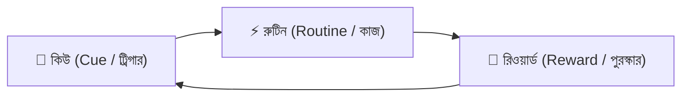

# পড়ার অভ্যাস তৈরির ২১ দিনের বৈজ্ঞানিক চ্যালেঞ্জ 🧠🔥

আমাদের প্রায় সবার জীবনেই এই ঘটনাটি নিয়মিত ঘটে:  
রাতে ঘুমানোর আগে বিশাল সংকল্প—*"কাল সকাল থেকে একদম দিনে ১০ ঘণ্টা পড়ব!"*  
কিন্তু বাস্তবে দেখা যায়—১ম দিন উৎসাহে ৩-৪ ঘণ্টা পড়া হলেও, ২য় দিন আলসেমি আসে, আর ৩য় দিনে পড়ার রুটিন ড্রয়ারের তলায় চাপা পড়ে যায়!

সমস্যাটা কিন্তু তোমার মেধা বা ইচ্ছাশক্তিতে নয়। সমস্যাটা হলো: **ইচ্ছাশক্তি (Willpower) খুব দ্রুত ফুরিয়ে যায়, কিন্তু অভ্যাস (Habit) স্বয়ংক্রিয়ভাবে কাজ করে।**

বিখ্যাত প্লাস্টিক সার্জন ও লেখক ডা. ম্যাক্সওয়েল মল্টজ (Dr. Maxwell Maltz) প্রথম লক্ষ্য করেছিলেন—মানুষের মস্তিষ্কে যেকোনো নতুন অভ্যাস স্থায়ী হতে অন্তত **২১ দিন** সময় লাগে।

এই ব্লগে আমরা শিখবো বিজ্ঞানসম্মত উপায়ে কীভাবে ২১ দিনে পড়ার এমন একটি অভ্যাস গড়ে তুলবে যা কখনোই ভাঙবে না।

---

## ১. অভ্যাসের বিজ্ঞান: হ্যাবিট লুপ (The Habit Loop)

ম্যাসাচুসেটস ইনস্টিটিউট অব টেকনোলজির (MIT) গবেষকরা আবিষ্কার করেছেন, আমাদের প্রতিটি অভ্যাস ৩টি ধাপে গঠিত:

1. **কিউ (ট্রিগার):** পড়ার টেবিল গুছিয়ে রাখা এবং ফোনের নোটিফিকেশন সাইলেন্ট করা।
2. **রুটিন (কাজ):** নির্ধারিত ২৫ বা ৪৫ মিনিট গভীর মনোযোগ দিয়ে পড়া।
3. **রিওয়ার্ড (পুরস্কার):** পড়া শেষ হওয়ার পর প্রিয় গান শোনা, একটু কফি খাওয়া বা অ্যাপের স্ট্রিক স্কোর বেড়ে যাওয়া।

মস্তিষ্ক যখন বারবার রিওয়ার্ড পায়, তখন সে পড়ালেখাকে আর কষ্টদায়ক মনে না করে আনন্দের সাথে গ্রহণ করে।

---

## ২. ২১ দিনের রোডম্যাপ: ৩টি ধাপে অভ্যাস গঠন

### ধাপ ১: প্রথম ৭ দিন (সংগ্রাম পর্ব — Fight Zone)
* **লক্ষ্য:** বেশি পড়া নয়, শুধু টেবিলে বসার অভ্যাস করা।
* **নিয়ম:** প্রতিদিন একই সময়ে (যেমন: ঠিক সন্ধ্যা ৭টায়) পড়তে বসবে। প্রথম সপ্তাহে মাত্র ১ থেকে ২ ঘণ্টা পড়বে, কিন্তু **একদিনও মিস দেওয়া যাবে না**।

### ধাপ ২: দ্বিতীয় সপ্তাহ (৮ম থেকে ১৪তম দিন — Transition Zone)
* **লক্ষ্য:** ফোকাস ও সময় বাড়ানো।
* **নিয়ম:** পড়ার সময় পোমোডোরো টেকনিক (২৫ মিনিট পড়া + ৫ মিনিট ব্রেক) যোগ করো। এই সপ্তাহে প্রতিদিন পড়ার সময় ৩০ মিনিট করে বাড়িয়ে ৩ থেকে ৪ ঘণ্টায় নিয়ে যাও।

### ধাপ ৩: তৃতীয় সপ্তাহ (১৫তম থেকে ২১তম দিন — Automatic Zone)
* **লক্ষ্য:** স্থায়ী অভ্যাসে রূপান্তর।
* **নিয়ম:** এই ধাপে মস্তিষ্ক পড়ার রুটিনে অভ্যস্ত হয়ে যায়। পড়তে না বসলে বরং খারাপ লাগবে। প্রতিদিন অন্তত ৫-৬ ঘণ্টা পড়া স্বাভাবিক মনে হবে।

> [!TIP]
> **কখনো দুটি দিন একটানা মিস দেবে না (Never Miss Twice):**  
> কোনো জরুরি কারণে বা অসুস্থতায় যদি একদিন পড়া মিস হয়, তবে পরের দিন যেকোনো মূল্যে অন্তত ১৫ মিনিটের জন্য হলেও বই খুলে বসবে। এতে মস্তিষ্কের নিউরাল সংযোগ নষ্ট হয় না।

---

## ৩. ডোপামিন ডিটক্স (Dopamine Detox)

পড়াশোনা বোরিং লাগার প্রধান কারণ হলো স্মার্টফোনের টিকটক, রিলস আর শর্টস ভিডিও আমাদের মস্তিষ্কে মাত্রাতিরিক্ত সস্তা ডোপামিন দেয়।

* পড়ার টেবিলে স্মার্টফোন স্পর্শ করবে না।
* ফোনটি পাশের রুমে বা চোখের আড়ালে রেখে পড়তে বসো। গবেষণায় দেখা গেছে, ফোন কেবল টেবিলে উল্টো করে রাখলেও মনোযোগ ২০% কমে যায়।

---

## 🎯 তোমার ২১ দিনের স্ট্রিক শুরু করো 'অভ্যাস'-এ

কাগজে-কলমে রুটিন ট্র্যাক রাখা কঠিন। কিন্তু যদি প্রতিদিনের পড়াশোনার জন্য পয়েন্ট পাও এবং বন্ধুদের সাথে কম্পিটিশন করতে পারো?

👉 **[অভ্যাস (Obhyash) অ্যাপে তোমার স্ট্রিক চ্যালেঞ্জ শুরু করো আজকেই](https://obhyash.com)**
* প্রতিদিনের পড়ার সময় ও টপিক ট্র্যাকার
* একটানা কতদিন পড়েছো তা দেখানোর জন্য ফায়ার স্ট্রিক (🔥 Streak)
* লেজেন্ডস লিগে সেরা শিক্ষার্থীদের সাথে প্রতিযোগিতা ও রিয়েল রিওয়ার্ডস!
