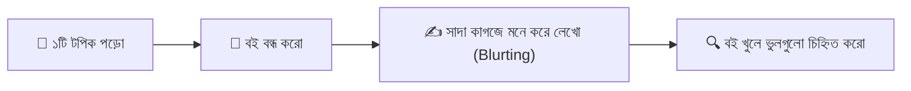
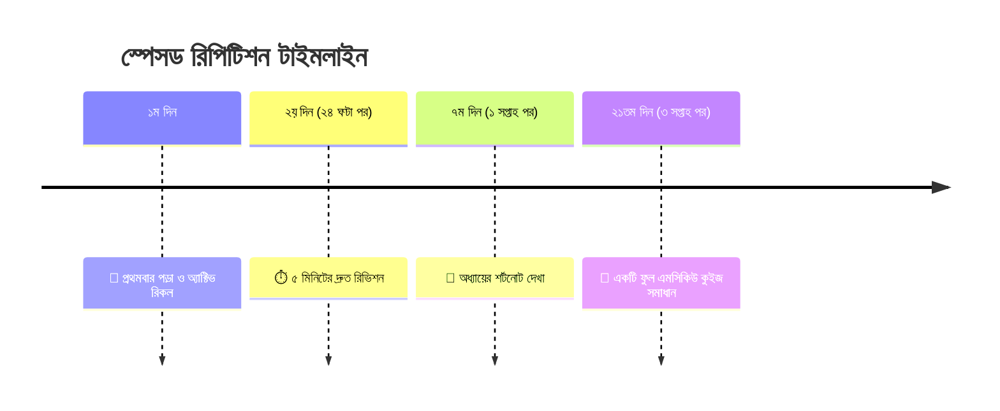

# পড়া দীর্ঘস্থায়ী করার অ্যাক্টিভ রিকল ও স্পেসড রিপিটিশন টেকনিক 🧠📚

আমরা প্রায় সবাই বিশ্বাস করি: একটি বই যত বেশিবার রিডিং পড়ব বা হাইলাইটার দিয়ে দাগাব, পড়া তত ভালো মনে থাকবে। কিন্তু শিক্ষাবিজ্ঞান ও নিউরোসায়েন্স বলছে সম্পূর্ণ উল্টো কথা—**প্যাসিভ রিডিং (বারবার শুধু রিডিং পড়া) হলো পড়াশোনার সবচেয়ে অকার্যকর উপায়!**

জার্মান মনোবিজ্ঞানী হারম্যান এবিংহাউস (Hermann Ebbinghaus) আবিষ্কার করেছিলেন **বিস্মৃতি বক্ররেখা (The Forgetting Curve)**। তাঁর গবেষণায় দেখা গেছে:  
যেকোনো নতুন পড়ার **২৪ ঘণ্টার মধ্যে আমরা ৭০% ভুলে যাই**, আর এক সপ্তাহ পর মনে থাকে মাত্র ২০%!

তাহলে বিশ্বের সেরা বিশ্ববিদ্যালয়গুলোর শিক্ষার্থীরা কীভাবে এত বিশাল সিলেবাস দীর্ঘদিন মনে রাখে? উত্তর হলো দুটি বৈজ্ঞানিক টেকনিক: **অ্যাক্টিভ রিকল (Active Recall)** এবং **স্পেসড রিপিটিশন (Spaced Repetition)**।

---

## ১. অ্যাক্টিভ রিকল কী এবং কীভাবে প্রয়োগ করবে?

খাতা বা বই খোলা রেখে বারবার চোখ বুলানো হলো 'প্যাসিভ লার্নিং'। আর **বই বন্ধ করে মস্তিষ্ককে জোর করে তথ্য মনে করতে বাধ্য করাকে বলে 'অ্যাক্টিভ রিকল'**।

### ব্লার্টিং মেথড (The Blurting Method):
১. একটি অধ্যায় বা প্যারাগ্রাফ ১০-১৫ মিনিট গভীর মনোযোগ দিয়ে পড়ো।  
২. এবার বই সম্পূর্ণ বন্ধ করে একটি সাদা কাগজ নাও।  
৩. যা যা মনে আছে—পয়েন্ট, সূত্র, চিত্র বা ডায়াগ্রাম—সবকিছু সাদা কাগজে দ্রুত লিখে ফেলো।  
৪. এবার বই খুলে দেখো কোন কোন তথ্য মিস হয়েছে। যে তথ্যগুলো মিস হয়েছিল, সেগুলো লাল কালি দিয়ে মার্ক করো।

মস্তিষ্ক যখন কোনো তথ্য পুনরুদ্ধার করতে সংগ্রাম করে, তখনই নিউরনগুলোর মধ্যকার সংযোগ সবচেয়ে শক্তিশালী হয়।

---

## ২. স্পেসড রিপিটিশন (Spaced Repetition): ভুলে যাওয়ার আগেই রিভিশন

প্রতিদিন একই জিনিস পড়ার দরকার নেই। ঠিক যে মুহূর্তে মস্তিষ্ক পড়াটি ভুলে যেতে শুরু করে, ঠিক তখনই একবার রিভিশন দেওয়াকে বলে স্পেসড রিপিটিশন।

এই ৪টি বিরতিতে একবার করে রিভিশন দিলে সেই পড়াটি স্বল্পমেয়াদী স্মৃতি (Short-term memory) থেকে সরাসরি **দীর্ঘমেয়াদী স্মৃতিতে (Long-term memory)** চলে যায়। পরীক্ষার আগের রাতে আর নতুন করে পড়ার দরকারই পড়ে না!

---

## ৩. ফ্ল্যাশকার্ড ও সেলফ-টেস্টিং (Flashcards & Self-Testing)

নিজেকে প্রশ্ন করা অ্যাক্টিভ রিকলের সবচেয়ে শক্তিশালী হাতিয়ার।  
* কোনো অধ্যায় পড়ার পর নিজে নিজে প্রশ্ন তৈরি করো: *"নিউটনের ৩য় সূত্রের সীমাবদ্ধতা কী?"*, *"মিথেনের দহনে কী উৎপন্ন হয়?"*  
* উত্তর না দেখে মুখে মুখে বলার চেষ্টা করো।

> [!TIP]
> সবচেয়ে ভালো উপায় হলো পড়ার পরপরই সেই টপিকের ওপর ৫-১০ নম্বরের একটি ছোট কুইজ দিয়ে ফেলা। পরীক্ষা দেওয়াই হলো অ্যাক্টিভ রিকলের সেরা রূপ!

---

## 🎯 অভ্যাস (Obhyash)-এ স্বয়ংক্রিয় স্পেসড রিপিটিশন

নিজে নিজে দিন হিসাব করে রিভিশন মনে রাখা কঠিন। ‘অভ্যাস’ প্ল্যাটফর্মের অ্যালগরিদম ঠিক এই কাজটিই করে:

👉 **[অভ্যাস (Obhyash) অ্যাপে প্রতিদিন কুইজ দাও আজকেই](https://obhyash.com)**
* যে প্রশ্নগুলো অতীতে ভুল করেছিলে, সেগুলো স্বয়ংক্রিয়ভাবে কিছুদিন পর আবার প্র্যাকটিসে সামনে নিয়ে আসে।
* প্রতিদিনের স্ট্রিক ও লিডারবোর্ড পড়ার অভ্যাসকে আনন্দদায়ক করে তোলে!
