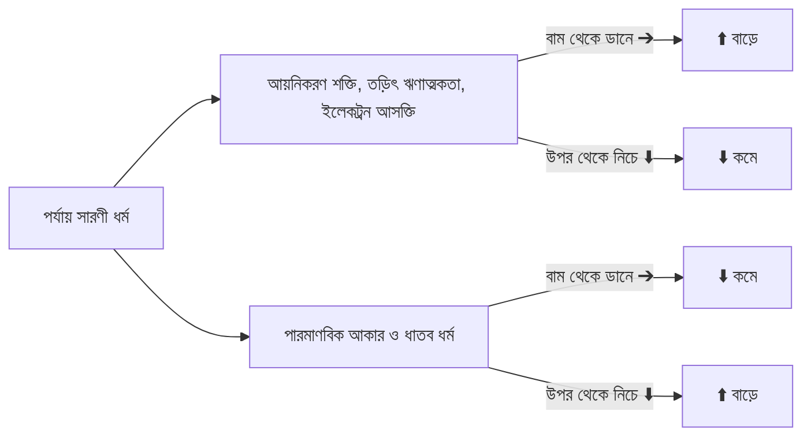

# রসায়ন পর্যায় সারণী মনে রাখার সহজ ছন্দ ও ট্রিকস 🧪✨

রসায়নে ভালো করার প্রথম এবং প্রধান শর্ত হলো **পর্যায় সারণী (Periodic Table)** হাতের মুঠোয় থাকা। কিন্তু ১১৮টি মৌলের নাম, তাদের গ্রুপ ও পর্যায় মুখস্থ করা কোনো সহজ কাজ নয়। মুখস্থ করলেও পরীক্ষার হলে গুলিয়ে যায়—কোন মৌলের নিচে কোনটা ছিল!

সৌভাগ্যবশত, অভিজ্ঞ শিক্ষক ও টপাররা বছরের পর বছর ধরে কিছু মজার **বাংলা ছন্দ (Mnemonics)** ব্যবহার করে আসছেন, যার মাধ্যমে মাত্র ৩০ মিনিটে পুরো পর্যায় সারণী আয়ত্তে আনা সম্ভব।

এই ব্লগে আমরা গ্রুপভিত্তিক সবচেয়ে জনপ্রিয় ও পরীক্ষিত ছন্দগুলো এবং পর্যায়বৃত্ত ধর্ম মনে রাখার শর্টকাট শিখবো।

---

## ১. গ্রুপভিত্তিক জাদুকরী বাংলা ছন্দ

### গ্রুপ ১ (ক্ষার ধাতু - Alkali Metals: H, Li, Na, K, Rb, Cs, Fr)
> **ছন্দ:** **"হায় লী না কে রুবি ছেঁচে ফেলেছে"**
* **হায়** $\to$ H (হাইড্রোজেন)
* **লী** $\to$ Li (লিথিয়াম)
* **না** $\to$ Na (সোডিয়াম)
* **কে** $\to$ K (পটাশিয়াম)
* **রুবি** $\to$ Rb (রুবিডিয়াম)
* **ছেঁচে** $\to$ Cs (সিজিয়াম)
* **ফেলেছে** $\to$ Fr (ফ্রান্সিয়াম)

---

### গ্রুপ ২ (মৃৎক্ষার ধাতু - Alkaline Earth Metals: Be, Mg, Ca, Sr, Ba, Ra)
> **ছন্দ:** **"বিরিয়ানি মোগলাই কাবাব সরিয়ে বাটিতে রাখো"**
* **বিরিয়ানি** $\to$ Be (বেরিলিয়াম)
* **মোগলাই** $\to$ Mg (ম্যাগনেসিয়াম)
* **কাবাব** $\to$ Ca (ক্যালসিয়াম)
* **সরিয়ে** $\to$ Sr (স্ট্রনশিয়াম)
* **বাটিতে** $\to$ Ba (বেরিয়াম)
* **রাখো** $\to$ Ra (রেডিয়াম)

---

### গ্রুপ ১৩ (বোরন পরিবার: B, Al, Ga, In, Tl)
> **ছন্দ:** **"বাংলাদেশী আলমের গায়ে ইনফেকশন তলে"** (অথবা: *"বোল্টু এলো গেলো ইন্ডিয়ান ট্রলারে"*)
* **B** (বোরন) $\to$ **Al** (অ্যালুমিনিয়াম) $\to$ **Ga** (গ্যালিয়াম) $\to$ **In** (ইন্ডিয়াম) $\to$ **Tl** (থ্যালিয়াম)

---

### গ্রুপ ১৪ (কার্বন পরিবার: C, Si, Ge, Sn, Pb)
> **ছন্দ:** **"কুয়েট সিটিতে গেলে সন্টু পাবে"**
* **কুয়েট (C)** $\to$ কার্বন
* **সিটিতে (Si)** $\to$ সিলিকন
* **গেলে (Ge)** $\to$ জার্মেনিয়াম
* **সন্টু (Sn)** $\to$ টিন (টিনের ল্যাটিন নাম Stannum)
* **পাবে (Pb)** $\to$ লেড (ল্যাটিন নাম Plumbum)

---

### গ্রুপ ১৫ (নাইট্রোজেন পরিবার: N, P, As, Sb, Bi)
> **ছন্দ:** **"নাসিমা পাড়ার আসমাকে সব বিলালো"**
* **N** (নাইট্রোজেন) $\to$ **P** (ফসফরাস) $\to$ **As** (আর্সেনিক) $\to$ **Sb** (অ্যান্টিমনি - Stibium) $\to$ **Bi** (বিসমাথ)

---

### গ্রুপ ১৬ (চালবোজেন - Chalcogens: O, S, Se, Te, Po)
> **ছন্দ:** **"ও এস এস ই তে পড়ে"**
* **ও** $\to$ O (অক্সিজেন)
* **এস** $\to$ S (সালফার)
* **এস ই** $\to$ Se (সেলেনিয়াম)
* **তে** $\to$ Te (টেলুরিয়াম)
* **পড়ে** $\to$ Po (পোলোনিয়াম)

---

### গ্রুপ ১৭ (হ্যালোজেন - Halogens: F, Cl, Br, I, At)
> **ছন্দ:** **"ফেললে কুল পাবে আসবে আন্টি"**
* **ফেললে** $\to$ F (ফ্লোরিন)
* **কুল** $\to$ Cl (ক্লোরিন)
* **পাবে** $\to$ Br (ব্রোমিন)
* **আসবে** $\to$ I (আয়োডিন)
* **আন্টি** $\to$ At (অ্যাস্টাটিন)

---

### গ্রুপ ১৮ (নিষ্ক্রিয় গ্যাস - Noble Gases: He, Ne, Ar, Kr, Xe, Rn)
> **ছন্দ:** **"হেনা আর করিম যাবে রমনায়"**
* **He** (হিলিয়াম) $\to$ **Ne** (নিয়ন) $\to$ **Ar** (আর্গন) $\to$ **Kr** (ক্রিপ্টন) $\to$ **Xe** (জেনন) $\to$ **Rn** (রেডন)

---

## ২. পর্যায়বৃত্ত ধর্ম মনে রাখার ১ লাইনের শর্টকাট

পর্যায় সারণীর বাঁ থেকে ডানে গেলে বা ওপর থেকে নিচে নামলে কোনটি বাড়ে আর কোনটি কমে—এটি এমসিকিউর সবচেয়ে বড় ফাঁদ।

> [!TIP]
> **গোল্ডেন ফর্মুলা:**  
> কেবল **'পারমাণবিক ব্যাসার্ধ' (আকার)** এবং **'ধাতব ধর্ম'** ওপর থেকে নিচে নামলে বাড়ে, আর বাকি সব প্রধান ধর্ম (আয়নাকরণ শক্তি, তড়িৎ ঋণাত্মকতা, ইলেকট্রন আসক্তি) ওপর থেকে নিচে নামলে **কমে**!

---

## 🎯 রসায়নে সর্বোচ্চ নম্বর পেতে প্র্যাকটিস শুরু করো

পর্যায় সারণীর ছন্দগুলো খাতায় লিখে নাও এবং প্রতিদিন ৫ মিনিট চোখ বুলানোর অভ্যাস করো।

রসায়নের অধ্যায়ভিত্তিক কুইজ এবং শত শত বহুনির্বাচনী প্র্যাকটিস করতে:

👉 **[অভ্যাস (Obhyash) প্ল্যাটফর্মে ফ্রি টেস্ট দাও আজকেই](https://obhyash.com)**
* রসায়ন ১ম ও ২য় পত্রের পূর্ণাঙ্গ কোশ্চেন ব্যাংক
* ইনস্ট্যান্ট ভুল উত্তরের ব্যাখ্যা ও সমাধান
* বন্ধুদের সাথে লাইভ কম্পিটিশন ও লিডারবোর্ড ট্র্যাকিং!
