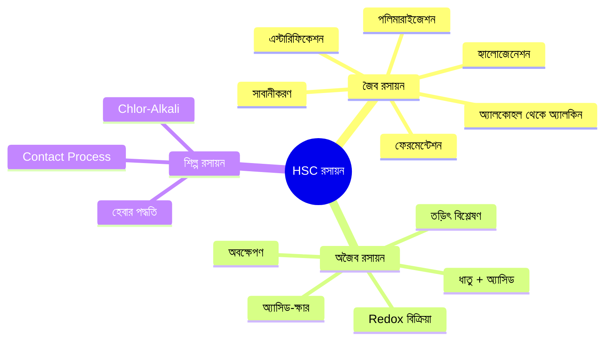
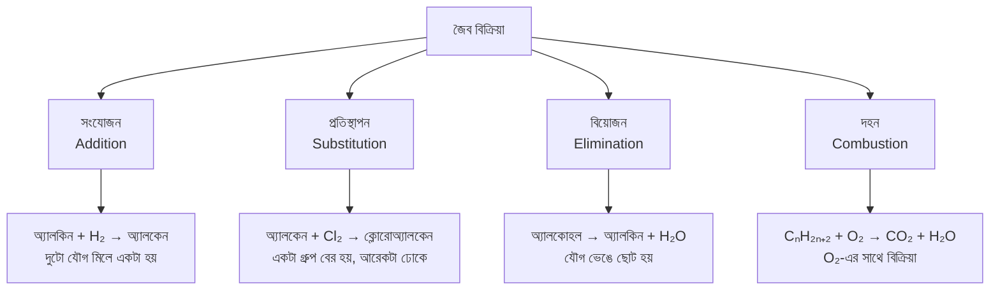
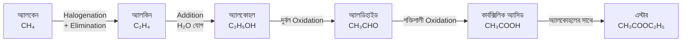
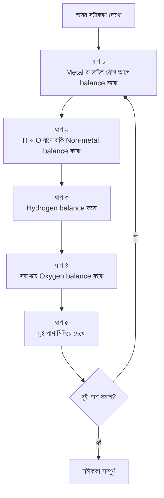
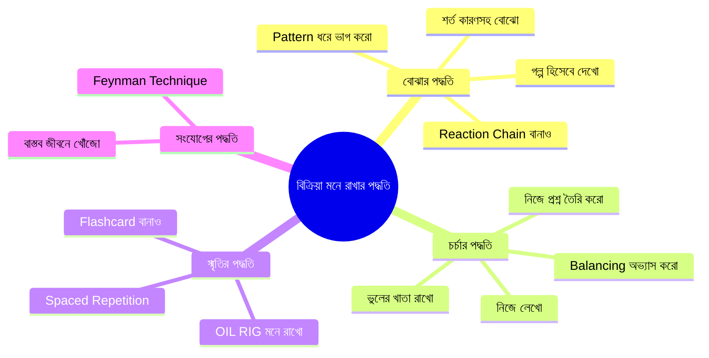
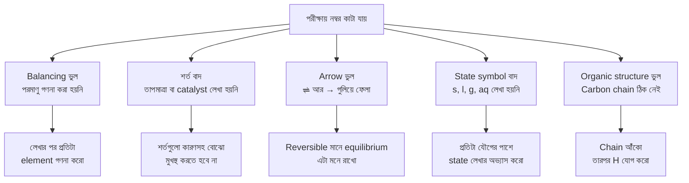

# রসায়নের বিক্রিয়া দীর্ঘস্থায়ীভাবে মনে রাখার উপায়

> তুমি হয়তো রাত জেগে রসায়নের বিক্রিয়া মুখস্থ করেছ। পরের দিন পরীক্ষায় বসে দেখলে — অর্ধেক ভুলে গেছ, বাকি অর্ধেক গুলিয়ে গেছে। এটা তোমার দোষ না। সমস্যাটা পদ্ধতিতে।

রসায়নের বিক্রিয়া মানে শুধু সমীকরণ না। প্রতিটা বিক্রিয়ার পেছনে একটা কারণ আছে, একটা যুক্তি আছে। তুমি যদি শুধু বাঁ দিক আর ডান দিক মুখস্থ করো, তাহলে সেটা কয়েক ঘণ্টা পর মাথা থেকে বেরিয়ে যাবে।

---

## কেন বিক্রিয়া ভুলে যাই — স্মৃতির বিজ্ঞান

আমাদের মস্তিষ্ক দুই ধরনের স্মৃতি তৈরি করে। তুমি যখন রাতে বিক্রিয়া মুখস্থ করো আর সকালে পরীক্ষা দাও — সেটা short-term memory থেকে কাজ হয়। দুই সপ্তাহ পর Final পরীক্ষায় সেই বিক্রিয়া আর থাকে না।

| স্মৃতির ধরন | কীভাবে তৈরি হয় | কতদিন থাকে |
|---|---|---|
| **Short-term Memory** | শুধু পড়লে বা একবার দেখলে | কয়েক ঘণ্টা থেকে ১–২ দিন |
| **Long-term Memory** | বুঝে পড়লে, বারবার অনুশীলন করলে | সপ্তাহ, মাস, বছর |

লক্ষ্য হলো long-term memory-তে তথ্য পাঠানো।

---

## পড়ার পদ্ধতি অনুযায়ী স্মৃতি ধারণ ক্ষমতা

নিচের তথ্যগুলো Learning Pyramid-এর উপর ভিত্তি করে। শুধু পড়লে যা মনে থাকে, অন্যকে শেখালে তার চেয়ে প্রায় ৫–৬ গুণ বেশি মনে থাকে।

```
পদ্ধতি                        ধারণ ক্ষমতা
──────────────────────────────────────────────────
শুধু পড়া             ██░░░░░░░░░░░░░░░░  ১০–২০%
হাইলাইট করা          ████░░░░░░░░░░░░░░  ২০–৩০%
নোট লেখা             ███████░░░░░░░░░░░  ৪০–৫০%
নিজে লেখা + সমাধান   ██████████░░░░░░░░  ৬০–৭০%
অন্যকে শেখানো        █████████████░░░░░  ৮০–৯০%
──────────────────────────────────────────────────
```

---

## Spaced Repetition — স্মৃতি কীভাবে শক্তিশালী হয়

Ebbinghaus-এর Forgetting Curve অনুযায়ী, আমরা পড়ার পর দ্রুত ভুলতে শুরু করি। কিন্তু নির্দিষ্ট বিরতিতে Revision করলে প্রতিবার স্মৃতি আরও শক্তিশালী হয়।

```
স্মৃতির শক্তি (%)
│
100% ┤ ●
     │  ╲
 60% ┤   ╲     ●
     │    ╲   ╱ ╲
 35% ┤     ● ╱   ╲     ●
     │         ╲   ╲   ╱ ╲
 20% ┤           ●   ╲╱   ╲      ●
     │                            ╲____
  0% ┼────┬────┬────┬─────┬─────┬──────→ দিন
      ১ম  ২য়  ৫ম   ৭ম   ১২তম  ২৬তম

      ● = Revision করা হয়েছে এই দিন
```

### Revision-এর সহজ সূচি

```
প্রথম পড়া
    │
    ▼
১ দিন পর ──► ৩ দিন পর ──► ৭ দিন পর ──► ১৪ দিন পর ──► দীর্ঘস্থায়ী স্মৃতি
```

প্রতিবার Revision-এ কম সময় লাগে। কিন্তু মস্তিষ্কে গভীরভাবে গেঁথে যায়। একটা নোটবুকে প্রতিটা বিক্রিয়ার পাশে তারিখ লেখো — পরের Revision-এর দিন ঠিক করো।

---

## HSC রসায়নের বিক্রিয়া — বিষয়ভিত্তিক মানচিত্র



---

## জৈব বিক্রিয়ার ধরন — Pattern ধরে বোঝো

সব বিক্রিয়া আলাদা আলাদা না। একই pattern-এর বিক্রিয়া একসাথে বুঝলে কম সময়ে বেশি মনে থাকে।



---

## Reaction Chain — একটার পর একটা

কিছু বিক্রিয়া আলাদা না, একটার পর একটা আসে। Chain হিসেবে মনে রাখলে প্রতিটা বিক্রিয়া আলাদা করে মনে রাখতে হয় না।



> এই chain-টা একবার মাথায় ঢুকলে প্রতিটা বিক্রিয়া আলাদা করে মনে রাখতে হয় না। একটা থেকে আরেকটা বের করতে পারবে।

---

## গুরুত্বপূর্ণ বিক্রিয়া এবং শর্ত

### জৈব রসায়ন

**এস্টারিফিকেশন:**

$$\text{CH}_3\text{COOH} + \text{C}_2\text{H}_5\text{OH} \xrightarrow{H_2SO_4,\ \Delta} \text{CH}_3\text{COOC}_2\text{H}_5 + \text{H}_2\text{O}$$

এস্টারিফিকেশন মানে নেইলপলিশ রিমুভারের গন্ধ তৈরি। অ্যাসিড আর অ্যালকোহল মিলে এস্টার তৈরি করে — এটা একবার ভাবলেই মনে থাকবে।

---

**সাবানীকরণ:**

$$\text{RCOOR'} + \text{NaOH} \xrightarrow{\Delta} \text{RCOONa} + \text{R'OH}$$

NaOH-এর বদলে KOH দিলে soft soap তৈরি হয় — এটা একটা প্রশ্ন হিসেবে নিজেকে জিজ্ঞেস করে দেখো।

---

**ফেরমেন্টেশন:**

$$\text{C}_6\text{H}_{12}\text{O}_6 \xrightarrow{\text{Enzyme},\ 37°C} 2\text{C}_2\text{H}_5\text{OH} + 2\text{CO}_2$$

দই তৈরি, রুটি ফোলা — সবই এই বিক্রিয়ার বাস্তব রূপ।

---

### শিল্প রসায়ন

**হেবার পদ্ধতি:**

$$\text{N}_2(g) + 3\text{H}_2(g) \rightleftharpoons 2\text{NH}_3(g) \qquad \Delta H = -92 \text{ kJ/mol}$$

| শর্ত | মান | কারণ |
|---|---|---|
| তাপমাত্রা | 400–500°C | Reaction rate বাড়াতে, তবে বেশি হলে NH₃ ভেঙে যায় |
| চাপ | 200–300 atm | Mol সংখ্যা কমিয়ে NH₃ বেশি তৈরি করতে |
| Catalyst | Fe + Al₂O₃ + K₂O | Activation energy কমিয়ে বিক্রিয়া দ্রুত করতে |

এই শর্তগুলো মুখস্থ করার দরকার নেই। কারণ জানলে নিজেই মনে পড়বে।

---

**Contact Process:**

$$2\text{SO}_2(g) + \text{O}_2(g) \rightleftharpoons 2\text{SO}_3(g) \qquad \Delta H = -197 \text{ kJ/mol}$$

| শর্ত | মান |
|---|---|
| তাপমাত্রা | 450–500°C |
| Catalyst | V₂O₅ |
| চাপ | বায়ুমণ্ডলীয় |

---

## Redox বিক্রিয়া — OIL RIG পদ্ধতি

Redox বিক্রিয়ায় electron কে হারাচ্ছে আর কে পাচ্ছে — এটাই মূল বিষয়।

```
┌─────────────────────────────────────────────────┐
│                   OIL RIG                        │
│                                                  │
│   OIL                        RIG                 │
│   Oxidation Is Loss          Reduction Is Gain   │
│                                                  │
│   Electron হারানো            Electron পাওয়া     │
│   = Oxidation                = Reduction         │
│                                                  │
│   Zn → Zn²⁺ + 2e⁻           2H⁺ + 2e⁻ → H₂    │
└─────────────────────────────────────────────────┘
```

### উদাহরণ বিশ্লেষণ

$$\overset{0}{\text{Zn}} + \overset{+1}{\text{H}_2}\text{SO}_4 \rightarrow \overset{+2}{\text{Zn}}\text{SO}_4 + \overset{0}{\text{H}_2}$$

| উপাদান | Oxidation Number | কী হয়েছে | ভূমিকা |
|---|---|---|---|
| Zn | 0 → +2 | Oxidized | Reducing agent |
| H | +1 → 0 | Reduced | Oxidizing agent |

---

## Balancing — ধাপে ধাপে



### উদাহরণ

**Unbalanced:**

$$\text{Fe}_2\text{O}_3 + \text{CO} \rightarrow \text{Fe} + \text{CO}_2$$

**Balanced:**

$$\text{Fe}_2\text{O}_3 + 3\text{CO} \rightarrow 2\text{Fe} + 3\text{CO}_2$$

প্রতিদিন ৫টা বিক্রিয়া balance করার অভ্যাস করলে পরীক্ষায় এটা আর সমস্যা থাকবে না।

---

## ১৩টি পদ্ধতি — মানচিত্র



---

## প্রতিটি পদ্ধতির বিস্তারিত

### পদ্ধতি ০১ — গল্প হিসেবে দেখো

প্রতিটা বিক্রিয়ার পেছনে একটা ঘটনা খোঁজো। এস্টারিফিকেশন মানে নেইলপলিশ রিমুভারের গন্ধ তৈরি। ফেরমেন্টেশন মানে দই জমা। দহন মানে চুলার গ্যাস জ্বলা। যদি বিক্রিয়ার সাথে একটা বাস্তব ঘটনা জুড়ে দিতে পারো — সেটা অনেকদিন মনে থাকে।

---

### পদ্ধতি ০২ — Pattern ধরে ভাগ করো

সব ধাতু + অ্যাসিড বিক্রিয়া একই নিয়মে চলে:

$$\text{ধাতু} + \text{অ্যাসিড} \rightarrow \text{লবণ} + \text{H}_2\uparrow$$

এই একটা pattern জানলে Zn, Fe, Mg — যেকোনো ধাতুর বিক্রিয়া নিজে লিখতে পারবে।

---

### পদ্ধতি ০৩ — নিজে লেখো

বই বন্ধ করে খালি কাগজে বিক্রিয়া লেখার চেষ্টা করো। ভুল হলে দেখো। আবার লেখো। এটাই সবচেয়ে সরল কিন্তু কার্যকর পদ্ধতি।

---

### পদ্ধতি ০৪ — Spaced Repetition

```
পড়লাম → ১ দিন পর → ৩ দিন পর → ৭ দিন পর → ১৪ দিন পর
```

একটা নোটবুকে প্রতিটা বিক্রিয়ার পাশে তারিখ লেখো। পরের Revision-এর দিন ঠিক করো।

---

### পদ্ধতি ০৫ — শর্ত কারণসহ বোঝো

হেবার পদ্ধতিতে চাপ ২০০–৩০০ atm কেন? কারণ Le Chatelier's Principle অনুযায়ী চাপ বাড়ালে কম mol-এর দিকে সাম্যাবস্থা সরে — মানে NH₃ বেশি তৈরি হয়। কারণ জানলে শর্ত মুখস্থ লাগে না।

---

### পদ্ধতি ০৬ — নিজে প্রশ্ন তৈরি করো

সাবানীকরণ পড়ে নিজেকে জিজ্ঞেস করো:
1. KOH দিলে কী পার্থক্য হতো?
2. এই বিক্রিয়া কোন শিল্পে ব্যবহার হয়?
3. বিক্রিয়াটি reversible কেন না?

এই প্রশ্নগুলোর উত্তর খুঁজতে গিয়ে বিক্রিয়াটা আরও গভীরভাবে বুঝবে।

---

### পদ্ধতি ০৭ — Flashcard বানাও

```
┌──────────────────────────────────┐
│  সামনের দিক                      │
│                                  │
│  এস্টারিফিকেশন বিক্রিয়া কী?     │
└──────────────────────────────────┘

┌──────────────────────────────────┐
│  পেছনের দিক                      │
│                                  │
│  অ্যাসিড + অ্যালকোহল →           │
│  এস্টার + পানি                   │
│                                  │
│  শর্ত: H₂SO₄, তাপ                │
│                                  │
│  CH₃COOH + C₂H₅OH →             │
│  CH₃COOC₂H₅ + H₂O               │
└──────────────────────────────────┘
```

বাসে যাওয়ার সময়, ঘুমানোর আগে — এই কার্ডগুলো দেখো।

---

### পদ্ধতি ০৮ — বাস্তব জীবনে খোঁজো

| বিক্রিয়া | বাস্তব উদাহরণ |
|---|---|
| ফেরমেন্টেশন | দই, রুটি তৈরি |
| দহন বিক্রিয়া | চুলায় গ্যাস জ্বলা |
| অ্যাসিড-ক্ষার | অ্যান্টাসিড পেটের অ্যাসিড কমায় |
| এস্টারিফিকেশন | আতর, ফলের সুগন্ধ |
| সাবানীকরণ | সাবান তৈরি |
| অক্সিডেশন | লোহায় মরিচা পড়া |
| পলিমারাইজেশন | প্লাস্টিক, পলিথিন ব্যাগ |

পরের বার যখন চুলায় গ্যাস জ্বালাবে, মাথায় আসবে — এটা দহন বিক্রিয়া।

---

### পদ্ধতি ০৯ — Feynman Technique

তুমি যখন কাউকে একটা বিক্রিয়া বোঝাতে যাও — বন্ধু, ছোট ভাই বা বোন — তখন তোমাকে নিজে সেটা সম্পূর্ণভাবে বুঝতে হয়। যেখানে ফাঁকি আছে, সেটা ধরা পড়ে। কেউ না থাকলে দেয়ালের দিকে তাকিয়ে নিজেই বলতে পারো।

> যদি সহজ ভাষায় ব্যাখ্যা করতে না পারো, তাহলে বুঝতে পারোনি।

---

### পদ্ধতি ১০ — ভুলের খাতা রাখো

একটা আলাদা খাতায় শুধু তোমার ভুলগুলো লিখে রাখো।

| তারিখ | বিক্রিয়া | কোথায় ভুল হয়েছিল | সঠিক উত্তর |
|---|---|---|---|
| ১৫/০১ | হেবার পদ্ধতি | চাপ ভুলে ছিলাম | 200–300 atm |
| ১৭/০১ | এস্টারিফিকেশন | Arrow ভুল লিখেছিলাম | → (irreversible) |
| ১৯/০১ | Redox বিক্রিয়া | Oxidation number ভুল | Zn: 0 → +2 |

পরীক্ষার আগে এই খাতাটা একবার দেখলে — সবচেয়ে দরকারি জায়গাগুলো cover হয়ে যাবে।

---

### পদ্ধতি ১১ — Reaction Chain বানাও

```
অ্যালকেন ──► অ্যালকিন ──► অ্যালকোহল ──► অ্যালডিহাইড ──► কার্বক্সিলিক অ্যাসিড
  CH₄           C₂H₄        C₂H₅OH          CH₃CHO              CH₃COOH
                                                                      │
                                                                      ▼
                                                                   এস্টার
                                                               CH₃COOC₂H₅
```

---

### পদ্ধতি ১২ — Balancing অভ্যাস করো

```
Metal আগে → Non-metal (H, O বাদে) → H → O → মিলিয়ে দেখো
```

প্রতিদিন ৫টা বিক্রিয়া balance করার অভ্যাস করলে পরীক্ষায় এটা আর সমস্যা থাকবে না।

---

### পদ্ধতি ১৩ — OIL RIG মনে রাখো

Oxidation Is Loss — Reduction Is Gain। Redox বিক্রিয়ায় electron কে হারাচ্ছে আর কে পাচ্ছে — এটা একবার বুঝলে যেকোনো Redox বিক্রিয়া নিজে বিশ্লেষণ করতে পারবে।

---

## সবচেয়ে বেশি ভুল হয় যেখানে



---

## Weekly Plan — একটা সহজ সূচি

| দিন | কাজ |
|---|---|
| **সোমবার** | নতুন বিক্রিয়া পড়ো, কারণ বোঝো |
| **মঙ্গলবার** | বই বন্ধ করে নিজে লেখার চেষ্টা করো |
| **বুধবার** | ভুলের খাতায় লিখো, আবার দেখো |
| **বৃহস্পতিবার** | সমস্যা সমাধান, Balancing practice |
| **শুক্রবার** | পুরো সপ্তাহের বিক্রিয়া ঝালাই করো |
| **শনিবার** | Flashcard দেখো, Reaction chain মনে করো |
| **রবিবার** | আগের সপ্তাহের বিক্রিয়া একবার দেখো |

এটা কোনো আদর্শ রুটিন না। তোমার সময় অনুযায়ী adjust করে নাও। মূল কথা হলো — একদিনে গাদা করে না পড়ে ছড়িয়ে পড়া।

---

## নিজেকে যাচাই করো

পড়া শেষ হলে নিজেকে এই প্রশ্নগুলো জিজ্ঞেস করো:

- [ ] এস্টারিফিকেশন আর সাবানীকরণের পার্থক্য কী?
- [ ] হেবার পদ্ধতিতে চাপ বেশি রাখা হয় কেন?
- [ ] OIL RIG কী বোঝায়?
- [ ] Balancing-এর সঠিক ক্রম কী?
- [ ] Reaction Chain-এ অ্যালকোহলের পর কোনটা আসে?
- [ ] Reversible আর Irreversible বিক্রিয়ার পার্থক্য কী?
- [ ] Contact Process-এ V₂O₅ কেন ব্যবহার হয়?

যদি সব উত্তর দিতে পারো — তুমি ঠিকঠাক বুঝেছ।

---

## শেষ কথা

রসায়নের বিক্রিয়া কঠিন না। কিন্তু ভুল পদ্ধতিতে পড়লে মনে হয় কঠিন।

উপরের সবগুলো পদ্ধতি একসাথে শুরু করতে হবে না। আজকে একটা বেছে নাও — যেটা তোমার কাছে সহজ মনে হয়। সেটা কয়েকদিন করো। তারপর আরেকটা যোগ করো।

তুমি যদি আজ থেকে শুধু একটা কাজ করো — প্রতিটা বিক্রিয়া পড়ার পর নিজেকে জিজ্ঞেস করো *"এটা কেন হচ্ছে?"* — তাহলে ধীরে ধীরে দেখবে বিক্রিয়া মনে থাকছে, ভুলে যাচ্ছ না।

মুখস্থ করার দরকার নেই। বোঝার দরকার আছে।

---

*তোমার কোন chapter বা বিক্রিয়াতে সবচেয়ে বেশি সমস্যা হচ্ছে জানালে সেটা নিয়ে আলাদা করে লেখা যাবে।*
