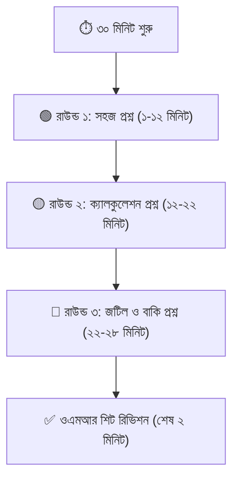

# পরীক্ষায় দ্রুত MCQ সমাধানের ৫টি বৈজ্ঞানিক কৌশল ও টাইম ম্যানেজমেন্ট ⏱️🎯

যেকোনো বোর্ড পরীক্ষা (SSC, HSC) বা বিশ্ববিদ্যালয় ভর্তি পরীক্ষায় ৯০% শিক্ষার্থী একটি সাধারণ অভিযোগ করে:  
**"সব উত্তরই তো জানা ছিল, কিন্তু সময়ের অভাবে ৪-৫টা এমসিকিউ দাগাতে পারিনি!"**

আসলে এমসিকিউ পরীক্ষা হলো জ্ঞান যাচাইয়ের পাশাপাশি একটি **গতি (Speed) এবং উপস্থিত বুদ্ধির যুদ্ধ**। যারা পরীক্ষায় সর্বোচ্চ নম্বর পায়, তারা প্রতিটি প্রশ্ন বইয়ের নিয়মে শুরু থেকে শেষ পর্যন্ত সমাধান করে না। তারা কিছু স্মার্ট কৌশল বা হ্যাকস ব্যবহার করে অপশন বাছাই করে।

এই আর্টিকেলে আন্তর্জাতিকভাবে স্বীকৃত ও পরীক্ষিত এমন **৫টি বৈজ্ঞানিক এমসিকিউ টেকনিক** আলোচনা করা হলো যা তোমার পরীক্ষার গতি অন্তত ৫০% বাড়িয়ে দেবে।

---

## ১. অপশন এলিমিনেশন মেথড (Option Elimination Method)

সরাসরি সঠিক উত্তর খোঁজার চেয়ে ভুল উত্তরগুলোকে আগে বাদ দেওয়া অনেক সহজ। 

চারটি অপশনের মধ্যে সবসময় অন্তত **দুটি অপশন থাকে সম্পূর্ণ অপ্রাসঙ্গিক** বা অসম্ভব।
* উদাহরণ: ফিজিক্সের কোনো অংকে ত্বরণ বের করতে বলা হয়েছে এবং মান ধনাত্মক হওয়া নিশ্চিত। অপশনে দুটি ঋণাত্মক মান থাকলে শুরুতেই সে দুটি কেটে দাও।
* এখন বাকি দুটি অপশনের মধ্যে তোমার সঠিক উত্তর হওয়ার সম্ভাবনা ২৫% থেকে বেড়ে **৫০%** হয়ে গেল!

> [!TIP]
> যখন কোনো প্রশ্নে সম্পূর্ণ নিশ্চিত হতে পারবে না, তখন ভুল অপশনগুলো কেটে ফেলার পর অবশিষ্ট অপশনগুলোর মধ্যে সবচেয়ে যৌক্তিক উত্তরটি দাগাও।

---

## ২. রিভার্স ইঞ্জিনিয়ারিং বা অপশন টেস্ট (Reverse Engineering)

অঙ্কের সমীকরণ সমাধান করতে গিয়ে সময় নষ্ট না করে সরাসরি অপশনগুলোর মান সমীকরণে বসিয়ে দাও।

* বিশেষ করে বীজগণিত, ত্রিকোণমিতি এবং জটিল সংখ্যার প্রশ্নে এটি ম্যাজিকের মতো কাজ করে।
* অপশনে দেওয়া চারটি মান ($x = 1, 2, 0, -1$) সমীকরণে বসিয়ে দেখো কোনটির জন্য বামপক্ষ ও ডানপক্ষ সমান হয়।
* এতে ১ পাতার ক্যালকুলেশন না করেই মাত্র ১০ সেকেন্ডে সঠিক অপশন পাওয়া যায়।

---

## ৩. ৩-রাউন্ড এক্সাম স্ট্র্যাটেজি (The 3-Round Strategy)

পরীক্ষার ৩০ মিনিট সময়কে ৩টি রাউন্ডে ভাগ করে প্রশ্নপত্র সমাধান করো:

1. **রাউন্ড ১ (প্রথম ১০-১২ মিনিট):** পুরো প্রশ্নপত্র একবার স্ক্যান করো। যে প্রশ্নগুলোর উত্তর দেখামাত্র বলতে পারো (তাত্ত্বিক বা সরাসরি তথ্যভিত্তিক), সেগুলো সাথে সাথে ওএমআরে দাগিয়ে ফেলো। কোনো কঠিন প্রশ্নে ১ সেকেন্ডও সময় নষ্ট করবে না।
2. **রাউন্ড ২ (১২ থেকে ২২ মিনিট):** যে প্রশ্নগুলো অল্প হিসাব বা ছোটখাটো সূত্র প্রয়োগ করলে বের হবে, সেগুলো শান্ত মাথায় সমাধান করো।
3. **রাউন্ড ৩ (শেষ ৮ মিনিট):** যে প্রশ্নগুলো কঠিন বা কনফিউজিং ছিল, সেগুলোতে অপশন এলিমিনেশন বা রিভার্স ক্যালকুলেশন প্রয়োগ করো।

---

## ৪. ইউনিট ও মাত্রা বিশ্লেষণ (Dimensional Analysis)

ফিজিক্স ও কেমিস্ট্রির অংকে সূত্র ভুলে গেলেও শুধু অপশনের একক দেখে উত্তর বলে দেওয়া সম্ভব!

* ধরা যাক, তোমাকে কোনো প্রশ্নে 'ক্ষমতা' (Power) নির্ণয় করতে বলা হয়েছে।
* অপশনগুলোতে লক্ষ্য করো—যদি ৩টি অপশনের এককে $\text{Joule}$ দেওয়া থাকে এবং কেবল ১টিতে $\text{Watt}$ থাকে, তবে কোনো অংক না করেই তুমি নিশ্চিত বলতে পারো যে $\text{Watt}$ ওয়ালা অপশনটিই সঠিক উত্তর!

---

## ৫. এক্সট্রিম অপশন ও ‘সবকটিই’ ট্র্যাপ

1. **Extreme Values বাদ দাও:** অপশনে যদি মানগুলো এমন থাকে: A) 5, B) 6, C) 7, D) 1500 — তবে ৯৫% ক্ষেত্রে অদ্ভুত বা অতিরিক্ত বড়/ছোট মানটি (১৫০০) ভুল উত্তর হয়ে থাকে।
2. **"উপরের সবকটি" (All of the above):** বহুপদী সমাপ্তিসূচক প্রশ্নে যদি দুটি অপশন নিশ্চিতভাবে সঠিক পাও, তবে নিশ্চিতভাবেই উত্তর হবে "i, ii ও iii" বা "সবকটি"।

> [!WARNING]
> আন্দাজে বা চোখ বন্ধ করে কখনোই এমসিকিউ দাগাবে না (বিশেষ করে নেগেটিভ মার্কিং থাকা অ্যাডমিশন টেস্টে)। কৌশল প্রয়োগ করে অন্তত দুটি অপশন বাদ দেওয়ার পরেই কেবল গেস (Educated Guess) করবে।

---

## 🎯 নিজের এমসিকিউ স্পিড বাড়াতে আজকেই লাইভ টেস্ট দাও

এমসিকিউ কৌশল পড়ার পর আসল দক্ষতা তৈরি হয় নিয়মিত টাইমড টেস্ট দেওয়ার মাধ্যমে।

👉 **[অভ্যাস (Obhyash) অ্যাপে প্রতিদিন ফ্রি এমসিকিউ প্র্যাকটিস করো](https://obhyash.com)**
* প্রতি প্রশ্নের জন্য রিয়েল-টাইম টাইমার
* নেগেটিভ মার্কিং ট্র্যাকিং ও বিস্তারিত সমাধান
* বন্ধুদের সাথে লাইভ কম্পিটিশন ও লিডারবোর্ড র‍্যাঙ্কিং!
