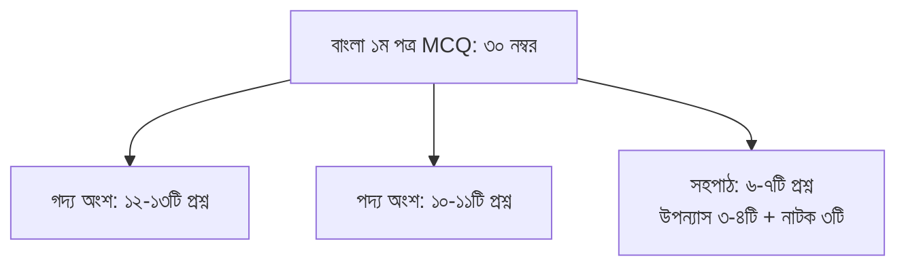
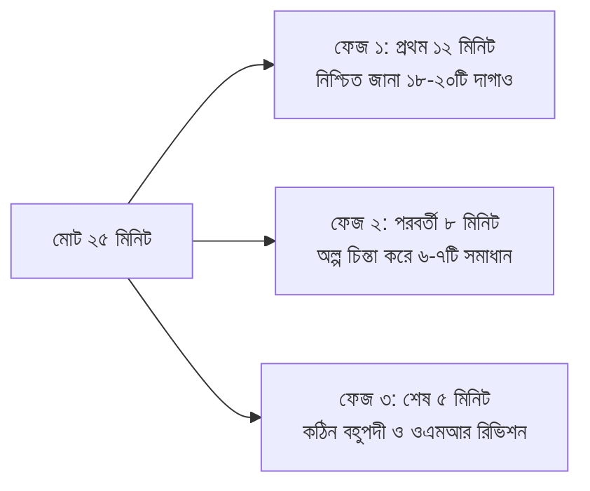

# এইচএসসি ২০২৬ বাংলা ১ম পত্র গুরুত্বপূর্ণ MCQ ও সমাধান: অধ্যায়ভিত্তিক সাজেশন PDF

উচ্চমাধ্যমিক পরীক্ষায় বিজ্ঞান, মানবিক কিংবা ব্যবসায় শিক্ষা—সব বিভাগের শিক্ষার্থীদের জন্য জিপিএ ৫.০০ (A+) নিশ্চিত করার সবচেয়ে বড় রক্ষাকবচ হলো **বাংলা ১ম পত্র**। আবার প্রতি বছর হাজারো মেধাবী শিক্ষার্থীর গোল্ডেন জিপিএ হাতছাড়া হয়ে যায় শুধু এই একটি বিষয়ের বহুনির্বাচনী (MCQ) অংশে মাত্র ৩-৪ নম্বর কম পাওয়ার কারণে।

সৃজনশীল অংশে লেখার ব্যাপ্তি ও হাতের লেখার কারণে শিক্ষকভেদে নম্বরের কিছুটা তারতম্য হতে পারে, কিন্তু বহুনির্বাচনী অংশে ৩০ নম্বরের মধ্যে ৩০-ই তুলে নেওয়া সম্পূর্ণ গাণিতিক। প্রতিটি সঠিক বৃত্ত ভরাটের জন্য তুমি পাচ্ছ সলিড ১ নম্বর। 

এই আর্টিকেলে ২০২৬ সালের এইচএসসি পরীক্ষার্থীদের জন্য বাংলা ১ম পত্রের পরিমার্জিত সিলেবাসভুক্ত প্রতিটি গদ্য, পদ্য ও সহপাঠ থেকে বিগত বছরগুলোর বোর্ড পরীক্ষার মোস্ট রিপিটেড MCQ কনসেপ্ট, সমাধান কৌশল এবং ২৫ মিনিটে ৩০টি দাগানোর টাইম ম্যানেজমেন্ট বিস্তারিত তুলে ধরা হলো।

> [!NOTE]
> **এক নজরে বহুনির্বাচনী পরীক্ষার কাঠামো**
> - **মোট পূর্ণমান:** ৩০ নম্বর (৩০টি প্রশ্ন থাকবে, প্রতিটির মান ১ নম্বর)।
> - **নির্ধারিত সময়:** ২৫ মিনিট (প্রতি প্রশ্নের জন্য গড়ে মাত্র ৫০ সেকেন্ড)।
> - **প্রশ্ন নির্বাচন:** কোনো বিকল্প বা চয়েস থাকবে না; ৩০টি প্রশ্নের সবগুলোর উত্তর দেওয়া বাধ্যতামূলক।
> - **পাস মার্ক:** ন্যূনতম ১০ নম্বর (৩০ এর মধ্যে)। তবে এ-প্লাস ধরে রাখতে টার্গেট থাকতে হবে ন্যূনতম ২৮+ নম্বর।

পরীক্ষার আগের রাতে গাইড বইয়ের হাজার হাজার প্রশ্ন মুখস্থ করার চেয়ে অধ্যায়ভিত্তিক গুরুত্বপূর্ণ কনসেপ্টগুলো বুঝে টেস্ট দেওয়া শতগুণ বেশি কার্যকরী। নিজের স্পিড ও নির্ভুলতা যাচাই করতে [অভ্যাস অ্যাপে বিনামূল্যে](/signup) এখনই বাংলা ১ম পত্রের অধ্যায়ভিত্তিক আনলিমিটেড MCQ ও বোর্ড স্ট্যান্ডার্ড টেস্ট দিয়ে নিজের রিয়েল-টাইম স্কোর দেখে নাও।

---

## ১. এক নজরে বাংলা ১ম পত্রের বহুনির্বাচনী মানবন্টন কাঠামো

বোর্ড পরীক্ষার মানদণ্ড অনুযায়ী ৩০টি বহুনির্বাচনী প্রশ্ন তিনটি মূল অংশ এবং চারটি শিখনফল স্তরের ওপর ভিত্তি করে সাজানো হয়:

### জ্ঞান ও দক্ষতার ৪টি স্তর:
1. **জ্ঞানমূলক প্রশ্ন (৪০%):** সরাসরি তথ্য, চরিত্র, উৎস গ্রন্থ, জন্ম-মৃত্যু সাল, পত্রিকা ও শব্দার্থ সংক্রান্ত।
2. **অনুধাবনমূলক প্রশ্ন (৩০%):** উক্তিটির অন্তর্নিহিত অর্থ, চরিত্রের মানসিক অবস্থা বা বিশেষ রূপকের তাৎপর্য।
3. **প্রয়োগমূলক প্রশ্ন (২০%):** উদ্দীপকের সাথে পাঠ্যবইয়ের সাদৃশ্য বা বৈসাদৃশ্য নির্ণয় সংক্রান্ত।
4. **উচ্চতর দক্ষতামূলক প্রশ্ন (১০%):** বহুপদী সমাপ্তিসূচক প্রশ্ন (i, ii ও iii) এবং সামগ্রিক ভাব বা মূল সুরের যথার্থতা বিচার।

---

## ২. গদ্য অংশের অধ্যায়ভিত্তিক মোস্ট ইম্পর্টেন্ট MCQ ও কনসেপ্ট সমাধান

গদ্য অংশে সাহিত্যিকদের অন্তর্নিহিত দর্শন, চরিত্রের পারস্পরিক সম্পর্ক এবং ঐতিহাসিক প্রেক্ষাপট থেকে সবচেয়ে বেশি প্রশ্ন আসে। নিচে নির্বাচিত প্রধান অধ্যায়গুলোর গুরুত্বপূর্ণ কনসেপ্ট বিশ্লেষণ করা হলো:

### ক. অপরিচিতা — রবীন্দ্রনাথ ঠাকুর
- **অনুপম ও শম্ভুনাথ সেন:** অনুপমের বয়স কত ছিল? (২৭ বছর)। অনুপমের মামা অনুপমের চেয়ে কত বছরের বড়? (মাত্র ৬ বছরের বড়)। কল্যাণীর বাবার পেশা কী ছিল? (তিনি একজন ডাক্তার ছিলেন)।
- **উক্তি ও ব্যঞ্জনা:** "আমি তো কন্যাকে গহনা দিয়া আশীর্বাদ করিয়াছিলাম"—উক্তিটি কার? (মামা)। "মেয়েটির বয়স যে পনেরো, তা তাহার মুখের দিকে চাহিলেই বোঝা যায়"—এখানে কী প্রকাশ পেয়েছে? (স্বাভাবিক সৌন্দর্য ও ব্যক্তিত্ব)।
- **ট্রেন্ডিং বোর্ড প্রশ্ন:** অনুপম নিজেকে কিসের সাথে তুলনা করেছে?  
  *সঠিক উত্তর:* গজাননের সাথে (যার কোনো স্বাধীন ইচ্ছা নেই, মামার আজ্ঞাবহ)।  
  *সমাধান নোট:* রবীন্দ্রনাথ এই গল্পে পণপ্রথার বিরুদ্ধে কল্যাণীর আত্মমর্যাদাবোধ এবং অনুপমের মানসিক দুর্বলতাকে তুলে ধরেছেন।

### খ. বিলাসী — শরৎচন্দ্র চট্টোপাধ্যায়
- **চরিত্র ও ঘটনাবলী:** বিলাসীর বাবার পেশা কী ছিল? (সাপুড়ে)। মৃত্যুঞ্জয়ের জাত কী ছিল? (মায়স্থ)। মৃত্যুঞ্জয়ের বাগানের আয়তন কত ছিল? (বিশাল আম-কাঁঠালের বাগান, যার আনুমানিক মূল্য ছিল হাজার কুড়ি টাকা)।
- **সামাজিক দর্শন:** "অন্নপাপ" কী? (জাতিভেদে অস্পৃশ্য জাতের হাতের অন্ন গ্রহণ করা)। বিলাসীর মৃত্যুর কারণ কী ছিল? (সাপের বিষ নয়, বরং আত্মহত্যার বিষপান)।
- **ট্রেন্ডিং বোর্ড প্রশ্ন:** ন্যাড়ার মতে সমাজের সবচেয়ে বড় নিষ্ঠুরতা কী?  
  *সঠিক উত্তর:* জাত-পাতের নামে সত্যিকারের নিঃস্বার্থ মানবপ্রেমকে অপবিত্র বলা।

### গ. আমার পথ — কাজী নজরুল ইসলাম
- **আত্মবিশ্বাস বনাম অহংকার:** "আমার কর্ণধার আমি"—এখানে নজরুলের আত্মোপলব্ধির প্রকাশ ঘটেছে। নজরুলের মতে কোনটি ভণ্ডামি? (ভেতরে বিশ্বাস না রেখে বাইরে মেনে নেওয়া)।
- **ভুলের মহত্ত্ব:** "ভুল করছি জেনেও তাকে ধরে থাকাটা হলো অন্যায়"—ভুলের মধ্য দিয়ে গিয়েই সত্যের সন্ধান পাওয়া যায়।
- **ট্রেন্ডিং বোর্ড প্রশ্ন:** নজরুলের সালাম কার উদ্দেশ্যে নিবেদিত?  
  *সঠিক উত্তর:* সত্যের উদ্দেশ্যে।

### ঘ. মাসি-পিসি — মানিক বন্দ্যোপাধ্যায়
- **চরিত্র ও দ্বন্দ্ব:** আহ্লাদীর বাবার নাম কী? (যদুপতি)। গোকুল ও কানাইয়ের চরিত্র কী রূপ? (নারীলোভী ও শোষক গ্রামীণ শ্রেণির প্রতিনিধি)। মাসি ও পিসির পেশা কী ছিল? (শালতি বেয়ে তরিতরকারি শহরে গিয়ে বিক্রি করা)।
- **প্রতিরোধের প্রতীক:** মাসি-পিসির হাতে থাকা দা ও বঁটি কিসের প্রতীক? (গ্রামীণ নারীদের টিকে থাকার লড়াই ও আত্মরক্ষার প্রত্যয়)।

### ঙ. রেইনকোট — আখতারুজ্জামান ইলিয়াস
- **চরিত্র রূপরেখা:** নুরুল হুদা কোন বিষয়ের প্রভাষক ছিলেন? (রসায়ন)। প্রিন্সিপাল আফাজ আহমদের চরিত্র কেমন? (পাকিস্তানি মিলিটারির দালাল ও চরম ভীতু)। নুরুল হুদার শ্যালকের নাম কী? (মিশিয়াক/মুগ্ধ মুক্তিযোদ্ধা বাসেত/আব্দুস সাত্তার মৃধা ও মিন্টু)।
- **রেইনকোটের রূপক অর্থ:** রেইনকোটটি কার ছিল? (মুক্তিযোদ্ধা মিন্টুর)। রেইনকোট গায়ে দিয়ে নুরুল হুদার ভেতর কী পরিবর্তন ঘটেছিল?  
  *সঠিক উত্তর:* কাপুরুষতা দূর হয়ে অদম্য দেশপ্রেম ও মুক্তিযুদ্ধের চেতনার উষ্ণতা জেগে উঠেছিল।

---

## ৩. পদ্য অংশের অধ্যায়ভিত্তিক মোস্ট ইম্পর্টেন্ট MCQ ও কনসেপ্ট সমাধান

কবিতার বহুনির্বাচনী প্রশ্নের ক্ষেত্রে চরণ বা পঙক্তির অর্থ, ছন্দ, অলংকার এবং রূপক প্রতীকের ওপর সবচেয়ে বেশি জোর দিতে হবে:

### ক. সোনার তরী — রবীন্দ্রনাথ ঠাকুর
- **রূপক বিশ্লেষণ:** ‘সোনার ধান’ কিসের প্রতীক? (মানুষের সৃষ্ট মহৎ কর্ম বা সৃষ্টিশীলতা)। ‘সোনার তরী’ কিসের প্রতীক? (মহাকালের চিরন্তন বহমানতা)।
- **কবির ট্র্যাজেডি:** "ঠাঁই নাই, ঠাঁই নাই—ছোট সে তরী / আমারি সোনার ধানে গিয়েছে ভরি"—এখানে মহাকাল কেবল সৃষ্টিকে গ্রহণ করে, কিন্তু ব্যক্তি স্রষ্টাকে গ্রহণ করে না।

### খ. বিদ্রোহী — কাজী নজরুল ইসলাম
- **পৌরাণিক ও ঐতিহাসিক অনুষঙ্গ:** 
  - পরশুরামের কুঠার (অন্যায় বিনাশকারী)।
  - বলরামের হাল (উৎপীড়িত কৃষকের অস্ত্র)।
  - ইন্দ্রাণীসূত (জয়ন্ত—দেবতাদের অহংকার চূর্ণকারী)।
- **কবিতার মূল সুর:** "যবে উৎপীড়িতের ক্রন্দন-রোল আকাশে বাতাসে ধ্বনিবে না / অত্যাচারীর খড়্গ কৃপাণ ভীম রণ-ভূমে রণিবে না"—বিদ্রোহীর চিরশান্ত হওয়ার শর্ত।

### গ. তাহারেই পড়ে মনে — সুফিয়া কামাল
- **নাটকীয় সংলাপ:** কবিতাটি কোন ধরনের কবিতা? (সংলাপপ্রধান ও বিষাদময় গীতি-কবিতা)।
- **ঋতু বনাম মনস্তত্ত্ব:** প্রকৃতিতে বসন্ত এলেও কবির মনে কিসের হাহাকার? (শীতের রিক্ততা ও প্রিয়জন বিয়োগের শোক)। কবি কাকে ভুলতে পারছেন না? (তাঁর প্রয়াত স্বামী ও সাহিত্যপ্রেরণাদাতা সৈয়দ নেহাল হোসেনকে)।

### ঘ. ১৮ বছর বয়স — সুকান্ত ভট্টাচার্য
- **বয়সের বৈশিষ্ট্য:** ১৮ বছর বয়স কী জানে না? (কাঁদতে জানে না)। এই বয়স কী দেয়? (তাজা তাজা প্রাণ)।
- **উক্তি:** "এ বয়সে প্রাণ তীব্র আর প্রখর / এ বয়সে কানে আসে কত মন্ত্রণা"—এখানে যৌবনের ইতিবাচক ও নেতিবাচক উভয় সম্ভাবনার কথাই বলা হয়েছে।

### ঙ. ফেব্রুয়ারি ১৯৬৯ — শামসুর রাহমান
- **ঐতিহাসিক প্রেক্ষাপট:** ঊনসত্তরের গণঅভ্যুত্থানের পটভূমি। বরকত ও সালামের আত্মত্যাগ।
- **প্রতীক:** ‘কৃষ্ণচূড়া ফুল’ কিসের প্রতীক? (শহীদের আত্মদান ও রক্তিম দেশপ্রেমের প্রতীক)।

---

## ৪. সহপাঠ (উপন্যাস ও নাটক) অংশের বহুনির্বাচনী হ্যাকস

সহপাঠ অংশে মোট ৬ থেকে ৭টি প্রশ্ন থাকে, যা উপন্যাস ‘লালসালু’ এবং নাটক ‘সিরাজউদ্দৌলা’ থেকে সমভাবে বণ্টিত হয়:

### ক. লালসালু — সৈয়দ ওয়ালীউল্লাহ
1. **মজিদের আগমন:** মজিদ কোন অঞ্চল থেকে মহব্বতনগরে এসেছিল? (গারো পাহাড় সংলগ্ন অনাহারক্লিষ্ট অঞ্চল থেকে)।
2. **ভণ্ডামির ভিত্তি:** কার মাজার দাবি করে লালসালু কাপড় জড়ানো হয়েছিল? (নাম না জানা মোদাচ্ছের পীরের)।
3. **চরিত্রের সংঘাত:** রহিমার অন্ধ বিশ্বাস বনাম জমিলার অবাধ্যতা। জমিলা মজিদের মুখে থুতু নিক্ষেপ করে ধর্মীয় ভণ্ডামির বিরুদ্ধে চরম বিদ্রোহ ঘোষণা করেছিল।
4. **প্রকৃতির রূপক:** উপন্যাসের শেষ বাক্য কোনটি?  
   *"বিশ্বাসকে ধরে রাখার জন্য মানুষ অন্ধ হয়ে যায়—'বিশ্বাস কর, খোদারে বিশ্বাস কর'।"*

### খ. সিরাজউদ্দৌলা — সিকান্দার আবু জাফর
1. **অঙ্ক ও দৃশ্য বিন্যাস:** নাটকটিতে মোট কতটি অঙ্ক ও দৃশ্য রয়েছে? (৪টি অঙ্ক ও ১২টি দৃশ্য)।
2. **ষড়যন্ত্রের কেন্দ্রবিন্দু:** ঘসেটি বেগমের মতিঝিল প্রাসাদ এবং মিরজাফরের প্রাসাদ।
3. **ঐতিহাসিক উক্তি:** 
   - *"বাংলার ভাগ্যাকাশে আজ দুর্যোগের ঘনঘটা"* — নবাব সিরাজউদ্দৌলা।
   - *"লর্ড ক্লাইভ যে চাল চেলেছেন, তার প্রতিটি চালই মাত"* — উমিচাঁদ।
   - *"মিরজাফর যদি নবাব হতে পারে, তবে শয়তানও স্বর্গে যেতে পারে"* — নবাবের প্রতি বিশ্বস্ত মীরমদন/মোহনলাল।

---

## ৫. বাংলা ২য় পত্র প্রশ্ন ২০২৬ এইচএসসি: ব্যাকরণ ও নির্মিতির সেতুবন্ধন

শিক্ষার্থীরা প্রায়ই বাংলা ১ম ও ২য় পত্রকে সম্পূর্ণ আলাদা বিষয় মনে করে ভুল করে। অথচ ব্যাকরণের স্পষ্ট ধারণা বাংলা ১ম পত্রের এমসিকিউতেও কাজে দেয়:

| ব্যাকরণিক অংশ (বাংলা ২য় পত্র) | নির্ধারিত নম্বর | পূর্ণ নম্বর তোলার স্ট্র্যাটেজি |
| :--- | :---: | :--- |
| **বাংলা উচ্চারণের নিয়ম** | ৫ নম্বর | ৫টি শব্দের সঠিক উচ্চারণ লিখলে পুরো ৫-এ ৫ পাওয়া যায় (তত্ত্বীয় নিয়মের চেয়ে শব্দ বেছে নেওয়া শ্রেয়)। |
| **বাংলা বানানের নিয়ম (ন-ত্ব ও ষ-ত্ব বিধান)** | ৫ নম্বর | অশুদ্ধ থেকে ৫টি শুদ্ধ বানান লেখা সবচেয়ে দ্রুততম ও নিরাপদ। |
| **ব্যাকরণিক শব্দশ্রেণি** | ৫ নম্বর | অনুচ্ছেদ থেকে বিশেষ্য, বিশেষণ, যোজক বা আবেগ শব্দ চিহ্নিতকরণ। |
| **শব্দ গঠন (উপসর্গ ও সমাস)** | ৫ নম্বর | ব্যাসবাক্য সহ সমাস নির্ণয় (দ্বিগু, কর্মধারয়, বহুব্রীহি ও তৎপুরুষ বেশি আসে)। |
| **বাক্যতত্ত্ব ও বাক্য রূপান্তর** | ৫ নম্বর | সরল, জটিল ও যৌগিক বাক্যের পারস্পরিক রূপান্তর। |
| **বাংলা ভাষার অপপ্রয়োগ ও শুদ্ধপ্রয়োগ** | ৫ নম্বর | বাক্য শুদ্ধিকরণ চর্চা করলে সৃজনশীল লেখার ব্যাকরণগত ভুল দূর হয়। |

> [!TIP]
> বাংলা ২য় পত্রের ব্যাকরণের ৩০ নম্বরে যারা ২৬+ পায়, তাদের সামগ্রিক জিপিএ ৫.০০ নিশ্চিত হওয়া শতভাগ সহজ হয়ে যায়। এই অংশে ফুল মার্কস তুলতে প্রতিদিন অন্তত ২০ মিনিট ব্যাকরণিক সূত্রের প্র্যাকটিস জরুরি।

---

## ৬. ওএমআর (OMR) শিটে ৩০-এ ৩০ পাওয়ার স্ট্র্যাটেজি ও সময় বণ্টন

২৫ মিনিটে ৩০টি এমসিকিউ দাগানো মানে প্রতি প্রশ্নের জন্য গড়ে **৫০ সেকেন্ড**। এই ৫০ সেকেন্ডকে কাজে লাগানোর জন্য আমাদের প্রমাণিত **৩-ফেজ টেকনিক (Three-Phase Method)** ব্যবহার করো:

### বহুপদী সমাপ্তিসূচক (i, ii ও iii) প্রশ্ন সমাধানের এলিমিনেশন টেকনিক:
অধিকাংশ শিক্ষার্থী এই প্রশ্নে আটকে যায়। সমাধান করার সহজ নিয়ম:
1. তিনটি বিবৃতির মধ্যে সবার আগে খোঁজো কোনটি **শতভাগ ভুল**।
2. যদি নিশ্চিত হও যে (ii) নম্বরটি ভুল, তবে অপশনগুলো দেখো: যেখানে যেখানে (ii) আছে (যেমন: ক. i ও ii, গ. ii ও iii, ঘ. i, ii ও iii) সেগুলোকে শুরুতেই কেটে বাদ দিয়ে দাও।
3. অবশিষ্ট অপশনটিই (যেমন: খ. i ও iii) স্বয়ংক্রিয়ভাবে সঠিক উত্তর হয়ে যাবে! পুরো প্রশ্ন পড়ে সময় নষ্ট করার দরকারই হবে না।

---

## ৭. টপ ৫ সাধারণ ভুল যা বাংলাতে এ প্লাস নষ্ট করে

বিগত কয়েক বছরের খাতা মূল্যায়ন ও শিক্ষার্থীদের ওএমআর বিশ্লেষণের ভিত্তিতে পাওয়া ৫টি মারাত্মক ভুল:

### ভুল ১: কবি ও লেখকের নামের বানান ভুল জানা
অনেকে মাইকেল মধুসূদন, রবীন্দ্রনাথ, শরৎচন্দ্র, বিভূতিভূষণ বা শামসুর রাহমানের নামের বানানে অসাবধান থাকে এবং ওএমআরে ভুল অপশনটি দাগিয়ে আসে।

### ভুল ২: জন্ম-মৃত্যু সাল নিয়ে অতিরিক্ত সময় নষ্ট করা
বোর্ডের প্রশ্নকর্তারা এখন সাল-তারিখের চেয়ে গল্পের মূল ভাব ও রূপক অর্থ থেকে বেশি প্রশ্ন করেন। অহেতুক শত শত অপ্রয়োজনীয় সাল মুখস্থ করতে গিয়ে গল্পের থিম ভুলে যাওয়া চরম বোকামি।

### ভুল ৩: উদ্দীপক না পড়ে সরাসরি প্রশ্ন দাগানো
প্রয়োগমূলক প্রশ্নে উদ্দীপকের চরিত্র আর পাঠ্যবইয়ের চরিত্রের মধ্যে সূক্ষ্ম তফাত থাকে। উদ্দীপকের পুরো ভাবার্থ না বুঝে হুট করে উত্তর দাগালে ভুল হওয়ার সম্ভাবনা ৯০%।

### ভুল ৪: ওএমআর সিরিয়াল মিসিং
৮ নম্বর প্রশ্নের উত্তর ৯ নম্বরের বৃত্তে ভরাট করে ফেলা। একবার একটি সিরিয়াল এলোমেলো হলে পরবর্তী ৫-৬টি প্রশ্ন একের পর এক ভুল বৃত্তে ভরাট হয়ে পুরো পরীক্ষা নষ্ট হয়ে যায়।  
**করণীয়:** প্রতি ৫টি প্রশ্ন দাগানোর পর ওএমআর নম্বরের সাথে প্রশ্নপত্রের নম্বর একবার মিলিয়ে নেওয়া।

### ভুল ৫: মডেল টেস্ট না দিয়ে সরাসরি পরীক্ষা হলে যাওয়া
বইয়ের প্রশ্ন আর পরীক্ষার হলে ঘড়ির কাঁটার বিপরীতে প্রশ্ন সমাধানের মধ্যে আকাশ-পাতাল তফাত থাকে।

---

## ৮. বাংলা ১ম পত্র MCQ নিয়ে সচরাচর জিজ্ঞাসিত প্রশ্নাবলী (FAQ)

### ১. বাংলা ১ম পত্রের জন্য কোন বই সবচেয়ে ভালো?
জাতীয় শিক্ষাক্রম ও পাঠ্যপুস্তক বোর্ড (NCTB) কর্তৃক প্রকাশিত মূল ‘সাহিত্যপাঠ’ এবং ‘সহপাঠ’ বই-ই হলো একমাত্র বেদবাক্য। যেকোনো গাইড বই পড়ার আগে মূল বইয়ের প্রতিটি অধ্যায় অন্তত ৩ বার লাইন বাই লাইন পড়া বাধ্যতামূলক।

### ২. বহুনির্বাচনী অংশে নেগেটিভ মার্কিং আছে কি?
না, এসএসসি বা এইচএসসি বোর্ড পরীক্ষায় কোনো প্রকার নেগেটিভ মার্কিং থাকে না। তাই কোনো প্রশ্নের উত্তর নিশ্চিত জানা না থাকলেও কোনো বৃত্ত ফাঁকা রেখে আসবে না; যুক্তিসঙ্গত অনুমানের ভিত্তিতে সবকটি বৃত্ত ভরাট করবে।

### ৩. সহপাঠ (উপন্যাস ও নাটক) থেকে কি হুবহু উদ্ধৃতিভিত্তিক প্রশ্ন আসে?
হ্যাঁ, বিশেষ করে মজিদ, খালেক ব্যাপারী, জমিলা এবং নাটকে সিরাজউদ্দৌলা, ক্লাইভ ও মিরজাফরের গুরুত্বপূর্ণ সংলাপগুলো কার উদ্দেশ্যে বলা হয়েছিল—তা জানতে চেয়ে প্রতি বছর প্রশ্ন থাকে।

### ৪. বোর্ড পরীক্ষার প্রশ্ন কি বিভিন্ন বোর্ডের জন্য আলাদা হয়?
হ্যাঁ, ঢাকা, কুমিল্লা, রাজশাহীসহ প্রতিটি শিক্ষা বোর্ডের জন্য পৃথক প্রশ্নপত্র প্রণয়ন করা হয়। তবে প্রতিটি বোর্ডের সিলেবাস ও প্রশ্নের স্ট্যান্ডার্ড সম্পূর্ণ অভিন্ন থাকে।

### ৫. বাংলা ১ম পত্রে সৃজনশীল ও এমসিকিউতে কি আলাদা পাস করতে হয়?
অবশ্যই। সৃজনশীলে ৭০ এর মধ্যে ন্যূনতম ২৩ এবং বহুনির্বাচনীতে ৩০ এর মধ্যে ন্যূনতম ১০ পেয়ে পৃথকভাবে পাস করতে হবে।

---

## ৯. প্রস্তুতি সম্পন্ন করার পরবর্তী পদক্ষেপ

বাংলা ১ম পত্রে ৩০-এ ৩০ পাওয়ার একমাত্র চাবিকাঠি হলো সেলফ-টেস্টিং। অধ্যায় শেষ করার সাথে সাথে ঘড়ি ধরে টেস্ট দেওয়ার কোনো বিকল্প নেই।

বোর্ড পরীক্ষার রুটিন ও সার্বিক সময়সূচি এক নজরে পেতে আমাদের [এইচএসসি রুটিন ২০২৬ ও পিডিএফ ডাউনলোড](/blog/hsc-2026-exam-date-routine-pdf) গাইডটি দেখে নাও। আর বিজ্ঞান ও মানবিক বিভাগের সকল বিষয়ের সিলেবাস ও পূর্ণাঙ্গ নম্বর কাঠামোর জন্য [এইচএসসি ২০২৬ শর্ট সিলেবাস ও মানবন্টন](/blog/hsc-2026-short-syllabus-marks-distribution) পড়ে নিজের রিভিশন প্ল্যান গুছিয়ে ফেলো।

নিজের প্রস্তুতি নিয়ে আত্মবিশ্বাসী হও, নিয়মিত চর্চা চালিয়ে যাও। ইনশাআল্লাহ বাংলায় সর্বোচ্চ নম্বর পেয়ে তোমার জিপিএ ৫.০০ নিশ্চিত হবে!
