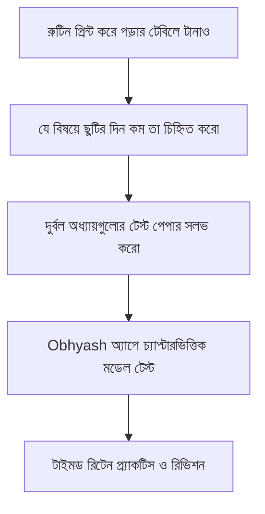

**HSC 2026 পরীক্ষা কবে শুরু হবে?** মাধ্যমিক ও উচ্চমাধ্যমিক শিক্ষা বোর্ডের খসড়া অ্যাকাডেমিক ক্যালেন্ডার অনুযায়ী, ২০২৬ সালের এইচএসসি পরীক্ষা আগামী **মে ২০২৬-এর দ্বিতীয় সপ্তাহে** শুরু হতে যাচ্ছে। ঢাকা, চট্টগ্রাম, রাজশাহীসহ দেশের মোট ৯টি সাধারণ শিক্ষা বোর্ড, মাদ্রাসা বোর্ড (আলিম) এবং কারিগরি শিক্ষা বোর্ডের জন্য অভিন্ন রুটিন প্রকাশ করা হবে এবং লিখিত পরীক্ষা একটানা প্রায় ৪৫ দিন ধরে অনুষ্ঠিত হবে।

প্রতি বছর পরীক্ষার কয়েক মাস আগে থেকেই রুটিন নিয়ে শিক্ষার্থীদের মাঝে বিপুল কৌতূহল ও জল্পনা-কল্পনা তৈরি হয়। সঠিক সময়ে রুটিন ও সময়সূচী জানা থাকলে প্রতিটি বিষয়ের রিভিশন এবং মডেল টেস্ট প্ল্যান সুন্দরভাবে সাজানো সম্ভব।

---

## ১. এক নজরে এইচএসসি ২০২৬ পরীক্ষার মূল তথ্যাবলী

| তথ্যের বিবরণ | অফিশিয়াল স্ট্যাটাস ও সম্ভাব্য তারিখ |
| :--- | :--- |
| **পরীক্ষার নাম** | উচ্চমাধ্যমিক সার্টিফিকেট (HSC) পরীক্ষা ২০২৬ |
| **পরীক্ষা নিয়ন্ত্রণকারী কর্তৃপক্ষ** | বাংলাদেশ আন্তঃশিক্ষা বোর্ড সমন্বয় কমিটি |
| **পরীক্ষা শুরুর সম্ভাব্য মাস** | মে ২০২৬ (২য় সপ্তাহ) |
| **অফিশিয়াল রুটিন প্রকাশের সময়** | ফেব্রুয়ারি / মার্চ ২০২৬ |
| **পরীক্ষার মোট সময়কাল** | ৪৫ থেকে ৫০ দিন (ব্যবহারিক সহ) |
| **পরীক্ষার শিফট** | সকাল শিফট (১০:০০ – ১:০০) ও দুপুর শিফট (২:০০ – ৫:০০) |
| **প্রশ্নপত্রের কাঠামো** | সৃজনশীল প্রশ্ন (CQ) ও বহুনির্বাচনী প্রশ্ন (MCQ) |
| **অফিশিয়াল ওয়েবসাইট** | [dhakaeducationboard.gov.bd](https://dhakaeducationboard.gov.bd) |

---

## ২. এইচএসসি ২০২৬ বিষয়ভিত্তিক খসড়া সময়সূচী (সম্ভাব্য রুটিন)

বোর্ডের বিগত বছরগুলোর ধারাবাহিকতা এবং শিক্ষা মন্ত্রণালয়ের পরীক্ষা সময়সূচীর নিয়ম অনুযায়ী ২০২৬ সালের এইচএসসি পরীক্ষার খসড়া বিষয়ভিত্তিক রুটিন নিচে উপস্থাপন করা হলো:

| বিষয় | বিষয় কোড | পরীক্ষার সম্ভাব্য তারিখ | সময় ও শিফট |
| :--- | :---: | :---: | :--- |
| **বাংলা ১ম পত্র** ([MCQ সাজেশন ও সমাধান](/blog/hsc-2026-bangla-1st-paper-mcq-solutions)) | ১০১ | ১২ মে ২০২৬ | সকাল ১০:০০ – দুপুর ১:০০ |
| **বাংলা ২য় পত্র** | ১০২ | ১৪ মে ২০২৬ | সকাল ১০:০০ – দুপুর ১:০০ |
| **ইংরেজি ১ম পত্র** | ১০৭ | ১৭ মে ২০২৬ | সকাল ১০:০০ – দুপুর ১:০০ |
| **ইংরেজি ২য় পত্র** | ১০৮ | ১৯ মে ২০২৬ | সকাল ১০:০০ – দুপুর ১:০০ |
| **তথ্য ও যোগাযোগ প্রযুক্তি (ICT)** | ২৭৫ | ২২ মে ২০২৬ | সকাল ১০:০০ – দুপুর ১:০০ |
| **পদার্থবিজ্ঞান ১ম পত্র** / হিসাববিজ্ঞান ১ম পত্র | ১৭৪ / ২৫৩ | ২৪ মে ২০২৬ | সকাল ১০:০০ – দুপুর ১:০০ |
| **পদার্থবিজ্ঞান ২য় পত্র** / হিসাববিজ্ঞান ২য় পত্র | ১৭৫ / ২৫৪ | ২৬ মে ২০২৬ | সকাল ১০:০০ – দুপুর ১:০০ |
| **রসায়ন ১ম পত্র** / ব্যবসায় সংগঠন ১ম পত্র | ১৭৬ / ২৭৭ | ২৯ মে ২০২৬ | সকাল ১০:০০ – দুপুর ১:০০ |
| **রসায়ন ২য় পত্র** / ব্যবসায় সংগঠন ২য় পত্র | ১৭৭ / ২৭৮ | ৩১ মে ২০২৬ | সকাল ১০:০০ – দুপুর ১:০০ |
| **উচ্চতর গণিত ১ম পত্র** / পৌরনীতি ১ম পত্র | ২৬৫ / ২৬৯ | ০২ জুন ২০২৬ | সকাল ১০:০০ – দুপুর ১:০০ |
| **উচ্চতর গণিত ২য় পত্র** / পৌরনীতি ২য় পত্র | ২৬৬ / ২৭০ | ০৪ জুন ২০২৬ | সকাল ১০:০০ – দুপুর ১:০০ |
| **জীববিজ্ঞান ১ম পত্র** / অর্থনীতি ১ম পত্র | ১৭৮ / ১০৯ | ০৭ জুন ২০২৬ | সকাল ১০:০০ – দুপুর ১:০০ |
| **জীববিজ্ঞান ২য় পত্র** / অর্থনীতি ২য় পত্র | ১৭৯ / ১১০ | ০৯ জুন ২০২৬ | সকাল ১০:০০ – দুপুর ১:০০ |

### এইচএসসি পরীক্ষার রুটিন ২০২৬ মানবিক শাখা

মানবিক বিভাগের পরীক্ষার্থীদের জন্য আবশ্যিক বিষয়ের (বাংলা, ইংরেজি, আইসিটি) পাশাপাশি বিভাগীয় ঐচ্ছিক ও নৈর্বাচনিক বিষয়সমূহের সময়সূচি:

| মানবিক বিষয়ের নাম | বিষয় কোড | পরীক্ষার সম্ভাব্য তারিখ | পরীক্ষার শিফট |
| :--- | :---: | :---: | :--- |
| **পৌরনীতি ও সুশাসন ১ম পত্র** | ২৬৯ | ০২ জুন ২০২৬ | সকাল ১০:০০ – দুপুর ১:০০ |
| **পৌরনীতি ও সুশাসন ২য় পত্র** | ২৭০ | ০৪ জুন ২০২৬ | সকাল ১০:০০ – দুপুর ১:০০ |
| **অর্থনীতি ১ম পত্র** | ১০৯ | ০৭ জুন ২০২৬ | সকাল ১০:০০ – দুপুর ১:০০ |
| **অর্থনীতি ২য় পত্র** | ১১০ | ০৯ জুন ২০২৬ | সকাল ১০:০০ – দুপুর ১:০০ |
| **যুক্তিবিদ্যা ১ম পত্র** | ১২১ | ১১ জুন ২০২৬ | সকাল ১০:০০ – দুপুর ১:০০ |
| **যুক্তিবিদ্যা ২য় পত্র** | ১২২ | ১৩ জুন ২০২৬ | সকাল ১০:০০ – দুপুর ১:০০ |
| **ইতিহাস / ইসলামের ইতিহাস ১ম পত্র** | ৩০৩ / ২৬৭ | ১৬ জুন ২০২৬ | সকাল ১০:০০ – দুপুর ১:০০ |
| **ইতিহাস / ইসলামের ইতিহাস ২য় পত্র** | ৩০৪ / ২৬৮ | ১৮ জুন ২০২৬ | সকাল ১০:০০ – দুপুর ১:০০ |
| **সমাজবিজ্ঞান / সমাজকর্ম ১ম পত্র** | ১১৭ / ২৭১ | ২১ জুন ২০২৬ | সকাল ১০:০০ – দুপুর ১:০০ |
| **সমাজবিজ্ঞান / সমাজকর্ম ২য় পত্র** | ১১৮ / ২৭২ | ২৩ জুন ২০২৬ | সকাল ১০:০০ – দুপুর ১:০০ |
| **ভূগোল ১ম পত্র (তত্ত্বীয়)** | ১২৫ | ২৫ জুন ২০২৬ | সকাল ১০:০০ – দুপুর ১:০০ |
| **ভূগোল ২য় পত্র (তত্ত্বীয়)** | ১২৬ | ২৭ জুন ২০২৬ | সকাল ১০:০০ – দুপুর ১:০০ |

> [!NOTE]
> শিক্ষা বোর্ড কর্তৃক চূড়ান্ত রুটিন জারির সাথে সাথে আমাদের এই টেবিলটি আপডেট করা হবে এবং অফিশিয়াল স্বাক্ষরিত নোটিশ যুক্ত করে দেওয়া হবে।

---

## ৩. পরীক্ষার হলে সময় ব্যবস্থাপনা ও নম্বর বণ্টন

এইচএসসি পরীক্ষায় সৃজনশীল ও বহুনির্বাচনী উভয় অংশেই নির্ধারিত সময়ে সর্বোচ্চ নম্বর তোলা একটি বড় চ্যালেঞ্জ।

* **বহুনির্বাচনী পরীক্ষা (MCQ):** সময় ২৫ মিনিট (২৫টি প্রশ্নের জন্য)। প্রতিটি প্রশ্নের মান ১ নম্বর।
* **সৃজনশীল পরীক্ষা (CQ):** সময় ২ ঘণ্টা ৩৫ মিনিট। সাধারণত ৮টি প্রশ্নের মধ্যে ৫টি প্রশ্নের উত্তর দিতে হয় (প্রতি প্রশ্নের মান ১০ নম্বর)।
* **ব্যবহারিক পরীক্ষা (Practical):** মূল লিখিত পরীক্ষা শেষ হওয়ার ঠিক এক সপ্তাহের মধ্যে নিজ নিজ কেন্দ্রে বা নির্ধারিত ভেন্যুতে অনুষ্ঠিত হবে।

> [!TIP]
> **⏰ পরীক্ষার হলে সময়ের ভয় দূর করতে চাও?**  
> অনেক শিক্ষার্থী সব প্রশ্নের উত্তর জানা সত্ত্বেও সময়মতো লিখে শেষ করতে পারে না। Obhyash অ্যাপের লাইভ টাইমার সহ প্রতিটি বিষয়ের চ্যাপ্টারওয়াইজ কুইজ ও ফুল মডেল টেস্ট দিয়ে নিজের স্পিড বাড়াও।  
> 👉 **[Obhyash অ্যাপে এখনই ফ্রি মডেল টেস্ট দাও](https://play.google.com/store/apps/details?id=com.obhyash.app)**

---

## ৪. কীভাবে শিক্ষা বোর্ডের অফিশিয়াল রুটিন PDF ডাউনলোড করবেন?

রুটিন প্রকাশের পর সামাজিক যোগাযোগ মাধ্যমে অনেক সময় ভুয়া বা এডিটেড রুটিন ছড়িয়ে পড়ে। সঠিক ও অফিশিয়াল রুটিন পাওয়ার নিরাপদ ধাপসমূহ:

1. প্রথমে ঢাকা শিক্ষা বোর্ডের অফিসিয়াল ওয়েবসাইটে যান: `dhakaeducationboard.gov.bd`।
2. হোমপেজের **‘এইচএসসি কর্নার’ (HSC Corner)** অপশনে ক্লিক করুন।
3. **“এইচএসসি পরীক্ষা ২০২৬-এর সময়সূচী সংক্রান্ত বিজ্ঞপ্তি”** নোটিশটি খুঁজে বের করুন।
4. নোটিশের পাশে থাকা **Download (PDF)** আইকনে ক্লিক করে ফাইলটি আপনার ফোনে বা কম্পিউটারে সেভ করে নিন।
5. অথবা নিচের সরাসরি হাই-স্পিড ডাউনলোড বাটন থেকে এক ক্লিকেই সংগ্রহ করে নিন:

> [!TIP]
> ### 📥 এইচএসসি ২০২৬ অফিসিয়াল রুটিন PDF ডাউনলোড
> পরীক্ষার্থীদের সুবিধার্থে শিক্ষা বোর্ডের সর্বশেষ বিজ্ঞপ্তির হাই-রেজোলিউশন PDF নিচে সরাসরি যুক্ত করা হয়েছে। কোনো ঝামেলা ছাড়াই এক ক্লিকে ডাউনলোড বা লাইভ প্রিভিউ করতে পারবে:
> 
> 📄 **[👉 HSC 2026 Exam Routine PDF Download (Cloud CDN)](https://assets.obhyash.com/pdf/hsc-2026-routine.pdf)** *(হাই-স্পিড ডাইরেক্ট ডাউনলোড)*  
> 🌐 **[ঢাকা শিক্ষা বোর্ড অফিশিয়াল নোটিশ পেজ (বিকল্প লিংক)](https://dhakaeducationboard.gov.bd)**
> 
> *(ফাইল সাইজ: ১.১২ MB | ঢাকা সহ সকল সাধারণ শিক্ষা বোর্ডের জন্য প্রযোজ্য)*

### 📑 রুটিন লাইভ প্রিভিউ (সরাসরি পড়ুন)

  <iframe src="https://assets.obhyash.com/pdf/hsc-2026-routine.pdf" width="100%" height="680px" style="border: none; display: block;">
    
আপনার ব্রাউজারে PDF ফ্রেমটি সাপোর্ট না করলে <a href="https://assets.obhyash.com/pdf/hsc-2026-routine.pdf">এখানে ক্লিক করে ডাউনলোড করুন</a>।

  </iframe>

---

## ৫. পরীক্ষার হলের জন্য বোর্ডের গুরুত্বপূর্ণ নির্দেশাবলী

পরীক্ষার্থীদের সুবিধার্থে শিক্ষা বোর্ড কর্তৃক জারিকৃত ১০টি বাধ্যতামূলক নিয়ম নিচে উল্লেখ করা হলো:

1. পরীক্ষা শুরুর অন্তত **৩০ মিনিট পূর্বে** পরীক্ষার্থীদের অবশ্যই পরীক্ষার কক্ষে আসন গ্রহণ করতে হবে।
2. প্রথমে বহুনির্বাচনী (MCQ) এবং পরবর্তীতে সৃজনশীল/রচনামূলক (CQ) পরীক্ষা অনুষ্ঠিত হবে।
3. ওএমআর (OMR) শিটে রোল নম্বর, রেজিস্ট্রেশন নম্বর এবং বিষয় কোড যথাযথভাবে বৃত্ত ভরাট করতে হবে। মার্জিন বা অন্য কোথাও কোনো অপ্রয়োজনীয় দাগ দেওয়া সম্পূর্ণ নিষেধ।
4. সাধারণ সায়েন্টিফিক ক্যালকুলেটর (নন-প্রোগ্রামেবল) ব্যবহার করা যাবে, তবে কোনো প্রকার মেমোরি স্টোরেজ সমৃদ্ধ ক্যালকুলেটর গ্রহণযোগ্য নয়।
5. পরীক্ষাকেন্দ্রে মোবাইল ফোন, স্মার্টওয়াচ বা যেকোনো প্রকার ইলেকট্রনিক ডিভাইস বহন সম্পূর্ণ নিষিদ্ধ। শুধুমাত্র কেন্দ্র সচিব ফিচার ফোন ব্যবহারের অনুমতি পান।
6. মূল প্রবেশপত্র (Admit Card) এবং রেজিস্ট্রেশন কার্ডের মূল কপি প্রতিদিন সাথে রাখতে হবে।

---

## ৬. রুটিন প্রকাশের পর যেভাবে সাজাবে তোমার রিভিশন স্ট্র্যাটেজি

রুটিন হাতে পাওয়ার পর পড়ার গতি দ্বিগুণ করা ছাড়া বিকল্প নেই। নিচের ধাপগুলো অনুসরণ করলে পরীক্ষার হলে শতভাগ আত্মবিশ্বাস ধরে রাখা যাবে:

* **ছুটি কম থাকা বিষয়গুলো আগেই শেষ করো:** রুটিনে সাধারণত ইংরেজি ১ম ও ২য় পত্রের মাঝে এবং ফিজিক্স/কেমিস্ট্রির মাঝে ছুটি কম থাকে। এই বিষয়গুলো পরীক্ষার ১ মাস আগেই এমনভাবে রিভিশন দাও যেন পরীক্ষার আগের রাতে শুধু চোখ বুলালেই চলে।
* **বিগত বছরের প্রশ্ন সলভিং:** বিগত ৫ বছরের বোর্ড প্রশ্ন এবং স্বনামধন্য কলেজের টেস্ট পরীক্ষার প্রশ্ন সমাধান করো।

> [!IMPORTANT]
> তোমার প্রস্তুতির ঘাটতি পূরণ করতে এবং প্রতিটি বিষয়ের গুরুত্বপূর্ণ অধ্যায়গুলো দেখে নিতে পড়তে পারো আমাদের [HSC 3 মাসের কমপ্লিট স্টাডি রুটিন](/blog/hsc-2026-last-3-month-revision-routine) এবং [HSC ফিজিক্স ১ম পত্র ফর্মুলা শিট](/blog/hsc-physics-1st-paper-formula)।

---

## ❓ প্রায়শই জিজ্ঞাসিত প্রশ্নাবলী (FAQ)

### ১. এইচএসসি ২০২৬ রুটিন কবে প্রকাশ করা হবে?
সাধারণত পরীক্ষা শুরুর ২ থেকে ৩ মাস আগে অর্থাৎ ফেব্রুয়ারি বা মার্চ ২০২৬-এর মধ্যে শিক্ষা বোর্ডগুলোর অফিশিয়াল ওয়েবসাইটে রুটিন প্রকাশ করা হয়।

### ২. সকল শিক্ষা বোর্ডের রুটিন কি একই দিনে হয়?
হ্যাঁ, সাধারণ ৯টি শিক্ষা বোর্ডের অধীনে তত্ত্বীয় (লিখিত) বিষয়গুলোর পরীক্ষা একই তারিখে ও অভিন্ন রুটিনে অনুষ্ঠিত হয়। শুধুমাত্র মাদ্রাসা (আলিম) ও কারিগরি বোর্ডের পরীক্ষার রুটিন কিছুটা ভিন্ন তারিখে হতে পারে।

### ৩. পরীক্ষায় ক্যালকুলেটর ব্যবহারে কোনো নিষেধাজ্ঞা আছে কি?
পরীক্ষায় সাধারণ নন-প্রোগ্রামেবল ক্যালকুলেটর (যেমন: Casio fx-991ES, 991EX, 100MS ইত্যাদি) ব্যবহার করা যায়। তবে প্রোগ্রামিং করা যায় এমন ক্যালকুলেটর ব্যবহার করা সম্পূর্ণ নিষিদ্ধ।

### ৪. প্রবেশপত্র (Admit Card) কখন এবং কোথা থেকে সংগ্রহ করতে হবে?
পরীক্ষা শুরুর সাধারণত ১ থেকে ২ সপ্তাহ আগে নিজ নিজ কলেজ থেকে অধ্যক্ষের স্বাক্ষরযুক্ত মূল প্রবেশপত্র ও আসন বিন্যাস সংগ্রহ করতে হয়।

---

## 🎯 চূড়ান্ত প্রস্তুতি হোক অব্যাশের সাথে
পরীক্ষার রুটিন কেবল একটি সময়সূচী নয়, এটি তোমার স্বপ্নের বিশ্ববিদ্যালয়ে পৌঁছানোর চূড়ান্ত কাউন্টডাউন। সময় নষ্ট না করে আজ থেকেই প্রতিদিনের ছোট ছোট টার্গেট পূরণ করো। 

হাজারো এইচএসসি পরীক্ষার্থীর সাথে লাইভ এক্সাম দিয়ে লিডারবোর্ডে নিজের রিয়েল-টাইম মেধা যাচাই করতে এখনই যুক্ত হও Obhyash-এ।

📲 **গুগল প্লে স্টোর থেকে ফ্রি ইনস্টল করো — [Obhyash App Download Link](https://play.google.com/store/apps/details?id=com.obhyash.app)**
