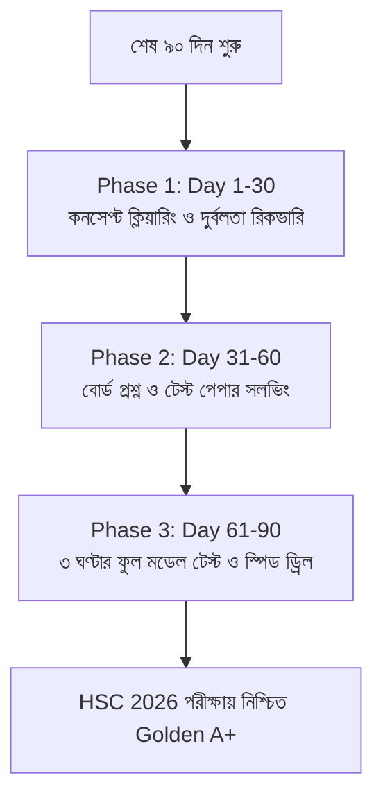

> **এইচএসসি পরীক্ষার শেষ ৩ মাসে (৯০ দিনে) সিলেবাস শেষ করে রিভিশন দেওয়ার সবচেয়ে কার্যকর নিয়ম কি?** শিক্ষা বিশেষজ্ঞ ও বোর্ড টপারদের মতে, ৯০ দিনকে **৩০-৩০-৩০ ফর্মুলায়** ৩টি ধাপে ভাগ করে নেওয়া সবচেয়ে বৈজ্ঞানিক পদ্ধতি:
> 1. **প্রথম ৩০ দিন (Day 1 - 30):** দুর্বল অধ্যায়গুলোর কনসেপ্ট ক্লিয়ার করা ও টেক্সটবুক সামারি নোট শেষ করা।
> 2. **দ্বিতীয় ৩০ দিন (Day 31 - 60):** বিগত ৫ বছরের বোর্ড প্রশ্ন এবং শীর্ষ ২০টি কলেজের টেস্ট পেপার CQ ও MCQ সমাধান।
> 3. **শেষ ৩০ দিন (Day 61 - 90):** ফুল সিলেবাসের ওপর ঘড়ি ধরে ৩ ঘণ্টার পূর্ণাঙ্গ মডেল টেস্ট দেওয়া এবং মিস্টেক খাতা বারবার রিভিশন করা।

এইচএসসি পরীক্ষার আর মাত্র ৩ মাস বাকি—এই সময়টিতে এসে বেশিরভাগ শিক্ষার্থীই এক ধরনের তীব্র মানসিক অস্থিরতা বা "Exam Panic"-এ ভোগে। মনে হয়, "এতদিন তো অনেক সময় নষ্ট করে ফেলেছি, এখন কি আর জিপিএ ৫ বা গোল্ডেন A+ পাওয়া সম্ভব?"

বাস্তবতা হলো, বিগত বছরগুলোর পরিসংখ্যান বলছে—**এইচএসসির চূড়ান্ত ফলাফল নির্ধারিত হয় শেষ ৯০ দিনের পড়াশোনার কৌশলের ওপর ভিত্তি করে।** আপনি আগের দেড় বছর কত ঘণ্টা পড়েছেন তার চেয়ে অনেক বেশি গুরুত্বপূর্ণ হলো শেষ ৩ মাস আপনি কতটা নিয়মতান্ত্রিকভাবে সময়কে কাজে লাগাচ্ছেন।

এই আর্টিকেলে রয়েছে শেষ ৯০ দিনের একটি বাস্তবসম্মত ডে-বাই-ডে রিভিশন রোডম্যাপ, যা অনুসরণ করলে আপনি যেকোনো বিভাগ (বিজ্ঞান, মানবিক বা বাণিজ্য) থেকেই সর্বোচ্চ ফলাফল নিশ্চিত করতে পারবেন।

---

## ১. ৯০ দিনের ৩-ফেজ (3-Phase) মাস্টার রোডম্যাপ

### 🔹 ফেজ ১: ডে ১ থেকে ৩০ (ফাউন্ডেশন ও ব্যাকলগ ক্লিয়ারেন্স)
* যে অধ্যায়গুলো আগে একদম পড়া হয়নি বা যেসব টপিকে এখনো ভয় কাজ করে, সেগুলোর জন্য প্রতিদিন নির্দিষ্ট ২ ঘণ্টা আলাদা বরাদ্দ রাখুন।
* অধ্যায়ের লাইন বাই লাইন পড়ার পরিবর্তে প্রতিটি বিষয়ের **বোর্ড স্ট্যান্ডার্ড মোস্ট ইমপর্ট্যান্ট টপিক তালিকা** ধরে পড়াশোনা করুন।
* প্রতিটি অধ্যায় শেষে নিজে নিজে ১ পাতার একটি **"ফর্মুলা ও কি-পয়েন্ট শিট"** তৈরি করে রাখুন।

### 🔹 ফেজ ২: ডে ৩১ থেকে ৬০ (প্রশ্ন সমাধান ও প্যাটার্ন মাস্টারি)
* বিগত ২০১৯ থেকে ২০২৪ সাল পর্যন্ত সকল শিক্ষা বোর্ডের প্রশ্ন পুঙ্খানুপুঙ্খভাবে সমাধান করুন।
* দেশের শীর্ষ ১০টি ক্যাডেট কলেজ এবং শীর্ষ ১০টি স্বনামধন্য কলেজের টেস্ট পরীক্ষার প্রশ্নগুলো সলভ করুন।
* **"Mistake Notebook" বা ভুলের খাতা তৈরি:** টেস্ট পেপার সলভ করার সময় যে অঙ্কে বা সূত্রে বারবার ভুল হয়, তা একটি আলাদা খাতায় নোট করে রাখুন। পরীক্ষার আগের রাতে এটি হবে আপনার সবচেয়ে বড় রিভিশন অস্ত্র।
* শুধুমাত্র সমাধান পড়বেন না; খাতায় লিখে লিখে নির্দিষ্ট সময়ের মধ্যে শেষ করার চর্চা করুন।

### 🔹 ফেজ ৩: ডে ৬১ থেকে ৯০ (সিমুলেশন ও স্পিড অ্যাকুরেসি)
* প্রতিদিন ঠিক সকাল ১০টা থেকে দুপুর ১টা পর্যন্ত (বোর্ড পরীক্ষার আসল সময়ে) ঘরে বসে ৩ ঘণ্টার ফুল পেপারের লিখিত পরীক্ষা দিন।
* প্রতিটি পরীক্ষায় কত নম্বর কাটা গেল এবং কোন MCQ-তে ভুল হলো তা মার্ক করে রাখুন।
* নতুন কোনো বই বা নোট ধরা সম্পূর্ণ বন্ধ রেখে নিজের করা নোটগুলো বারবার রিভিশন দিন।
* **ঘুম ও বায়োলজিক্যাল ক্লক ঠিক রাখা:** অনেকেই শেষ মুহূর্তে রাত জেগে পড়ে এবং দিনে ঘুমায়। পরীক্ষার সময় সকাল ১০টায় যাতে ব্রেন সর্বোচ্চ কার্যক্ষম থাকে, তাই রাত ১২টার মধ্যে ঘুমিয়ে সকাল ৬টায় ওঠার অভ্যাস গড়ে তুলুন।

---

## ২. দৈনিক ১২ ঘণ্টার কার্যকর স্টাডি টাইম-ব্লকিং রুটিন

শেষ ৩ মাসে এলোমেলো পড়ার পরিবর্তে দিনটিকে ৫টি সুনির্দিষ্ট ব্লকে ভাগ করে নিলে পড়া অনেক বেশি ফলপ্রসূ হয়:

| টাইম স্লট | কার্যক্রম ও বিষয়ের ধরণ | কৌশল ও কার্যকারিতা |
| :--- | :--- | :--- |
| **সকাল ০৬:০০ – ০৮:৩০ (২.৫ ঘণ্টা)** | **স্লট ১:** গণিত / জটিল ক্যালকুলেশন | সকালে ব্রেন সবচেয়ে সতেজ থাকে, জটিল সূত্রের অংক দ্রুত মাথায় ঢোকে। |
| **সকাল ০৯:৩০ – ১২:০০ (২.৫ ঘণ্টা)** | **স্লট ২:** বিজ্ঞান / থিওরি ও মেকানিজম | রিভিশন নোট তৈরি এবং কনসেপ্ট ক্লিয়ারিং। |
| **দুপুর ০৩:০০ – ০৫:০০ (২.০ ঘণ্টা)** | **স্লট ৩:** বাংলা ও ইংরেজি কম্পোজিশন | ব্যাকরণ অংশ, রাইটিং সাইড ও প্যাসেজ প্র্যাকটিস। |
| **সন্ধ্যা ০৬:০০ – ০৮:৩০ (২.৫ ঘণ্টা)** | **স্লট ৪:** গ্রুপ সাবজেক্টের সৃজনশীল (CQ) | ঘড়ি ধরে প্রতি প্রশ্নের জন্য ২১ মিনিট সময় মেপে লেখা। |
| **রাত ০৯:৩০ – ১১:০০ (১.৫ ঘণ্টা)** | **স্লট ৫:** স্পিড MCQ ড্রিল ও মিস্টেক রিভিশন | প্রতিদিন অন্তত ১০০টি নতুন MCQ ও পূর্বে ভুল হওয়া প্রশ্ন রিভিশন। |

> [!TIP]
> **🔥 পড়াশোনার ধারাবাহিকতা ধরে রাখার গোপন উপায়:**  
> প্রতিদিন কত ঘণ্টা পড়লে তা ডায়েরিতে লেখার চেয়ে কতটি প্রশ্ন নিখুঁতভাবে সলভ করতে পারলে তা ট্র্যাক করা জরুরি। Obhyash অ্যাপে লগইন করে প্রতিদিনের স্ট্রিক (Daily Streak) অন রাখলে পড়া কখনোই মিস হবে না।  
> 👉 **[Obhyash অ্যাপে তোমার ডেইলি রিভিশন স্ট্রিক শুরু করো](https://play.google.com/store/apps/details?id=com.obhyash.app)**

---

## ৩. বিভাগভিত্তিক শেষ ৯০ দিনের রিভিশন ট্রিকস

### 🧬 বিজ্ঞান বিভাগ (Science Group)
* **পদার্থবিজ্ঞান:** প্রতিটি অধ্যায়ের সূত্রের একক, মাত্রা এবং কোন চলকের পরিবর্তনে রাশিটির মান কীভাবে পরিবর্তিত হয় তার সম্পর্ক পরিষ্কার রাখুন। বিশেষ করে ভেক্টর, গতিবিদ্যা, কাজ-শক্তি-ক্ষমতা, পর্যায়বৃত্ত গতি এবং স্থির তড়িৎ থেকে প্রতি বছর নিশ্চিত গাণিতিক প্রশ্ন আসে।
* **রসায়ন:** বিক্রিয়ার তাপমাত্রা, চাপ ও প্রভাবকের ভূমিকা নির্ভুলভাবে মুখস্থ করুন। জারণ-বিজারণ সমতাকরণ এবং পরিবেশ রসায়নের গ্যাসীয় সূত্রের অংকগুলো প্রতিদিন খাতায় প্র্যাকটিস করুন।
* **উচ্চতর গণিত:** ক্যালকুলাসের অন্তরীকরণ ও যোগজীকরণের স্ট্যান্ডার্ড ফরম্যাটের অংকগুলো বারবার সমাধান করুন। জ্যামিতি ও কনিকের স্ট্যান্ডার্ড সমীকরণ থেকে চিত্র আঁকার অভ্যাস রাখুন।
* **জীববিজ্ঞান:** প্রতিটি উত্তরের সাথে পরিচ্ছন্ন চিত্র যুক্ত করার অভ্যাস রাখুন। মনে রাখবেন, বায়োলজিতে চিত্র ছাড়া বর্ণনামূলক উত্তরে পূর্ণ নম্বর পাওয়া কঠিন।

### 📊 ব্যবসায় শিক্ষা বিভাগ (Commerce Group)
* **হিসাববিজ্ঞান:** আর্থিক বিবরণীর সমন্বয় দাখিলাগুলো একটি আলাদা খাতায় লিখে রাখুন। রেওয়ামিল এবং কার্যপত্রের ছক রুলার ও পেন্সিল দিয়ে দ্রুত টানার প্র্যাকটিস করুন।
* **ব্যবসায় সংগঠন ও ব্যবস্থাপনা:** প্রথম পত্রের কোম্পানির গঠন প্রণালী এবং দ্বিতীয় পত্রের ব্যবস্থাপনার নীতি ও প্রেষণা তত্ত্বের বাস্তব উদাহরণসহ উত্তর লেখার কৌশল শিখুন।
* **ফিন্যান্স, ব্যাংকিং ও বীমা:** সূত্রের নাম ও প্রতীকগুলোর সঠিক অর্থ জেনে অংক করুন। বাণিজ্যিক ব্যাংক ও কেন্দ্রীয় ব্যাংকের কার্যাবলীর পয়েন্টগুলো মুখস্থ রাখুন।

### 🏛️ মানবিক বিভাগ (Humanities Group)
* **পৌরনীতি ও সুশাসন:** বিভিন্ন সংবিধানের ধারা, ঐতিহাসিক অধ্যাদেশ এবং আইনসভার গঠন কাঠামো চার্ট আকারে মুখস্থ করুন।
* **অর্থনীতি:** যোগান ও চাহিদার রেখাচিত্র, উপযোগের ক্রমহ্রাসমান বিধি এবং জাতীয় আয় গণনার গাণিতিক সমস্যাগুলো লিখে সমাধান করুন।
* **ইতিহাস ও যুক্তিবিদ্যা:** সৃজনশীল প্রশ্নের উত্তরের জন্য ঐতিহাসিক পটভূমি, সাল ও ব্যক্তিদের অবদান সুস্পষ্টভাবে উল্লেখ করুন।

---

## ৪. বৈজ্ঞানিক পদ্ধতিতে পড়ার ২ সেরা টেকনিক

শুধুমাত্র বই রিডিং পড়লে পরীক্ষার হলে অনেক সময় তথ্য মনে পড়ে না। বোর্ড টপাররা এই দুটি বৈজ্ঞানিক মেথড সবচেয়ে বেশি ব্যবহার করেন:

### ১. অ্যাক্টিভ রিকল (Active Recall - সক্রিয় স্মরণ পদ্ধতি)
কোনো অধ্যায় পড়ার পর বই বন্ধ করে একটি সাদা কাগজে মনে করার চেষ্টা করুন—অধ্যায়ে কোন কোন সূত্র ছিল, কোন কোন সংজ্ঞা ছিল। যে অংশটি মনে করতে পারবেন না, ঠিক সেই অংশে আপনার দুর্বলতা রয়েছে।

### ২. স্পেসড রিপিটেশন (Spaced Repetition - ব্যবধানভিত্তিক রিভিশন)
আজকে পড়া যেকোনো টপিক:
* **৩ দিন পর** একবার চোখ বুলিয়ে নিন (১০ মিনিট)।
* **৭ দিন পর** একবার সংক্ষিপ্ত প্র্যাকটিস করুন (১৫ মিনিট)।
* **২১ দিন পর** পূর্ণাঙ্গ রিভিশন দিন (২০ মিনিট)।  
এতে পড়া মস্তিষ্কের দীর্ঘস্থায়ী স্মৃতিতে (Long-term Memory) স্থায়ী হয়ে যায়।

---

## ৫. পরীক্ষার হলে সময় বাঁচানোর ৫টি প্র্যাকটিক্যাল হ্যাকস

1. **২১ মিনিটের সৃজনশীল টাইম রুল:** একটি সৃজনশীল (CQ) প্রশ্নের জন্য কোনো অবস্থাতেই ২১ মিনিটের বেশি সময় দেওয়া যাবে না (৭টি CQ $\times$ ২১ মিনিট = ১৪৭ মিনিট, বাকি থাকে ১৩ মিনিট রিভিশনের জন্য)।
2. **ক ও খ প্রশ্নের দ্রুত সমাপ্তি:** 'ক' (১ বাক্য) এবং 'খ' (৩-৪ বাক্য)-এর উত্তর লিখতে ৩ মিনিটের বেশি ব্যয় করবেন না।
3. **ক্যালকুলেটরের দ্রুত ব্যবহার:** fx-991EX বা fx-991CW ক্যালকুলেটরে সমীকরণ সমাধান (Equation Solver) ও দ্বিঘাত সমীকরণ দ্রুত সলভ করার বাটন কমান্ডগুলো আয়ত্তে রাখুন।
4. **সহজ প্রশ্ন আগে উত্তর:** যে প্রশ্নের উত্তর আপনার শতভাগ নিশ্চিত জানা, সেটি খাতার শুরুতে সুন্দর হস্তাক্ষরে লিখুন। এটি পরীক্ষকের মনে আপনার সম্পর্কে চমৎকার প্রথম ধারণা তৈরি করে।
5. **ওএমআর (OMR) পূরণে সতর্কতা:** পরীক্ষার শেষ ৫ মিনিটের জন্য ওএমআর পূরণ ফেলে রাখবেন না। প্রতি ১০টি MCQ সমাধানের পরপরই বৃত্ত ভরাট করে নেওয়া নিরাপদ।

---

## 🔗 সম্পর্কিত অন্যান্য গুরুত্বপূর্ণ গাইড

* 📅 [HSC 2026 পরীক্ষার সম্ভাব্য তারিখ ও রুটিন PDF ডাউনলোড নির্দেশিকা](/blog/hsc-2026-exam-date-routine-pdf)
* 📑 [HSC 2026 শর্ট সিলেবাস আপডেট ও পূর্ণাঙ্গ বিষয়ভিত্তিক মানবন্টন](/blog/hsc-2026-short-syllabus-marks-distribution)
* 🏫 [HSC 2026 টেস্ট পরীক্ষার রুটিন ও প্রস্তুতি কৌশল: শীর্ষ কলেজে A+ পাওয়ার গাইড](/blog/hsc-2026-test-exam-routine-preparation)
* 🎓 [HSC Full Meaning ও জিপিএ গণনার সহজ ফর্মুলা (৪র্থ বিষয়ের বোনাস পয়েন্ট)](/blog/hsc-full-meaning-and-gpa-calculator)

---

## ❓ শেষ ৩ মাসের প্রস্তুতি নিয়ে শিক্ষার্থীদের সাধারণ প্রশ্ন (FAQ)

### ১. আমি এখনো ভালো করে পড়াশোনা শুরু করিনি, শেষ ৩ মাস পড়ে কি জিপিএ ৫ পাওয়া সম্ভব?
হ্যাঁ, শতভাগ সম্ভব। তবে এই ৯০ দিনে প্রতিদিন অন্তত ১০ থেকে ১২ ঘণ্টা অত্যন্ত ফোকাসড হয়ে পড়তে হবে। টেস্ট পেপারের গুরুত্বপূর্ণ প্রশ্ন ও বোর্ড বিগত বছরগুলোর প্রশ্ন সমাধান করলে অল্প সময়েই কাঙ্ক্ষিত ফল অর্জন করা যায়।

### ২. রিভিশনের সময় নতুন কোনো অধ্যায় পড়া কি উচিত?
প্রথম ৩০ দিনে (ফেজ ১) বাদ পড়ে যাওয়া গুরুত্বপূর্ণ অধ্যায়গুলো শেষ করে নেওয়া উচিত। কিন্তু শেষ ৬০ দিনে নতুন কোনো অপরিচিত অধ্যায় না ধরে যেগুলোতে আপনার দখল আছে সেগুলোকে আরও নিখুঁত করাই বুদ্ধিমানের কাজ।

### ৩. দিনে কতটি বিষয় একসাথে পড়া উচিত?
একটানা একটি বিষয় সারাদিন না পড়ে দিনে অন্তত ৩টি ভিন্ন বিষয়ের সমন্বয় রাখুন (যেমন—একটি কঠিন বিষয়, একটি মাঝারি বিষয় এবং একটি সহজ বা ভাষার বিষয়)। এতে ব্রেন ক্লান্ত হয় না এবং পড়ার গতি বজায় থাকে।

---

## 🎯 সময় নষ্ট করার সুযোগ নেই, আজ থেকেই শুরু হোক প্রস্তুতি
তোমার স্বপ্ন পূরণের জন্য আর মাত্র ৯০ দিন বাকি। প্রতিদিনের এক একটি ঘণ্টা তোমার এইচএসসি রেজাল্ট ও ভবিষ্যতের বিশ্ববিদ্যালয় ভর্তির সুযোগ নির্ধারণ করে দেবে।

তোমার প্রস্তুতিকে শতভাগ আত্মবিশ্বাসী করে তুলতে যুক্ত হও **Obhyash**-এর সাথে।

📲 **গুগল প্লে স্টোর থেকে এখনই সম্পূর্ণ ফ্রিতে অ্যাপটি ডাউনলোড করো — [Obhyash App Download Link](https://play.google.com/store/apps/details?id=com.obhyash.app)**
