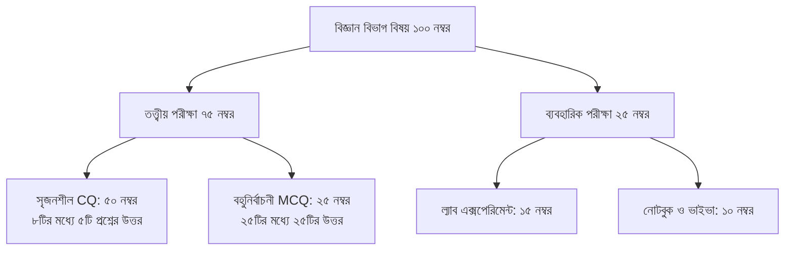

> **HSC 2026 পরীক্ষা কি সংক্ষিপ্ত (শর্ট) সিলেবাসে হবে নাকি পূর্ণাঙ্গ সিলেবাসে?** জাতীয় শিক্ষাক্রম ও পাঠ্যপুস্তক বোর্ড (NCTB) এবং শিক্ষা মন্ত্রণালয়ের সর্বশেষ সিদ্ধান্ত অনুযায়ী, ২০২৬ সালের এইচএসসি পরীক্ষা **পরিমার্জিত পুনর্বিন্যাসকৃত পাঠ্যসূচি (Revised Syllabus)** অনুযায়ী ১০০ নম্বরের পূর্ণ মানে অনুষ্ঠিত হবে। প্রতিটি বিষয়ে সৃজনশীল (CQ), বহুনির্বাচনী (MCQ) এবং ব্যবহারিক (Practical) অংশে পৃথকভাবে পাস করার বাধ্যবাধকতা বহাল থাকছে।

পরীক্ষার টেবিলে হাজারো ঘণ্টা পড়ার চেয়ে সবচেয়ে বেশি গুরুত্বপূর্ণ হলো কোন অধ্যায় থেকে কত নম্বরের প্রশ্ন আসবে এবং প্রশ্নের কাঠামো কেমন হবে তা নিখুঁতভাবে জানা। মানবন্টন ও প্রশ্নের প্যাটার্ন না বুঝে পড়াশোনা করলে শতভাগ প্রস্তুতি নিয়েও অনেক সময় কাঙ্ক্ষিত জিপিএ ৫ (GPA 5.00) হাতছাড়া হয়ে যায়।

এই আর্টিকেলে বিজ্ঞান, মানবিক ও ব্যবসায় শিক্ষা বিভাগের প্রতিটি বিষয়ের নম্বর বণ্টন, পাস মার্কের হিসাব এবং অফিশিয়াল সিলেবাস PDF পাওয়ার উপায় বিস্তারিত আলোচনা করা হলো।

---

## ১. এক নজরে এইচএসসি ২০২৬ পরীক্ষার প্রশ্ন কাঠামো ও নীতি

২০২৬ সালের উচ্চমাধ্যমিক পরীক্ষায় প্রতিটি বিষয়ের পরীক্ষার সময় এবং নম্বর নির্ধারণ করা হয়েছে নির্দিষ্ট মানদণ্ড মেনে:

| পরীক্ষার উপাদান | তত্ত্বীয় (ব্যবহারিক নেই এমন বিষয়) | ব্যবহারিক সহ বিষয় (সায়েন্স ও অন্যান্য) |
| :--- | :---: | :---: |
| **মোট নম্বর** | ১০০ নম্বর | ১০০ নম্বর (তত্ত্বীয় ৭৫ + ব্যবহারিক ২৫) |
| **সৃজনশীল প্রশ্ন (CQ)** | ৭০ নম্বর (১১টির মধ্যে ৭টি উত্তর) | ৫০ নম্বর (৮টির মধ্যে ৫টি উত্তর) |
| **বহুনির্বাচনী প্রশ্ন (MCQ)** | ৩০ নম্বর (৩০টি প্রশ্নের উত্তর) | ২৫ নম্বর (২৫টি প্রশ্নের উত্তর) |
| **মোট সময়** | ৩ ঘণ্টা (CQ: ২ ঘণ্টা ৩৫ মি. + MCQ: ২৫ মি.) | ৩ ঘণ্টা (CQ: ২ ঘণ্টা ৩৫ মি. + MCQ: ২৫ মি.) |
| **CQ পাস নম্বর** | ২৩ নম্বর (৭০ এর মধ্যে) | ১৭ নম্বর (৫০ এর মধ্যে) |
| **MCQ পাস নম্বর** | ১০ নম্বর (৩০ এর মধ্যে) | ৮ নম্বর (২৫ এর মধ্যে) |
| **ব্যবহারিক পাস নম্বর** | প্রযোজ্য নয় | ৮.২৫ বা ৯ নম্বর (২৫ এর মধ্যে) |

> [!CAUTION]
> ### ⚠️ পৃথকভাবে পাস করার কঠোর নিয়ম (Must Pass Individually)
> অনেক শিক্ষার্থী ভুল ধারণা পোষণ করে যে CQ এবং MCQ মিলে মোট ৩৩ পেলেই পাস। শিক্ষা বোর্ডের স্পষ্ট নিয়ম হলো—**সৃজনশীল (CQ) এবং বহুনির্বাচনী (MCQ) অংশে আলাদা আলাদাভাবে ন্যূনতম ৩৩% নম্বর পেয়ে পাস করতে হবে।** কোনো একটি অংশে ১ নম্বর কম পেলেও বিষয়ে অকৃতকার্য (Fail) হিসেবে গণ্য করা হবে।

---

## ২. আবশ্যিক বিষয়সমূহের সিলেবাস ও পূর্ণাঙ্গ মানবন্টন

বিজ্ঞান, মানবিক ও ব্যবসায় শিক্ষা—সকল বিভাগের শিক্ষার্থীদের জন্য আবশ্যিক বিষয়গুলোর নম্বর কাঠামো নিচে দেওয়া হলো:

### ক. বাংলা ১ম পত্র (বিষয় কোড: ১০১)
* **মোট নম্বর:** ১০০ (CQ: ৭০, MCQ: ৩০)
* **সৃজনশীল অংশ (৭০ নম্বর):** মোট ১১টি প্রশ্ন থাকবে, যার মধ্যে ৭টি প্রশ্নের উত্তর দিতে হবে।
  * গদ্য অংশ থেকে অন্তত ২টি
  * কবিতা অংশ থেকে অন্তত ২টি
  * উপন্যাস (সহপাঠ) থেকে অন্তত ১টি
  * নাটক (সহপাঠ) থেকে অন্তত ১টি
* **MCQ অংশ (৩০ নম্বর):** ৩০টি প্রশ্ন থাকবে, প্রতিটির মান ১ নম্বর। গদ্য, কবিতা ও সহপাঠ থেকে সমন্বিত প্রশ্ন করা হবে। সময় ২৫ মিনিট।

### খ. বাংলা ২য় পত্র (বিষয় কোড: ১০২)
বাংলা ২য় পত্রে কোনো সৃজনশীল (উদ্দীপকভিত্তিক) বা MCQ প্রশ্ন থাকে না। এটি সম্পূর্ণ ব্যাকরণ ও নির্মিতি অংশের ১০০ নম্বরের লিখিত পরীক্ষা:
* **ব্যাকরণ অংশ (৩০ নম্বর):** বাংলা উচ্চারণের নিয়ম, বানানের নিয়ম, ব্যাকরণিক শব্দশ্রেণি, শব্দ গঠন (উপসর্গ ও সমাস), বাক্যতত্ত্ব এবং বাক্য শুদ্ধিকরণ। (প্রতিটি অংশে বিকল্প প্রশ্ন থাকে)।
* **নির্মিতি অংশ (৭০ নম্বর):**
  * পারিভাষিক শব্দ / অনুবাদ (১০ নম্বর)
  * দিনলিপি লিখন / প্রতিবেদন প্রণয়ন (১০ নম্বর)
  * বৈদ্যুতিন চিঠি (ই-মেইল) / আবেদনপত্র (১০ নম্বর)
  * সারাংশ/সারমর্ম / ভাবসম্প্রসারণ (১০ নম্বর)
  * সংলাপ / খুদে গল্প রচনা (১০ নম্বর)
  * প্রবন্ধ রচনা (২০ নম্বর) - ৫টি থেকে ১টি উত্তর।

### গ. ইংরেজি ১ম ও ২য় পত্র (বিষয় কোড: ১০৭ ও ১০৮)
ইংরেজি বিষয়ে কোনো MCQ বা আলাদা সৃজনশীল থাকে না; সম্পূর্ণ পরীক্ষাটি রিডিং, রাইটিং ও গ্রামারের ওপর ১০০+১০০ = ২০০ নম্বরে অনুষ্ঠিত হয়:

| পেপার | সেকশন ও বিষয়বস্তু | নির্ধারিত নম্বর |
| :--- | :--- | :---: |
| **English 1st Paper** | **Part A: Reading Skills** (Multiple Choice, Short Answers, Information Transfer / Flow Chart, Summary Writing, Theme Writing) | ৬০ নম্বর |
| | **Part B: Guided Writing** (Writing Paragraph, Completing a Story, Informal Letter / E-mail, Analyzing Maps/Graphs/Charts) | ৪০ নম্বর |
| **English 2nd Paper** | **Part A: Grammar Test Items** (Gap filling without clues, Prepositions, Completing sentences with phrases, Right form of verbs, Narrative style/Speech, Use of modifiers, Sentence connectors, Synonym & Antonym, Punctuation) | ৬০ নম্বর |
| | **Part B: Composition** (Formal Letter / Complaint / Seeking Info, Writing Paragraphs by Listing/Describing, Paragraph Comparing/Contrasting) | ৪০ নম্বর |

### ঘ. তথ্য ও যোগাযোগ প্রযুক্তি - ICT (বিষয় কোড: ২৭৫)
* **তত্ত্বীয় অংশ (৭৫ নম্বর):** 
  * সৃজনশীল (CQ): ৫০ নম্বর (৮টি প্রশ্নের মধ্যে ৫টির উত্তর দিতে হবে)।
  * বহুনির্বাচনী (MCQ): ২৫ নম্বর (২৫টি প্রশ্নের ২৫টিরই উত্তর দিতে হবে)।
* **ব্যবহারিক অংশ (২৫ নম্বর):** HTML কোডিং, C প্রোগ্রামিং অথবা ডেটাবেজ ম্যানেজমেন্ট থেকে ল্যাব টেস্ট ও মৌখিক পরীক্ষা।

---

## ৩. বিজ্ঞান বিভাগ (Science Group) বিষয়ভিত্তিক মানবন্টন

বিজ্ঞান বিভাগের প্রতিটি বিষয়ে ৭৫ নম্বরের তত্ত্বীয় (৫০ CQ + ২৫ MCQ) এবং ২৫ নম্বরের ব্যবহারিক পরীক্ষা অনুষ্ঠিত হয়:



### ১. পদার্থবিজ্ঞান ১ম ও ২য় পত্র (বিষয় কোড: ১৭৪ ও ১৭৫)
* **সৃজনশীল (৫০ নম্বর):** ক ও খ বিভাগ মিলিয়ে মোট ৮টি সৃজনশীল প্রশ্ন থাকবে, যেকোনো ৫টি প্রশ্নের উত্তর দিতে হবে। প্রতিটি প্রশ্নে জ্ঞান (১), অনুধাবন (২), প্রয়োগ (৩) ও উচ্চতর দক্ষতা (৪) থাকবে।
* **MCQ (২৫ নম্বর):** সাধারণ বহুনির্বাচনী, বহুপদী সমাপ্তিসূচক এবং অভিন্ন তথ্যভিত্তিক প্রশ্ন থাকবে।
* **হাই-ইল্ড অধ্যায়সমূহ:** ভেক্টর, নিউটনিয়ান বলবিদ্যা, কাজ শক্তি ও ক্ষমতা, পর্যাবৃত্ত গতি, আদর্শ গ্যাস (১ম পত্র); তাপগতিবিদ্যা, চলতড়িৎ, ভৌত আলোকবিজ্ঞান, পরমাণুর মডেল ও নিউক্লিয়ার পদার্থবিজ্ঞান, সেমিকন্ডাক্টর ও ইলেকট্রনিক্স (২য় পত্র)।

### ২. রসায়ন ১ম ও ২য় পত্র (বিষয় কোড: ১৭৬ ও ১৭৭)
* **সৃজনশীল (৫০ নম্বর):** ১ম পত্রে গুণগত রসায়ন, পর্যায়বৃত্ত ধর্ম ও রাসায়নিক পরিবর্তন থেকে অধিকাংশ প্রশ্ন আসে। ২য় পত্রে জৈব রসায়ন (Organic Chemistry) অংশ থেকেই এককভাবে ২টি সম্পূর্ণ সৃজনশীল প্রশ্ন থাকে।
* **MCQ (২৫ নম্বর):** রিঅ্যাকশন কন্ডিশন, ম্যাথমেটিক্যাল ক্যালকুলেশন এবং বিক্রিয়াজাত উৎপাদ সম্পর্কিত প্রশ্ন।

### ৩. উচ্চতর গণিত ১ম ও ২য় পত্র (বিষয় কোড: ২৬৫ ও ২৬৬)
উচ্চতর গণিতে কোনো ব্যবহারিক ল্যাব পরীক্ষা সাধারণত থাকে না (প্রজেক্ট/মৌখিক মিলে ২৫ থাকে)। তত্ত্বীয় ৫০ নম্বরের সৃজনশীল প্রশ্ন থাকে শাখাভিত্তিক:
* **১ম পত্র:** ক-বিভাগ (বীজগণিত ও জ্যামিতি) থেকে অন্তত ২টি এবং খ-বিভাগ (ত্রিকোণমিতি ও ক্যালকুলাস) থেকে অন্তত ২টি করে মোট ৫টি প্রশ্নের উত্তর দিতে হয়।
* **২য় পত্র:** ক-বিভাগ (বীজগণিত ও ত্রিকোণমিতি) এবং খ-বিভাগ (কনিক্স, বলবিদ্যা ও সম্ভাব্যতা) থেকে বিভাগ অনুযায়ী উত্তর করতে হয়।

### ৪. জীববিজ্ঞান ১ম ও ২য় পত্র (বিষয় কোড: ১৭৮ ও ১৭৯)
* **১ম পত্র (উদ্ভিদবিজ্ঞান):** কোষ ও এর গঠন, কোষ বিভাজন, অণুজীব, উদ্ভিদ শারীরতত্ত্ব, জীবপ্রযুক্তি।
* **২য় পত্র (প্রাণীবিজ্ঞান):** প্রাণীর বিভিন্নতা ও শ্রেণিবিন্যাস, রক্ত ও সংবহন, শ্বসন ও শ্বাসক্রিয়া, জিনতত্ত্ব ও বিবর্তন।

> [!TIP]
> **🚀 সায়েন্সে A+ নিশ্চিত করতে চাও?**  
> পদার্থ ও রসায়নের ম্যাথ এবং বায়োলজির শত শত টার্ম মুখস্থ না রেখে বুঝে পড়া জরুরি। Obhyash অ্যাপের অধ্যায়ভিত্তিক কুইজ ও বিগত ৫ বছরের বোর্ড প্রশ্ন ব্যাংকের মাধ্যমে নিজেকে প্রতিদিন ঝালাই করে নাও।  
> 👉 **[Obhyash অ্যাপে এখনই ফ্রিতে কুইজ দাও](https://play.google.com/store/apps/details?id=com.obhyash.app)**

---

## ৪. ব্যবসায় শিক্ষা বিভাগ (Commerce Group) মানবন্টন

ব্যবসায় শিক্ষা বিভাগের প্রধান বিষয়গুলোর নম্বর বিভাজন:

| বিষয় | বিষয় কোড | CQ নম্বর (সময়: ২ ঘণ্টা ৩৫ মি.) | MCQ নম্বর (সময়: ২৫ মি.) | মোট নম্বর |
| :--- | :---: | :---: | :---: | :---: |
| **হিসাববিজ্ঞান ১ম পত্র** | ২৫৩ | ৭০ নম্বর (১১টির মধ্যে ৭টি) | ৩০ নম্বর (৩০টির উত্তর) | ১০০ |
| **হিসাববিজ্ঞান ২য় পত্র** | ২৫৪ | ৭০ নম্বর (১১টির মধ্যে ৭টি) | ৩০ নম্বর (৩০টির উত্তর) | ১০০ |
| **ব্যবসায় সংগঠন ও ব্যবস্থাপনা ১ম পত্র** | ২৭৭ | ৭০ নম্বর (১১টির মধ্যে ৭টি) | ৩০ নম্বর (৩০টির উত্তর) | ১০০ |
| **ব্যবসায় সংগঠন ও ব্যবস্থাপনা ২য় পত্র** | ২৭৮ | ৭০ নম্বর (১১টির মধ্যে ৭টি) | ৩০ নম্বর (৩০টির উত্তর) | ১০০ |
| **ফিন্যান্স, ব্যাংকিং ও বীমা ১ম ও ২য় পত্র** | ২৯২, ২৯৩ | ৭০ নম্বর (১১টির মধ্যে ৭টি) | ৩০ নম্বর (৩০টির উত্তর) | ১০০ |
| **উৎপাদন ব্যবস্থাপনা ও বিপণন ১ম ও ২য় পত্র** | ২৮৬, ২৮৭ | ৭০ নম্বর (১১টির মধ্যে ৭টি) | ৩০ নম্বর (৩০টির উত্তর) | ১০০ |

*হিসাববিজ্ঞানে ক-বিভাগে আর্থিক বিবরণী থেকে ২টি প্রশ্ন বাধ্যতামূলক থাকে এবং খ-বিভাগে বাকি ৯টি প্রশ্ন থেকে যেকোনো ৫টি উত্তর করতে হয়।*

---

## ৫. মানবিক বিভাগ (Humanities / Arts Group) মানবন্টন

মানবিক বিভাগের বিষয়গুলোতে গভীর বিশ্লেষণধর্মী ও তথ্যভিত্তিক সৃজনশীল প্রশ্ন করা হয়:

* **পৌরনীতি ও সুশাসন (২৪১, ২৪২):** CQ ৭০ (১১টিতে ৭টি) + MCQ ৩০।
* **অর্থনীতি (১০৯, ১১০):** CQ ৭০ (গ্রাফ, সমীকরণ ও ব্যাখ্যা সহ ১১টিতে ৭টি) + MCQ ৩০।
* **ইতিহাস ও ইসলামের ইতিহাস (৩০৪, ২৬৭):** CQ ৭০ (১১টিতে ৭টি) + MCQ ৩০।
* **যুক্তিবিদ্যা ও সমাজবিজ্ঞান (১২১, ১১৭):** CQ ৭০ (১১টিতে ৭টি) + MCQ ৩০।

---

## ৬. অফিশিয়াল সিলেবাস ও মানবন্টন নির্দেশিকা PDF ডাউনলোড

শিক্ষার্থীদের সুবিধার্থে ২০২৬ সালের এইচএসসি পরীক্ষার পূর্ণাঙ্গ অধ্যায়ভিত্তিক সিলেবাস ও অফিশিয়াল নির্দেশিকা আমাদের ক্লাউড স্টোরেজে যুক্ত করা হয়েছে:

> [!TIP]
> ### 📥 এইচএসসি ২০২৬ বিষয়ভিত্তিক সিলেবাস ও মানবন্টন PDF
> বোর্ডের সর্বশেষ পাঠ্যসূচি ও নম্বর বণ্টনের কমপ্লিট বুকলেট নিচের লিংক থেকে সংগ্রহ করতে পারবে:
> 
> 📄 **[👉 HSC 2026 Complete Syllabus & Marks Breakdown PDF (Cloud CDN)](https://assets.obhyash.com/pdf/hsc-2026-routine.pdf)** *(হাই-স্পিড ডাউনলোড)*  
> 🌐 **[জাতীয় শিক্ষাক্রম ও পাঠ্যপুস্তক বোর্ড (NCTB) ওয়েবসাইট](https://nctb.gov.bd)**
> 
> *(বিজ্ঞান, মানবিক ও ব্যবসায় শিক্ষা শাখার সকল বিষয়ের অধ্যায় তালিকা সংবলিত)*

---

## ৭. GPA 5.00 নিশ্চিত করার নম্বর টার্গেট ক্যালকুলেশন

এইচএসসি পরীক্ষায় গোল্ডেন এ+ কিংবা সাধারণ এ+ পেতে হলে কেবল পাসের কথা ভাবলে চলবে না। প্রতিটি বিষয়ে গড়ে ৮০+ নম্বর অর্জন করতে হবে:

```
মোট জিপিএ নির্ণয়ের স্কেল:
৮০ – ১০০ নম্বর = A+ (Grade Point: 5.00)
৭০ – ৭৯ নম্বর  = A  (Grade Point: 4.00)
৬০ – ৬৯ নম্বর  = A- (Grade Point: 3.50)
৫০ – ৫৯ নম্বর  = B  (Grade Point: 3.00)
৪০ – ৪৯ নম্বর  = C  (Grade Point: 2.00)
৩৩ – ৩৯ নম্বর  = D  (Grade Point: 1.00)
০০ – ৩২ নম্বর  = F  (Fail / 0.00)
```

> [!NOTE]
> ### ৪র্থ বিষয়ের অতিরিক্ত বোনাস পয়েন্টের জাদু!
> তোমার ৪র্থ বিষয়ে (Optional Subject) প্রাপ্ত গ্রেড পয়েন্ট থেকে **২.০০ বাদ দিয়ে** বাকি পয়েন্ট মূল ৫টি বিষয়ের মোট গ্রেড পয়েন্টের সাথে যোগ হয়।  
> *উদাহরণ:* ৪র্থ বিষয়ে যদি A+ (5.00) পাও, তবে মূল রেজাল্টে যোগ হবে: **5.00 - 2.00 = +3.00** পয়েন্ট! এটি কোনো একটি বাধ্যতামূলক বিষয়ে A বা A- পেলেও সামগ্রিক রেজাল্ট জিপিএ ৫.০০ ধরে রাখতে সাহায্য করে।

---

## ❓ প্রায়শই জিজ্ঞাসিত প্রশ্নাবলী (FAQ)

### ১. এইচএসসি ২০২৬ পরীক্ষায় কি কোনো বিষয়ে শর্ট সিলেবাস থাকবে?
শিক্ষা মন্ত্রণালয় ও এনসিটিবি কর্তৃক ঘোষিত পুনর্বিন্যাসকৃত পাঠ্যসূচির আওতাভুক্ত গুরুত্বপূর্ণ অধ্যায়গুলোর ওপর ভিত্তি করেই এইচএসসি ২০২৬ পরীক্ষা ১০০ নম্বরের পূর্ণ মানে অনুষ্ঠিত হবে।

### ২. বাংলা ও ইংরেজিতে পাস মার্ক কীভাবে গণনা করা হয়?
বাংলা ১ম ও ২য় পত্র মিলিয়ে মোট ২০০ নম্বরের পরীক্ষা হলেও পাস করার ক্ষেত্রে শিক্ষা বোর্ডের আধুনিক নিয়মে প্রতি পত্রে পৃথকভাবে পাস করতে হয়। একইভাবে ইংরেজি ১ম ও ২য় পত্রেও আলাদাভাবে পাস নম্বর পেতে হবে।

### ৩. ব্যবহারিক পরীক্ষায় সর্বনিম্ন কত পেলে পাস?
ব্যবহারিক পরীক্ষা সাধারণত ২৫ নম্বরে অনুষ্ঠিত হয়। ২৫ নম্বরের মধ্যে পাস করতে হলে একজন পরীক্ষার্থীকে ন্যূনতম ৮.২৫ বা ৯ নম্বর পেতে হবে।

### ৪. পরীক্ষার সময়সূচী ও রুটিন কোথা থেকে পাব?
২০২৬ সালের এইচএসসি পরীক্ষার পূর্ণাঙ্গ সময়সূচী ও পরীক্ষার সম্ভাব্য তারিখ জানতে পড়তে পারো আমাদের বিস্তারিত গাইড: [HSC 2026 Exam Date & Routine PDF](/blog/hsc-2026-exam-date-routine-pdf)।

---

## 🎯 নিজের প্রস্তুতিকে নিয়ে যাও অনন্য উচ্চতায়
সিলেবাস যত বড়ই হোক, সময়মতো সঠিক পরিকল্পনায় এগুলে যেকোনো লক্ষ্য অর্জন সম্ভব। প্রতিটি বিষয়ের বিগত বছরের প্রশ্ন সমাধান করো এবং নিয়মিত সেলফ-অ্যাসেসমেন্ট দাও।

হাজারো মেধাবী শিক্ষার্থীর সাথে লাইভ পরীক্ষা দিয়ে মেধার সঠিক অবস্থান জানতে আজই ব্যবহার করো **Obhyash App**।

📲 **গুগল প্লে স্টোর থেকে সম্পূর্ণ ফ্রিতে ডাউনলোড করো — [Obhyash App Download Link](https://play.google.com/store/apps/details?id=com.obhyash.app)**
