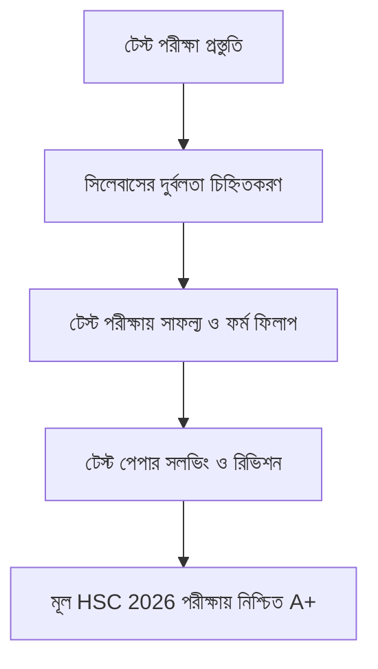

> **HSC 2026 টেস্ট পরীক্ষা কবে শুরু হবে?** মাধ্যমিক ও উচ্চমাধ্যমিক শিক্ষা বোর্ডের বাৎসরিক শিক্ষাপঞ্জি অনুযায়ী, ২০২৬ সালের এইচএসসি পরীক্ষার্থীদের নির্বাচনী বা টেস্ট পরীক্ষা (Test Examination) **নভেম্বর ২০২৫ থেকে জানুয়ারি ২০২৬-এর মধ্যে** দেশের সকল কলেজ ও উচ্চমাধ্যমিক শিক্ষাপ্রতিষ্ঠানে অনুষ্ঠিত হতে যাচ্ছে। টেস্ট পরীক্ষায় উত্তীর্ণ হওয়া শিক্ষার্থীদের জন্যই পরবর্তীতে বোর্ডের অফিশিয়াল ফর্ম ফিলাপ (Form Fill-up) কার্যক্রম উন্মুক্ত করা হয়।

এইচএসসি পরীক্ষার্থীদের শিক্ষাজীবনে টেস্ট পরীক্ষা কেবল একটি সাধারণ সাময়িক পরীক্ষা নয়; এটি মূল বোর্ড পরীক্ষার ঠিক পূর্বের সবচেয়ে বড় এবং সবচেয়ে চ্যালেঞ্জিং অগ্নিপরীক্ষা। শীর্ষস্থানীয় কলেজগুলো (যেমন—নটর ডেম কলেজ, ভিকারুননিসা নূন স্কুল অ্যান্ড কলেজ, রাজউক উত্তরা মডেল কলেজ, ঢাকা কলেজ) টেস্ট পরীক্ষায় বোর্ড পরীক্ষার চেয়েও অনেক বেশি মানসম্মত ও বিশ্লেষণধর্মী প্রশ্ন প্রণয়ন করে থাকে।

আপনি যদি টেস্ট পরীক্ষাকে হালকাভাবে নেন, তবে বোর্ড পরীক্ষার চূড়ান্ত প্রস্তুতিতে বড় ধরনের ধাক্কা খেতে পারেন। এই পূর্ণাঙ্গ গাইডে টেস্ট পরীক্ষার সময়সূচী, পাস মার্কের নিয়মাবলী, শীর্ষ কলেজের প্রশ্ন সমাধানের কৌশল এবং শেষ ৩০ দিনের রিভিশন মাস্টারপ্ল্যান তুলে ধরা হলো।

---

## ১. এক নজরে এইচএসসি ২০২৬ টেস্ট পরীক্ষার মূল তথ্যাবলী

| তথ্যের বিবরণ | অফিশিয়াল সম্ভাব্য তথ্য |
| :--- | :--- |
| **পরীক্ষার নাম** | এইচএসসি নির্বাচনী পরীক্ষা ২০২৬ (HSC Test Exam 2026) |
| **অংশগ্রহণকারী ব্যাচ** | এইচএসসি ২০২৬ (দ্বাদশ শ্রেণির নিয়মিত শিক্ষার্থী) |
| **পরীক্ষার সম্ভাব্য সময়** | নভেম্বর ২০২৫ – জানুয়ারি ২০২৬ (কলেজভেদে নিজস্ব রুটিন) |
| **সিলেবাসের ধরণ** | পুনর্বিন্যাসকৃত পূর্ণাঙ্গ সিলেবাস (১০০ নম্বরের পরীক্ষা) |
| **ফলাফল প্রকাশ** | পরীক্ষা শেষের ১০ থেকে ১৫ দিনের মধ্যে |
| **ফর্ম ফিলাপের সময়** | টেস্ট রেজাল্ট প্রকাশের পরপরই (ফেব্রুয়ারি ২০২৬) |
| **মূল বোর্ড পরীক্ষা** | মে ২০২৬-এর দ্বিতীয় সপ্তাহ |

---

## ২. টেস্ট পরীক্ষা কেন এত বেশি গুরুত্বপূর্ণ?

অনেকের ধারণা, "টেস্ট পরীক্ষার রেজাল্ট তো আর বোর্ডে যোগ হবে না, কোনোমতে পাস করলেই হলো!"—এটি এইচএসসি পরীক্ষার্থীদের জীবনের সবচেয়ে মারাত্মক ভুল ধারণাগুলোর একটি। টেস্ট পরীক্ষার গুরুত্ব মূলত ৩টি কারণে অপরিসীম:

1. **ফর্ম ফিলাপের চূড়ান্ত ছাড়পত্র:** শিক্ষা বোর্ডের সুস্পষ্ট নিয়ম অনুযায়ী, টেস্ট পরীক্ষায় সকল বিষয়ে উত্তীর্ণ না হলে কোনো শিক্ষার্থীকে মূল এইচএসসি পরীক্ষায় অংশগ্রহণের জন্য ফর্ম ফিলাপের অনুমতি দেওয়া হয় না।
2. **ভুল ও দুর্বলতা চিহ্নিত করার শেষ সুযোগ:** পুরো সিলেবাসের ওপর এক সাথে ৩ ঘণ্টার পরীক্ষা দেওয়ার অভিজ্ঞতা টেস্ট পরীক্ষার মাধ্যমেই প্রথম ঘটে। কোন অধ্যায়ে দুর্বলতা আছে এবং পরীক্ষার হলে সময়ের ব্যবস্থাপনা (Time Management) কেমন হচ্ছে, তা বোঝার এটিই সেরা সময়।
3. **শীর্ষ কলেজের প্রশ্ন ও প্রতিযোগিতার মুখোমুখি হওয়া:** টেস্ট পরীক্ষার পর দেশের সেরা কলেজগুলোর টেস্ট পেপার প্রকাশিত হয়। নিজের কলেজে ভালো করার আত্মবিশ্বাস বোর্ড পরীক্ষায় জিপিএ ৫.০০ অর্জনের পথ সহজ করে দেয়।

---

## ৩. টেস্ট পরীক্ষার পাস মার্ক ও গ্রেডিংয়ের কড়া নিয়ম

বোর্ড পরীক্ষার মতো কলেজ টেস্ট পরীক্ষাতেও পৃথক পাসের কড়া নিয়ম প্রযোজ্য:

* **সৃজনশীল অংশ (CQ):** ৫০ বা ৭০ নম্বরের মধ্যে ন্যূনতম ৩৩% নম্বর পেয়ে পৃথকভাবে পাস করতে হবে।
* **বহুনির্বাচনী অংশ (MCQ):** ২৫ বা ৩০ নম্বরের মধ্যে পৃথকভাবে ৩৩% নম্বর পাওয়া বাধ্যতামূলক।
* **ব্যবহারিক অংশ (Practical):** ২৫ নম্বরে পৃথকভাবে পাস করতে হবে।

> [!WARNING]
> ### ⚠️ এক বিষয়ে ফেল করলে কি ফর্ম ফিলাপ আটকে যাবে?
> সরকারি ও শীর্ষ বেসরকারি কলেজগুলোতে কোনো বিষয়ে অকৃতকার্য (F) হলে রি-টেস্ট (Re-test) ছাড়া সাধারণত ফর্ম ফিলাপের অনুমতি দেওয়া হয় না। কিছু ক্ষেত্রে বিশেষ বিবেচনায় সুযোগ দেওয়া হলেও শিক্ষার্থী মানসিকভাবে ভীষণ চাপে পড়ে যায়। তাই প্রতিটি বিষয়ে অন্তত পাস নম্বর নিশ্চিত করে ভালো স্কোরের লক্ষ্য রাখা বুদ্ধিমানের কাজ।

---

## ৪. বিভাগভিত্তিক টেস্ট পরীক্ষার সেরা প্রস্তুতি কৌশল

### 🧪 বিজ্ঞান বিভাগ (Science Group)
* **পদার্থবিজ্ঞান:** শুধুমাত্র সূত্র মুখস্থ না করে প্রতিটি সূত্রের বাস্তব প্রয়োগ ও একক লক্ষ্য করুন। বিশেষ করে ১ম পত্রের নিউটনিয়ান বলবিদ্যা, কাজ-শক্তি-ক্ষমতা এবং ২য় পত্রের স্থির তড়িৎ ও তাপগতিবিদ্যার গাণিতিক সমস্যাগুলোতে ক্যালকুলেটরের দ্রুত ব্যবহারের অভ্যাস গড়ুন।
* **রসায়ন:** বিক্রিয়ার মেকানিজম, জারক-বিজারক সমতাকরণ এবং পরিবেশ রসায়নের গাণিতিক অংশ প্রতিদিন লিখে লিখে প্র্যাকটিস করুন।
* **উচ্চতর গণিত:** অন্তরীকরণ (Differentiation) ও যোগজীকরণ (Integration)-এর ফর্মুলাগুলো প্রতিদিন রিভিশন দিন। ত্রিকোণমিতি ও স্থানাঙ্ক জ্যামিতির চিত্রসহ অংক সমাধান করুন।
* **জীববিজ্ঞান:** চিত্র আঁকার গতি বাড়ান। বিশেষ করে মাইটোসিস, ডিএনএ রেপ্লিকেশন, হৃদপিণ্ডের রক্ত সংবহন এবং নেফ্রনের গঠন চিহ্নিত চিত্র আঁকার চর্চা রাখুন।

### 💼 ব্যবসায় শিক্ষা বিভাগ (Commerce Group)
* **হিসাববিজ্ঞান:** জাবেদা, খতিয়ান, রেওয়ামিল এবং আর্থিক বিবরণীর ছক স্কেল দিয়ে দ্রুত ও পরিচ্ছন্নভাবে টানার অভ্যাস করুন। সমন্বয় দাখিলার সঠিক এন্ট্রি প্র্যাকটিস করুন।
* **ব্যবসায় সংগঠন ও ব্যবস্থাপনা:** মুখস্থ করার চেয়ে প্রতিটি ধারণার বৈশিষ্ট্য ও সুবিধা বুঝে উদাহরণসহ উত্তর লেখার কৌশল আয়ত্ত করুন।
* **ফিন্যান্স ও ব্যাংকিং:** অর্থের সময়মূল্য ও মূলধন বাজেটিংয়ের গাণিতিক সূত্রগুলোর শর্টকাট ক্যালকুলেশন রপ্ত করুন।

### 📚 মানবিক বিভাগ (Humanities Group)
* **পৌরনীতি ও সুশাসন:** সংবিধানের গুরুত্বপূর্ণ অনুচ্ছেদ, ধারা ও ঐতিহাসিক পটভূমির সঠিক সাল-তারিখ নোট করে পড়ুন।
* **অর্থনীতি:** বিভিন্ন বাজারের ভারসাম্য ও চাহিদার স্থিতিস্থাপকতার রেখাচিত্র নির্ভুলভাবে আঁকার অনুশীলন করুন।
* **ইতিহাস ও যুক্তিবিদ্যা:** সৃজনশীল প্রশ্নের ‘গ’ ও ‘ঘ’ নম্বরের উত্তরের জন্য মূল তত্ত্বের সাথে বাস্তব জীবনের উদাহরণ সংযোগ করার ক্ষমতা বাড়ান।

---

## ৫. শেষ ৩০ দিনের টেস্ট পরীক্ষার রিভিশন টাইমটেবিল

প্রতিদিন অন্তত ৮ থেকে ১০ ঘণ্টা কার্যকর পড়ার জন্য এই রুটিনটি অনুসরণ করতে পারেন:

| সময় | পড়ার বিষয় ও কার্যক্রম | কৌশল |
| :--- | :--- | :--- |
| **সকাল ০৬:০০ – ০৮:৩০** | কঠিন বিষয় (যেমন—গণিত / হিসাববিজ্ঞান) | সকালে মস্তিষ্ক সতেজ থাকে, বড় অংক দ্রুত সমাধান হয়। |
| **সকাল ০৯:৩০ – ১২:০০** | বিজ্ঞান বিষয় / থিওরি ও সূত্র রিভিশন | গুরুত্বপূর্ণ সংজ্ঞা ও নোট খাতা তৈরি। |
| **দুপুর ০৩:০০ – ০৫:০০** | বাংলা ও ইংরেজি ১ম/২য় পত্র | ব্যাকরণ, রাইটিং সাইড ও প্যাসেজ প্র্যাকটিস। |
| **সন্ধ্যা ০৬:০০ – ০৮:৩০** | গ্রুপ সাবজেক্ট ২ ও রিভিশন | নিয়মিত সৃজনশীল প্রশ্ন (CQ) ঘড়ি ধরে লেখার অনুশীলন। |
| **রাত ০৯:৩০ – ১১:০০** | MCQ সলভিং ও ওএমআর (OMR) পূরণ | প্রতিদিন অন্তত ১০০টি MCQ টেস্ট দেওয়া। |

> [!TIP]
> **🚀 প্রতিদিনের পড়ার ঘাটতি কীভাবে মাপবে?**  
> Obhyash অ্যাপে লগইন করে তোমার রিভিশন করা চ্যাপ্টারগুলোর ওপর ১৫ মিনিটের ইনস্ট্যান্ট কুইজ দাও। স্মার্ট অ্যানালিটিক্স তোমাকে মুহূর্তেই বলে দেবে কোন টপিক তোমার এখনো দুর্বল।  
> 👉 **[Obhyash অ্যাপে এখনই চ্যাপ্টার কুইজ শুরু করো](https://play.google.com/store/apps/details?id=com.obhyash.app)**

---

## ৬. টেস্ট পেপার ও শীর্ষ কলেজের প্রশ্ন সমাধানের গোপন ট্রিকস

টেস্ট পরীক্ষার পরপরই বাজারে বিভিন্ন প্রকাশনীর টেস্ট পেপার চলে আসে। টেস্ট পেপার সলভ করার সবচেয়ে কার্যকর নিয়ম:

1. **টপ ২০ কলেজের প্রশ্ন বাছাই:** নটর ডেম, ক্যাডেট কলেজসমূহ, ভিকারুননিসা, আইডিয়াল, রাজউক ও ঢাকা কলেজের টেস্ট পরীক্ষার প্রশ্নগুলো প্রথমে সমাধান করুন।
2. **ঘড়ি ধরে ৩ ঘণ্টার পরীক্ষা:** ঘরে বসে ঠিক ৩ ঘণ্টার টাইমার সেট করে সৃজনশীল প্রশ্ন লিখুন। এতে পরীক্ষার হলের ভয় দূর হবে।
3. **মিস্টেক নোটবুক (Mistake Notebook):** যে MCQ বা অংকগুলো সমাধান করতে গিয়ে আটকে যাচ্ছেন, সেগুলো একটি লাল কালির ডায়রিতে টুকে রাখুন এবং পরীক্ষার আগের রাতে রিভিশন দিন।

---

## 🔗 সম্পর্কিত অন্যান্য গুরুত্বপূর্ণ গাইড

* 📅 [HSC 2026 পরীক্ষার তারিখ ও সকল শিক্ষা বোর্ডের রুটিন PDF](/blog/hsc-2026-exam-date-routine-pdf)
* 📑 [HSC 2026 শর্ট সিলেবাস আপডেট ও পূর্ণাঙ্গ মানবন্টন (বিজ্ঞান, মানবিক ও বাণিজ্য)](/blog/hsc-2026-short-syllabus-marks-distribution)
* 🎓 [HSC Full Meaning ও জিপিএ গণনার সহজ ফর্মুলা (৪র্থ বিষয়ের বোনাস পয়েন্ট)](/blog/hsc-full-meaning-and-gpa-calculator)

---

## ❓ টেস্ট পরীক্ষা নিয়ে শিক্ষার্থীদের সাধারণ প্রশ্ন (FAQ)

### ১. টেস্ট পরীক্ষা কি সব কলেজে একই দিনে অনুষ্ঠিত হয়?
না। টেস্ট পরীক্ষার কেন্দ্রীয় কোনো বোর্ড রুটিন হয় না। শিক্ষা বোর্ডের বেধে দেওয়া নির্দিষ্ট সময়সীমার মধ্যে প্রতিটি কলেজ তাদের নিজস্ব একাডেমিক ক্যালেন্ডার অনুযায়ী রুটিন তৈরি করে পরীক্ষা গ্রহণ করে।

### ২. টেস্ট পরীক্ষায় ভালো রেজাল্ট করলে কি বোর্ড পরীক্ষায় ভালো করা সম্ভব?
অবশ্যই। টেস্ট পরীক্ষায় যারা ভালো প্রস্তুতি নিয়ে অংশগ্রহণ করে, তাদের ৯০% সিলেবাস বোর্ড পরীক্ষার ৩ মাস আগেই শেষ হয়ে যায়। ফলে শেষ সময়ে তারা শুধুমাত্র রিভিশন ও মডেল টেস্ট দিয়ে বোর্ড পরীক্ষায় সহজেই A+ অর্জন করতে পারে।

### ৩. টেস্ট পরীক্ষার জন্য কয়টি সৃজনশীল প্রশ্ন প্র্যাকটিস করা উচিত?
প্রতিটি গুরুত্বপূর্ণ অধ্যায় থেকে অন্তত ৫ থেকে ৮টি মানসম্মত সৃজনশীল (CQ) প্রশ্ন সম্পূর্ণ লিখে সমাধান করার অভ্যাস থাকা জরুরি।

---

## 🎯 নিজের প্রস্তুতিতে সেরা আত্মবিশ্বাস আনো
টেস্ট পরীক্ষার প্রতিটি দিনকে বোর্ড পরীক্ষার মতো গুরুত্ব দাও। আজ থেকে নিজের সেরাটা দিয়ে প্রস্তুতি শুরু করলে টেস্ট পরীক্ষা এবং মূল এইচএসসি পরীক্ষা—উভয় ক্ষেত্রেই তোমার বিজয় সুনিশ্চিত!

পরীক্ষার শেষ মুহূর্তের সেরা প্রস্তুতির জন্য যুক্ত হও **Obhyash** পরিবারের সাথে।

📲 **গুগল প্লে স্টোর থেকে এখনই ফ্রিতে অ্যাপটি ডাউনলোড করো — [Obhyash App Download Link](https://play.google.com/store/apps/details?id=com.obhyash.app)**
