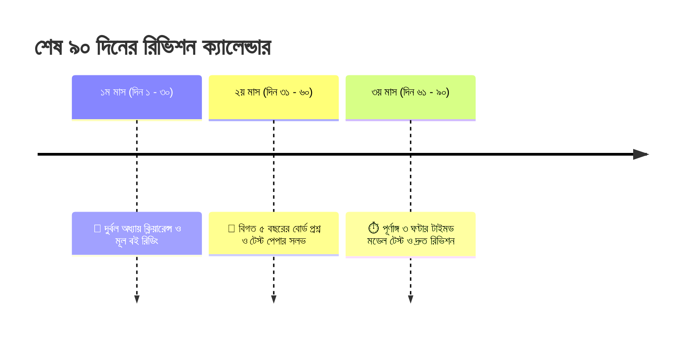

# এইচএসসি পরীক্ষার শেষ ৩ মাসের পূর্ণাঙ্গ রিভিশন রুটিন ও প্ল্যান 📅🏆

এইচএসসি (HSC) জীবনের অন্যতম গুরুত্বপূর্ণ মোড়। কিন্তু টেস্ট পরীক্ষার পর বেশিরভাগ শিক্ষার্থী আবিষ্কার করে—তাদের অনেক বিষয়ের পড়া এখনো শেষ হয়নি বা আগের পড়াগুলো মাথা থেকে উবে গেছে!

মনে রেখো, **এইচএসসির আসল লড়াই শুরু হয় শেষ ৩ মাসে (৯০ দিনে)।**  
সারা বছর কে কতটুকু পড়েছে তার চেয়ে বেশি গুরুত্বপূর্ণ হলো—পরীক্ষার ঠিক আগের ৩টি মাস কে কতটা কৌশলে রিভিশন দিয়েছে এবং টেস্ট পেপার সলভ করেছে।

এই ব্লগে শেষ ৯০ দিনকে ৩টি ব্লকে ভাগ করে একটি বাস্তবসম্মত রুটিন এবং প্রতিটি বিষয়ে এ+ পাওয়ার নিয়ম দেওয়া হলো।

---

## ১. ৯০ দিনের ৩-পর্যায়ের মাস্টারপ্ল্যান (The 3-Phase Rule)

### ক) ১ম মাস (১–৩০ দিন): দুর্বলতা দূরীকরণ পর্ব
* প্রতিটি বিষয়ের যে চ্যাপ্টারগুলো এখনো পড়া হয়নি বা ভীতি আছে, সেগুলোকে চিহ্নিত করো।
* প্রতিদিন অন্তত একটি কঠিন অধ্যায়ের থিওরি ও বেসিক কনসেপ্ট শেষ করো।
* গাইড দেখে মুখস্থ না করে মূল বইয়ের উদাহরণ ও কনসেপ্টগুলো বুঝে নাও।

### খ) ২য় মাস (৩১–৬০ দিন): টেস্ট পেপার ও বোর্ড কোশ্চেন
* বিগত ৫ বছরের (২০১৯–২০২৪) সকল শিক্ষা বোর্ডের সিকিউ (CQ) ও এমসিকিউ (MCQ) সমাধান করো।
* শীর্ষস্থানীয় কলেজগুলোর টেস্ট পরীক্ষার প্রশ্ন সলভ করো।
* কোনো প্রশ্নে বারবার আটকে গেলে আলাদা একটি **"Mistake Notebook"** বা ভুলের খাতায় লিখে রাখো।

### গ) ৩য় মাস (৬১–৯০ দিন): ফুল মডেল টেস্ট ও রিভিশন
* এই মাসে কোনো নতুন কঠিন টপিক পড়া যাবে না।
* ঘড়ি ধরে সকাল ১০টা থেকে দুপুর ১টা পর্যন্ত হুবহু পরীক্ষার পরিবেশ তৈরি করে পূর্ণাঙ্গ ১০০ নম্বরের মডেল টেস্ট দাও।
* সূত্রের চিটশিট ও শর্টনোটগুলো প্রতিদিন সকাল-সন্ধ্যায় রিভিশন করো।

---

## ২. আদর্শ দৈনিক পড়ার রুটিন (Daily Time Table)

| সময় | বিষয় / কাজ |
| :--- | :--- |
| **সকাল ৬:৩০ – ৮:৩০** | ফ্রেস মাইন্ডে মুখস্থ ও তাত্ত্বিক পড়া (বাংলা, ইংরেজি, বায়োলজি) |
| **সকাল ৯:৩০ – ১২:৩০** | মূল গাণিতিক বিষয় (উচ্চতর গণিত / পদার্থবিজ্ঞান) |
| **দুপুর ৩:৩০ – ৫:০০** | আইসিটি অথবা রসায়নের বিক্রিয়া রিভিশন |
| **সন্ধ্যা ৬:৩০ – ৯:৩০** | টেস্ট পেপার থেকে সিকিউ (CQ) সমাধান |
| **রাত ১০:০০ – ১১:৩০** | প্রতিদিন ৫০টি এমসিকিউ প্র্যাকটিস ও ওএমআর ফিলিং |
| **রাত ১১:৩০ – ১২:০০** | সারা দিনের পড়ার সামারি দেখা ও পরের দিনের প্ল্যান |

> [!TIP]
> **ঘুমের সাথে আপস নয়:** অনেকেই শেষ মুহূর্তে সারারাত জেগে পড়ে এবং দিনে ঘুমায়। পরীক্ষার সময় সকাল ১০টায় তোমার ব্রেন যেন সবচেয়ে বেশি সজাগ থাকে, সেজন্য প্রতিদিন রাত ১২টার মধ্যে ঘুমিয়ে সকাল ৬টায় ওঠার অভ্যাস করো।

---

## 🎯 টেস্ট পেপারের চেয়েও সহজে এমসিকিউ টেস্ট দাও

বাসায় একা একা ওএমআর শিট কেটে পরীক্ষা দেওয়া ঝামেলার কাজ। অভ্যাস অ্যাপে তুমি মাত্র কয়েক সেকেন্ডে বোর্ড স্ট্যান্ডার্ড টেস্ট দিয়ে নিজের স্কোর জানতে পারো।

👉 **[অভ্যাস (Obhyash) অ্যাপে এইচএসসি মডেল টেস্ট দাও আজকেই](https://obhyash.com)**
* বিগত বছরের বোর্ড প্রশ্নভিত্তিক স্বয়ংক্রিয় পরীক্ষা
* প্রতিটি এমসিকিউর তাৎক্ষণিক ব্যাখ্যা ও সঠিক উত্তর
* দেশজুড়ে এইচএসসি পরীক্ষার্থীদের মাঝে নিজের অবস্থান যাচাই!
