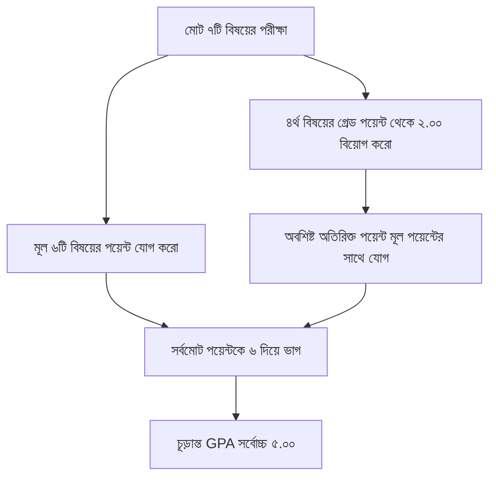

> **HSC-এর পূর্ণরূপ কি?** HSC-এর ইংরেজি পূর্ণরূপ হলো **Higher Secondary Certificate** (বাংলা অর্থ: **উচ্চমাধ্যমিক সার্টিফিকেট**)। এটি মাধ্যমিক ও উচ্চমাধ্যমিক শিক্ষা বোর্ডের অধীনে ১০ম শ্রেণির SSC পরীক্ষার পর একাদশ ও দ্বাদশ শ্রেণির ২ বছরের শিক্ষা সমাপনান্তে অনুষ্ঠিত হওয়া জাতীয় পাবলিক পরীক্ষা।

এইচএসসি পরীক্ষার পর কিংবা পরীক্ষার আগেই প্রতিটি শিক্ষার্থীর মনে সবচেয়ে বড় কৌতূহল কাজ করে—**“আমি প্রতিটি বিষয়ে কত নম্বর পেলে জিপিএ ৫.০০ (GPA 5.00) পাব?”** কিংবা **“৪র্থ বিষয়ের (Optional Subject) পয়েন্ট কীভাবে মূল রেজাল্টে যোগ হবে?”**

অনেকেই জিপিএ এবং গ্রেড পয়েন্টের হিসাব জটিল মনে করেন। কিন্তু সঠিক নিয়ম জানলে আপনি নিজে মাত্র ১ মিনিটেই নিজের বা যে কারো এইচএসসি জিপিএ নির্ভুলভাবে হিসাব করতে পারবেন। এই আর্টিকেলে এইচএসসির অফিশিয়াল গ্রেডিং স্কেল, বাস্তব উদাহরণের সাহায্যে জিপিএ গণনা এবং ৪র্থ বিষয়ের ম্যাজিক ফর্মুলা সহজ ভাষায় ব্যাখ্যা করা হলো।

---

## ১. এক নজরে এইচএসসি অফিশিয়াল গ্রেডিং সিস্টেম স্কেল

বাংলাদেশ শিক্ষা বোর্ড কর্তৃক নির্ধারিত গ্রেডিং সিস্টেম অনুযায়ী প্রাপ্ত নম্বরের ভিত্তিতে লেটার গ্রেড এবং গ্রেড পয়েন্ট নির্ধারণ করা হয়:

| প্রাপ্ত নম্বর (Marks Range) | লেটার গ্রেড (Letter Grade) | গ্রেড পয়েন্ট (Grade Point) | মূল্যায়নের বিবরণ |
| :---: | :---: | :---: | :--- |
| **৮০ – ১০০** | **A+** (এ প্লাস) | **৫.০০** (5.00) | আউটস্ট্যান্ডিং (Outstanding) |
| **৭০ – ৭৯** | **A** (এ) | **৪.০০** (4.00) | অতি উত্তম (Excellent) |
| **৬০ – ৬৯** | **A-** (এ মাইনাস) | **৩.৫০** (3.50) | উত্তম (Very Good) |
| **৫০ – ৫৯** | **B** (বি) | **৩.০০** (3.00) | সন্তোষজনক (Good) |
| **৪০ – ৪৯** | **C** (সি) | **২.০০** (2.00) | পাস মান (Satisfactory) |
| **৩৩ – ৩৯** | **D** (ডি) | **১.০০** (1.00) | ন্যূনতম পাস (Pass) |
| **০০ – ৩২** | **F** (এফ) | **০.০০** (0.00) | অকৃতকার্য (Fail) |

> [!CAUTION]
> ### ⚠️ যেকোনো এক বিষয়ে 'F' মানেই সামগ্রিক রেজাল্ট ফেল!
> এইচএসসি পরীক্ষায় যদি কোনো শিক্ষার্থী ৫টি বিষয়ে A+ পায় কিন্তু মাত্র ১টি বিষয়ে ৩২ বা তার কম নম্বর পেয়ে 'F' গ্রেড পায়, তবে তার মোট জিপিএ হবে **GPA 0.00 (Fail)**। অর্থাৎ বাকি বিষয়ের কোনো পয়েন্টই কাজে আসবে না। তাই প্রতিটি বিষয়ে সমান নজর দেওয়া আবশ্যক।

---

## ২. এইচএসসি জিপিএ গণনার মূল সূত্র (GPA Formula)

এইচএসসি পরীক্ষার মূল রেজাল্ট নির্ধারিত হয় মূলত **বাধ্যতামূলক ও বিভাগভিত্তিক মোট ৬টি মূল বিষয় এবং ১টি ৪র্থ বিষয়ের (মোট ৭টি বিষয়)** ওপর:
1. আবশ্যিক বিষয় ১: বাংলা (১ম ও ২য় পত্র মিলিয়ে)
2. আবশ্যিক বিষয় ২: ইংরেজি (১ম ও ২য় পত্র মিলিয়ে)
3. আবশ্যিক বিষয় ৩: তথ্য ও যোগাযোগ প্রযুক্তি (ICT)
4. গ্রুপ বিষয় ১: (যেমন- পদার্থবিজ্ঞান / হিসাববিজ্ঞান / পৌরনীতি)
5. গ্রুপ বিষয় ২: (যেমন- রসায়ন / ব্যবসায় সংগঠন / অর্থনীতি)
6. গ্রুপ বিষয় ৩: (যেমন- উচ্চতর গণিত / ফিন্যান্স / যুক্তিবিদ্যা)
7. ৪র্থ বিষয় (ঐচ্ছিক বা Optional Subject): (যেমন- জীববিজ্ঞান / কৃষি / পরিসংখ্যান ইত্যাদি)

### জিপিএ গণনার অফিশিয়াল গাণিতিক সূত্র:

$$GPA = \frac{\text{Total Grade Points of 6 Main Subjects} + \text{Bonus Points of 4th Subject}}{6}$$

---

## 🧮 লাইভ এইচএসসি জিপিএ ক্যালকুলেটর (Live GPA Calculator Engine)

নিচের ইন্টারেক্টিভ ক্যালকুলেটরে তোমার বিভাগ নির্বাচন করে প্রতিটি বিষয়ের প্রাপ্ত লেটার গ্রেড অথবা সম্ভাব্য প্রাপ্ত নম্বর (০-১০০) ইনপুট করো। আমাদের রিয়েল-টাইম ক্যালকুলেশন ইঞ্জিন সাথে সাথে ৪র্থ বিষয়ের বোনাস পয়েন্ট হিসাব করে তোমার চূড়ান্ত জিপিএ ও ফলাফল বিশ্লেষণ প্রদর্শন করবে:

---

## ৩. ৪র্থ বিষয়ের (Optional Subject) অতিরিক্ত পয়েন্ট হিসাব করার নিয়ম

৪র্থ বিষয়কে বলা হয় পরীক্ষার্থীদের জন্য বড় একটি লাইফ-সেভার (Life Saver)। কারণ ৪র্থ বিষয় কোনো শিক্ষার্থীকে জিপিএ বাড়িয়ে নিতে অসাধারণ সাহায্য করে:

### নিয়ম:
* ৪র্থ বিষয়ে আপনি যা পয়েন্ট পাবেন, তার থেকে **২.০০ পয়েন্ট বাদ যাবে** (কারণ ন্যূনতম পাস পয়েন্ট ২.০০)।
* অবশিষ্ট পয়েন্ট মূল বিষয়ের মোট পয়েন্টের সাথে বোনাস হিসেবে যোগ হবে।
* **যদি ৪র্থ বিষয়ে F (০.০০) বা D (১.০০) পান?** এতে মূল রেজাল্টে কোনো মাইনাস হবে না বা আপনি ফেল করবেন না! ৪র্থ বিষয়ে ফেল করলেও শিক্ষার্থী উত্তীর্ণ হিসেবে গণ্য হয়।

| ৪র্থ বিষয়ে প্রাপ্ত গ্রেড | মূল গ্রেড পয়েন্ট | বাদ যাবে | মূল রেজাল্টে যোগ হবে (Bonus Point) |
| :---: | :---: | :---: | :---: |
| **A+** | ৫.০০ | ২.০০ | **+ ৩.০০ পয়েন্ট** |
| **A** | ৪.০০ | ২.০০ | **+ ২.০০ পয়েন্ট** |
| **A-** | ৩.৫০ | ২.০০ | **+ ১.৫০ পয়েন্ট** |
| **B** | ৩.০০ | ২.০০ | **+ ১.০০ পয়েন্ট** |
| **C** | ২.০০ | ২.০০ | **+ ০.০০ পয়েন্ট** |
| **D বা F** | ১.০০ বা ০.০০ | - | **+ ০.০০ পয়েন্ট (কোনো প্রভাব নেই)** |

---

## ৪. বাস্তব উদাহরণের সাহায্যে সহজে জিপিএ নির্ণয়

ধরা যাক, সায়েন্স গ্রুপের একজন পরীক্ষার্থী 'রাফি' প্রতিটি বিষয়ে নিচের গ্রেড পয়েন্ট পেয়েছে:

| বিষয়সমূহ | প্রাপ্ত লেটার গ্রেড | গ্রেড পয়েন্ট |
| :--- | :---: | :---: |
| ১. বাংলা (১ম ও ২য় পত্র) | A | ৪.০০ |
| ২. ইংরেজি (১ম ও ২য় পত্র) | A | ৪.০০ |
| ৩. তথ্য ও যোগাযোগ প্রযুক্তি (ICT) | A+ | ৫.০০ |
| ৪. পদার্থবিজ্ঞান (১ম ও ২য় পত্র) | A+ | ৫.০০ |
| ৫. রসায়ন (১ম ও ২য় পত্র) | A+ | ৫.০০ |
| ৬. উচ্চতর গণিত (১ম ও ২য় পত্র) | A | ৪.০০ |
| **মূল ৬টি বিষয়ের মোট পয়েন্ট:** | - | **২৭.০০** |
| **৭. ৪র্থ বিষয়: জীববিজ্ঞান** | **A+** | **৫.০০** |

### এখন হিসাব করা যাক:
1. **৪র্থ বিষয়ের অতিরিক্ত পয়েন্ট:** **৫.০০ - ২.০০ = +৩.০০** পয়েন্ট।
2. **সর্বমোট কার্যকর পয়েন্ট:** মূল বিষয়ের ২৭.০০ + ৪র্থ বিষয়ের ৩.০০ = **৩০.০০** পয়েন্ট।
3. **চূড়ান্ত জিপিএ (GPA):** **৩০.০০ ÷ ৬ = ৫.০০** (রাফির চূড়ান্ত রেজাল্ট হবে **GPA 5.00**!)

> [!TIP]
> **লক্ষ্য করুন:** রাফি ৩টি বিষয়ে 'A' পেয়েও ৪র্থ বিষয়ের ৩.০০ বোনাস পয়েন্টের কারণে চূড়ান্তভাবে **জিপিএ ৫.০০ (A+)** অর্জন করতে পেরেছে! এটাই ৪র্থ বিষয়ের আসল শক্তি।

---

## ৫. গোল্ডেন A+ এবং সাধারণ A+ এর মধ্যে পার্থক্য কি?

শিক্ষার্থী ও অভিভাবকদের মাঝে গোল্ডেন এ+ নিয়ে ব্যাপক আলোচনা দেখা যায়। বোর্ডের অফিসিয়াল সার্টিফিকেটে কেবল **GPA 5.00** লেখা থাকে, তবে শিক্ষাক্ষেত্রে এদের পার্থক্য নিম্নরূপ:

* **জেনারেল এ+ (General A+):** কোনো শিক্ষার্থী যদি ৪র্থ বিষয়ের অতিরিক্ত পয়েন্টের সহায়তায় কিংবা কিছু বিষয়ে A পেয়েও গড়ে মোট জিপিএ ৫.০০ অর্জন করে, তাকে সাধারণ A+ বলা হয়।
* **গোল্ডেন এ+ (Golden A+):** ৪র্থ বিষয়ের সাহায্য ছাড়াই যদি কোনো শিক্ষার্থী **বাধ্যতামূলক ও ঐচ্ছিক সকল বিষয়ে পৃথকভাবে A+ (৮০ বা তদূর্ধ্ব নম্বর)** অর্জন করে, তবে তাকে শিক্ষার্থীদের ভাষায় "গোল্ডেন এ+" বলা হয়। বিভিন্ন স্বনামধন্য কলেজে মেধা বৃত্তি ও সংবর্ধনার ক্ষেত্রে এটি বিশেষ মর্যাদাপূর্ণ।

> [!TIP]
> **🎯 তোমার বর্তমান প্রস্তুতিতে জিপিএ কত আসতে পারে?**  
> নিজের দুর্বল চ্যাপ্টারগুলো এখনই চিহ্নিত করে প্রস্তুতিকে এক ধাপ এগিয়ে নাও। Obhyash অ্যাপে প্রতিটি বিষয়ের চ্যাপ্টারওয়াইজ কুইজ দাও এবং লাইভ এক্সামে অংশ নিয়ে নিজের রিয়েল-টাইম জিপিএ স্কোর ও লিডারবোর্ড র‍্যাংক যাচাই করো।  
> 👉 **[Obhyash অ্যাপে ফ্রি মডেল টেস্ট শুরু করো](https://play.google.com/store/apps/details?id=com.obhyash.app)**

---

## ৬. বাংলা ও ইংরেজি দ্বিপত্রে গ্রেড গণনার নিয়ম

বাংলা ও ইংরেজির ক্ষেত্রে দুটি পত্র মিলিয়ে মোট ২০০ নম্বরের ভিত্তিতে গ্রেড নির্ধারিত হয়:

* **বাংলা ১ম ও ২য় পত্র:** মোট ২০০ নম্বরের মধ্যে অন্তত **১৬০ নম্বর** পেলে বিষয়ে সামগ্রিক লেটার গ্রেড আসবে **A+**।
* **ইংরেজি ১ম ও ২য় পত্র:** একইভাবে দুই পত্র মিলিয়ে মোট **১৬০ নম্বর** পেলে ইংরেজিতে **A+** আসবে।

তবে মনে রাখতে হবে, কোনো একটি পত্রে পাস মার্ক (৩৩%) না পেলে অন্য পত্রে যতই নম্বর থাকুক, শিক্ষার্থী ওই বিষয়ে উত্তীর্ণ হতে পারবে না।

---

## ৭. এইচএসসি সংক্রান্ত অন্যান্য দরকারী রিসোর্স

* 📅 [HSC 2026 পরীক্ষার তারিখ ও সকল বোর্ডের রুটিন PDF ডাউনলোড](/blog/hsc-2026-exam-date-routine-pdf)
* 📊 [HSC 2026 শর্ট সিলেবাস আপডেট ও বিষয়ভিত্তিক মানবন্টন গাইড](/blog/hsc-2026-short-syllabus-marks-distribution)
* ⏳ [HSC শেষ ৩ মাসের রিভিশন রুটিন ও পড়ার মাস্টারপ্ল্যান](/blog/hsc-3-month-study-routine)

---

## ❓ প্রায়শই জিজ্ঞাসিত প্রশ্নাবলী (FAQ)

### ১. HSC এর পূর্ণরূপ বাংলায় কি?
HSC এর পূর্ণরূপ বাংলায় হলো **"উচ্চমাধ্যমিক সার্টিফিকেট"** (Higher Secondary Certificate)।

### ২. ৪র্থ বিষয়ে ফেল করলে কি পুরো এইচএসসিতে ফেল আসবে?
না, ৪র্থ বিষয়ে ফেল করলে কিংবা F পেলে মূল রেজাল্টে কোনো ফেল আসে না। কেবল ৪র্থ বিষয় থেকে কোনো বোনাস পয়েন্ট যোগ হবে না। তবে মূল আবশ্যিক কোনো বিষয়ে ফেল করলে পুরো রেজাল্ট ফেইল আসবে।

### ৩. জিপিএ ৫ পেতে মোট কত পয়েন্ট লাগে?
৪র্থ বিষয়ের অতিরিক্ত পয়েন্ট সহ মূল ৫টি বিষয়ের মোট পয়েন্টের যোগফল **২৫.০০ বা তার বেশি** হলে জিপিএ ৫.০০ (GPA 5.00) অর্জিত হয়।

### ৪. বোর্ড পরীক্ষার গ্রেড পয়েন্ট ও মার্কস শিট কোথা থেকে দেখা যায়?
রেজাল্ট প্রকাশের দিন শিক্ষা বোর্ডের অফিশিয়াল ওয়েবসাইট `eboardresults.com` থেকে রোল ও রেজিস্ট্রেশন নম্বর দিয়ে পূর্ণাঙ্গ মার্কস সহ গ্রেডশিট ডাউনলোড করা যায়।

---

## 🎯 চূড়ান্ত সাফল্য আসুক নিখুঁত পরিকল্পনায়
জিপিএ গণনার নিয়ম জানা থাকলে নিজের প্রতিটি বিষয়ের টার্গেট ঠিক করা সহজ হয়। প্রতিদিনের ছোট ছোট লক্ষ্য পূরণ করে নিজের কাঙ্ক্ষিত জিপিএ ৫ অর্জন করো।

মেধাতালিকায় শীর্ষস্থান অর্জন করতে আজই যুক্ত হও **Obhyash** পরিবারের সাথে।

📲 **গুগল প্লে স্টোর থেকে এখনই ফ্রিতে ইনস্টল করো — [Obhyash App Download Link](https://play.google.com/store/apps/details?id=com.obhyash.app)**
