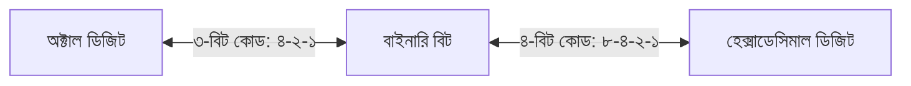

# এইচএসসি আইসিটি ৩য় অধ্যায়: সংখ্যা পদ্ধতির রূপান্তর ও শর্টকাট

উচ্চমাধ্যমিক তথ্য ও যোগাযোগ প্রযুক্তি (ICT) বিষয়ের ৩য় অধ্যায়ের প্রথম অংশ হলো **সংখ্যা পদ্ধতি (Number Systems)**। বিজ্ঞান, মানবিক কিংবা ব্যবসায় শিক্ষা—যেকোনো বিভাগের শিক্ষার্থীর জন্যই এই অধ্যায়টি হলো পরীক্ষায় ১০০% নিশ্চিত পূর্ণ নম্বর তোলার সবচেয়ে নির্ভরযোগ্য ক্ষেত্র। বোর্ড পরীক্ষার সৃজনশীল প্রশ্ন (CQ)-এর 'গ' নম্বরে সরাসরি ৩ নম্বর থাকে সংখ্যা পদ্ধতির রূপান্তরের ওপর এবং বহুনির্বাচনি অংশে (MCQ) অন্তত ৩ থেকে ৪টি প্রশ্ন থাকে সরাসরি রূপান্তর ও সংখ্যাভিত্তিক তুলনার ওপর।

অনেক শিক্ষার্থী পরীক্ষার হলে দীর্ঘভাগ বা গুণ করতে গিয়ে প্রচুর সময় নষ্ট করে কিংবা ভগ্নাংশের হিসাবে ভুল করে বসে। অথচ মাত্র দুটি ম্যাজিক কোড ($4-2-1$ এবং $8-4-2-1$) এবং বিজ্ঞানসম্মত কিছু কৌশল জানলে যেকোনো রূপান্তর খাতা-কলমে মাত্র কয়েক সেকেন্ডেই সম্পন্ন করা যায়। এই পূর্ণাঙ্গ গাইডে সংখ্যা পদ্ধতির ৪টি কাঠামোর পারস্পরিক ১২ ধরনের রূপান্তর, ভগ্নাংশের হিসাব, বাইনারি-অক্টাল যোগ এবং ক্যালকুলেটর ট্রিকস বিস্তারিত সাজিয়ে দেওয়া হলো।

> [!NOTE]
> **এক নজরে সংখ্যা পদ্ধতির ৪টি মূল স্তম্ভ:**
> - **দশমিক (Decimal, Base 10):** অংক $0$ থেকে $9$ পর্যন্ত মোট ১০টি। দৈনন্দিন হিসাবের ভিত্তি।
> - **বাইনারি (Binary, Base 2):** অংক কেবল $0$ ও $1$। কম্পিউটারের অভ্যন্তরীণ ইলেকট্রনিক সিগন্যালের ভাষা।
> - **অক্টাল (Octal, Base 8):** অংক $0$ থেকে $7$ পর্যন্ত মোট ৮টি। প্রতি ডিজিট বাইনারির ৩ বিটের সমতুল্য ($2^3 = 8$)।
> - **হেক্সাডেসিমাল (Hexadecimal, Base 16):** মোট ১৬টি প্রতীক: $0-9$ এবং $A(10), B(11), C(12), D(13), E(14), F(15)$। প্রতি ডিজিট বাইনারির ৪ বিটের সমতুল্য ($2^4 = 16$)।

---

## সংখ্যা পদ্ধতির তুলনামূলক রূপরেখা

| সংখ্যা পদ্ধতির নাম | ভিত্তি (Base) | ব্যবহৃত অংক বা প্রতীক | সর্ববৃহৎ একক অংক | উদাহরণ |
|---|---|---|---|---|
| **দশমিক (Decimal)** | ১০ | $0, 1, 2, 3, 4, 5, 6, 7, 8, 9$ | $9$ | $(245.75)_{10}$ |
| **বাইনারি (Binary)** | ২ | $0, 1$ | $1$ | $(11010.11)_2$ |
| **অক্টাল (Octal)** | ৮ | $0, 1, 2, 3, 4, 5, 6, 7$ | $7$ | $(372.5)_8$ |
| **হেক্সাডেসিমাল (Hexadecimal)** | ১৬ | $0-9$ এবং $A, B, C, D, E, F$ | $F$ (যার মান ১৫) | $(2B9.A)_{16}$ |

---

## ১. ম্যাজিক কোড হ্যাকস: ৪-২-১ এবং ৮-৪-২-১ পদ্ধতি

বাইনারি, অক্টাল এবং হেক্সাডেসিমালের পারস্পরিক রূপান্তরে কোনো গুণ বা ভাগ করার প্রয়োজন হয় না। সরাসরি বিট বিন্যাস পদ্ধতি প্রয়োগ করে কয়েক সেকেন্ডেই উত্তর বের করা যায়।



### ক) অক্টাল ও বাইনারি রূপান্তর (৪-২-১ কোড)
অক্টালের যেকোনো একটি ডিজিটের মান তৈরি করতে $4, 2, 1$-এর যে যে সংখ্যা যোগ করতে হয়, তাদের নিচে $1$ বসাও এবং বাকিগুলোর নিচে $0$ বসাও।

| অক্টাল ডিজিট | ৪-২-১ বাইনারি বিট | অক্টাল ডিজিট | ৪-২-১ বাইনারি বিট |
|:---:|:---:|:---:|:---:|
| $0$ | $000$ | $4$ ($4$) | $100$ |
| $1$ ($1$) | $001$ | $5$ ($4+1$) | $101$ |
| $2$ ($2$) | $010$ | $6$ ($4+2$) | $110$ |
| $3$ ($2+1$) | $011$ | $7$ ($4+2+1$) | $111$ |

**বাস্তব উদাহরণ:** $(653)_8$-কে বাইনারিতে রূপান্তর করো।
- $6 \rightarrow 110$
- $5 \rightarrow 101$
- $3 \rightarrow 011$
- অতএব, $(653)_8 = (110101011)_2$! (কোনো ভাগ বা গুণ ছাড়াই সমাধান)।

---

### খ) হেক্সাডেসিমাল ও বাইনারি রূপান্তর (৮-৪-২-১ কোড)
হেক্সাডেসিমালের প্রতিটি প্রতীক বাইনারির ৪টি বিটের সমন্বয় ($8, 4, 2, 1$)।

| হেক্সাডেসিমাল প্রতীক | দশমিক মান | ৮-৪-২-১ বাইনারি বিট |
|:---:|:---:|:---:|
| $A$ | ১০ | $8 + 2 \rightarrow 1010$ |
| $B$ | ১১ | $8 + 2 + 1 \rightarrow 1011$ |
| $C$ | ১২ | $8 + 4 \rightarrow 1100$ |
| $D$ | ১৩ | $8 + 4 + 1 \rightarrow 1101$ |
| $E$ | ১৪ | $8 + 4 + 2 \rightarrow 1110$ |
| $F$ | ১৫ | $8 + 4 + 2 + 1 \rightarrow 1111$ |

**বাস্তব উদাহরণ:** $(2BF)_{16}$-কে বাইনারিতে রূপান্তর করো।
- $2 \rightarrow 0010$
- $B (11) \rightarrow 1011$
- $F (15) \rightarrow 1111$
- অতএব, $(2BF)_{16} = (001010111111)_2$।

---

## ২. সংখ্যা পদ্ধতির ১২টি রূপান্তরের ৩টি মৌলিক নিয়ম

সকল প্রকার রূপান্তরকে ৩টি সাধারণ ক্যাটাগরিতে ভাগ করে আয়ত্ত করা যায়:

```mermaid
graph TD
    A[রূপান্তরের ৩টি নিয়ম] --> B[নিয়ম ১: দশমিক থেকে যেকোনো বেসে]
    A --> C[নিয়ম ২: যেকোনো বেস থেকে দশমিকে]
    A --> D[নিয়ম ৩: বাইনারি-অক্টাল-হেক্সাডেসিমাল পারস্পরিক]
    B --> E[পূর্ণসংখ্যায় বেস দিয়ে ক্রমাগত ভাগ | ভগ্নাংশে বেস দিয়ে ক্রমাগত গুণ]
    C --> F[স্থানীয় মান দিয়ে গুণ: সংখ্যা × বেস^পজিশন]
    D --> G[৪-২-১ এবং ৮-৪-২-১ কোডের গ্রুপ পদ্ধতি]
```

---

### নিয়ম ১: দশমিক সংখ্যা থেকে যেকোনো পদ্ধতিতে রূপান্তর
- **পূর্ণসংখ্যার নিয়ম:** দশমিক সংখ্যাটিকে কাঙ্ক্ষিত পদ্ধতির ভিত্তি (Base: ২, ৮ বা ১৬) দিয়ে ক্রমাগত ভাগ করো এবং ভাগশেষগুলোকে নিচ থেকে উপরে (MSB থেকে LSB) সাজাও।
- **ভগ্নাংশের নিয়ম:** দশমিক ভগ্নাংশটিকে কাঙ্ক্ষিত ভিত্তি দিয়ে ক্রমাগত গুণ করো এবং প্রাপ্ত পূর্ণসংখ্যা অংশগুলোকে উপর থেকে নিচে সাজাও।

**বাস্তব উদাহরণ:** $(43.625)_{10}$-কে বাইনারিতে রূপান্তর করো।
- **পূর্ণসংখ্যা (৪৩):**
  - $43 \div 2 = 21$ (ভাগশেষ ১)
  - $21 \div 2 = 10$ (ভাগশেষ ১)
  - $10 \div 2 = 5$ (ভাগশেষ ০)
  - $5 \div 2 = 2$ (ভাগশেষ ১)
  - $2 \div 2 = 1$ (ভাগশেষ ০)
  - $1 \div 2 = 0$ (ভাগশেষ ১)
  - নিচ থেকে উপরে লিখলে পাই: $101011$।
- **ভগ্নাংশ (০.৬২৫):**
  - $0.625 \times 2 = 1.25$ (পূর্ণসংখ্যা ১)
  - $0.25 \times 2 = 0.50$ (পূর্ণসংখ্যা ০)
  - $0.50 \times 2 = 1.00$ (পূর্ণসংখ্যা ১)
  - উপর থেকে নিচে লিখলে পাই: $.101$।
- **পূর্ণাঙ্গ ফলাফল:** $(43.625)_{10} = (101011.101)_2$।

---

### নিয়ম ২: যেকোনো পদ্ধতি থেকে দশমিক সংখ্যায় রূপান্তর
যেকোনো সংখ্যা পদ্ধতির মানকে ডেসিমালে আনতে প্রতিটি অংককে তার নিজ নিজ স্থানীয় মান বা ভার (Weight: $\text{Base}^{\text{Position}}$) দ্বারা গুণ করে যোগ করতে হয়।

**বাস্তব উদাহরণ:** $(2A.8)_{16}$-কে দশমিকে রূপান্তর করো।
$$(2A.8)_{16} = 2 \times 16^1 + A(10) \times 16^0 + 8 \times 16^{-1}$$
$$= 2 \times 16 + 10 \times 1 + 8 \times 0.0625 = 32 + 10 + 0.5 = (42.5)_{10}$$

---

### নিয়ম ৩: অক্টাল থেকে হেক্সাডেসিমাল (ও বিপরীত) রূপান্তর
অক্টাল থেকে হেক্সাডেসিমালে সরাসরি যাওয়ার কোনো পথ নেই। মাঝখানে **বাইনারিকে মাধ্যম (Bridge)** হিসেবে ব্যবহার করতে হয়।
- **ধাপ ১:** অক্টাল সংখ্যাটিকে ৪-২-১ কোড ব্যবহার করে বাইনারিতে নাও।
- **ধাপ ২:** প্রাপ্ত বাইনারি বিটগুলোকে ৪ বিট করে গ্রুপ বানাও (ডান থেকে বামে)।
- **ধাপ ৩:** প্রতি ৪ বিটের হেক্সাডেসিমাল মান বসাও।

**বাস্তব উদাহরণ:** $(75.4)_8$-কে হেক্সাডেসিমালে রূপান্তর করো।
- বাইনারি রূপ: $7 \rightarrow 111, 5 \rightarrow 101, .4 \rightarrow .100$
- পূর্ণ বাইনারি: $111101.100_2$
- ৪ বিট গ্রুপ সাজানো:
  - পূর্ণসংখ্যা: $\underline{0011} \ \underline{1101}$ (বামপাশে দুটি শূন্য যোগ করে ৪ বিট করা হলো) $= 3D$
  - ভগ্নাংশ: $\underline{1000}$ (ডানপাশে একটি শূন্য যোগ করা হলো) $= 8$
- অতএব, $(75.4)_8 = (3D.8)_{16}$!

---

## ৩. বাইনারি, অক্টাল ও হেক্সাডেসিমাল যোগের বিশেষ কৌশল

### বাইনারি যোগের চার নীতি:
- $0 + 0 = 0$
- $0 + 1 = 1$
- $1 + 0 = 1$
- $1 + 1 = 10_2$ (যোগফল $0$, ক্যারি $1$)
- $1 + 1 + 1 = 11_2$ (যোগফল $1$, ক্যারি $1$)

### অক্টাল ও হেক্সাডেসিমাল যোগের গোপন সূত্র:
যেকোনো সংখ্যা পদ্ধতির যোগে অংকগুলোর সাধারণ যোগফল যদি ওই পদ্ধতির **ভিত্তি (Base)-এর সমান বা বড়** হয়ে যায়, তবে যোগফল থেকে ভিত্তি বিয়োগ করতে হয় এবং হাতে ক্যারি $1$ থাকে।

**অক্টাল যোগ উদাহরণ:** $(75)_8 + (36)_8$
১. এককের ঘর: $5 + 6 = 11$ (যা অক্টালের বেস ৮-এর চেয়ে বড়)।
   - বিয়োগ: $11 - 8 = 3$ (যোগফল ৩, ক্যারি ১)।
২. দশকের ঘর: $7 + 3 + 1 (\text{ক্যারি}) = 11$।
   - বিয়োগ: $11 - 8 = 3$ (যোগফল ৩, ক্যারি ১)।
৩. ক্যারি ১ সামনে বসে যাবে।
- অতএব, $(75)_8 + (36)_8 = (133)_8$!

---

## ৪. ক্যালকুলেটরে ৫ সেকেন্ডে রূপান্তর করার নিয়ম (Base-N মোড)

বোর্ড পরীক্ষায় বহুনির্বাচনি প্রশ্ন দ্রুত মেলাতে সায়েন্টিফিক ক্যালকুলেটরের Base-N মোড অত্যন্ত কার্যকর:

১. **মোড পরিবর্তন:** ক্যালকুলেটরে `MODE` ➔ `4` (BASE-N) চাপো।
২. স্ক্রিনে ডিফল্টভাবে `dec` (দশমিক) লেখা থাকবে।
৩. কি-প্যাডের সংশ্লিষ্ট বাটন চাপো:
   - `x²` বাটন $\rightarrow$ **DEC**
   - `xʸ` বাটন $\rightarrow$ **HEX**
   - `log` বাটন $\rightarrow$ **BIN**
   - `ln` বাটন $\rightarrow$ **OCT**
৪. **রূপান্তরের ধাপ:**
   - প্রথমে যে সংখ্যা পদ্ধতিতে ইনপুট দিতে চাও তার বাটন চাপো (যেমন অক্টাল হলে `OCT`)।
   - সংখ্যাটি লিখে `=` চাপো।
   - এবার সরাসরি কাঙ্ক্ষিত পদ্ধতির বাটন চাপো (যেমন বাইনারি চাইলে `BIN`)। স্ক্রিনে অবিলম্বে উত্তর ভেসে উঠবে!

> [!WARNING]
> সায়েন্টিফিক ক্যালকুলেটরের Base-N মোড কেবল **পূর্ণসংখ্যার** রূপান্তর সমর্থন করে; এতে ভগ্নাংশ বা দশমিক বিন্দু ($.$) ইনপুট দেওয়া যায় না। ভগ্নাংশের জন্য ৪-২-১ ও ৮-৪-২-১ কোড ম্যানুয়ালি ব্যবহার করাই সবচেয়ে দ্রুততম পদ্ধতি।

---

## ৫. আলফানিউমেরিক কোড ও ক্যারেক্টার এনকোডিং: BCD, ASCII ও Unicode

বোর্ড পরীক্ষার বহুনির্বাচনি (MCQ) ও জ্ঞানমূলক প্রশ্নে সংখ্যা পদ্ধতির পাশাপাশি বিভিন্ন কোডিং সিস্টেম থেকে প্রতি বছর প্রশ্ন আসে। কম্পিউটার কেবল বাইনারি $0$ ও $1$ বোঝে বলে বিভিন্ন বর্ণ, সংখ্যা ও বিশেষ চিহ্নকে বাইনারিতে রূপান্তর করতে বিশেষ কোডিং পদ্ধতি ব্যবহার করা হয়:

| কোডের নাম | পূর্ণরূপ | বিট সংখ্যা | মোট উপস্থাপনযোগ্য ক্যারেক্টার | মূল বৈশিষ্ট্য ও ব্যবহার |
| :--- | :--- | :--- | :--- | :--- |
| **BCD** | Binary Coded Decimal | ৪-বিট | ১৬ ($2^4$) প্রকার | প্রতিটি দশমিক অংককে আলাদা ৪-বিট বাইনারিতে রূপান্তর করা হয় |
| **EBCDIC** | Extended Binary Coded Decimal Interchange Code | ৮-বিট | ২৫৬ ($2^8$) প্রকার | আইবিএম (IBM) মেইনফ্রেম কম্পিউটারে বহুল ব্যবহৃত হয় |
| **ASCII-7** | American Standard Code for Information Interchange | ৭-বিট | ১২৮ ($2^7$) প্রকার | ৩টি জোন বিট ও ৪টি সংখ্যাবাচক বিট থাকে |
| **ASCII-8** | Extended ASCII | ৮-বিট | ২৫৬ ($2^8$) প্রকার | ১টি প্যারিটি বিট, ৩টি জোন বিট এবং ৪টি সংখ্যাসূচক বিট থাকে |
| **Unicode** | Universal Code | ১৬-বিট / ৩২-বিট | ৬৫,৫৩৬ ($2^{16}$) বা ততোধিক | বিশ্বের সকল জীবন্ত ভাষার বর্ণমালা ও ইমোজি এনকোড করতে ব্যবহৃত |

### বোর্ড পরীক্ষায় আসা গুরুত্বপূর্ণ কোডিং ট্রিকস:
- **ASCII মান মনে রাখার শর্টকাট:** 
  - ইংরেজি বড় হাতের অক্ষর 'A'-এর দশমিক মান হলো $65$ (বাইনারিতে $01000001$)।
  - ইংরেজি ছোট হাতের অক্ষর 'a'-এর দশমিক মান হলো $97$ (বাইনারিতে $01100001$)।
  - বড় হাতের বর্ণ থেকে ছোট হাতের বর্ণের পার্থক্য সর্বদা $32$ ($97 - 65 = 32$)। অর্থাৎ ষষ্ঠ বিটটি $1$ করলেই ছোট হাতের বর্ণে রূপান্তরিত হয়।
- **ইউনিকোড (Unicode):** বাংলা বর্ণমালার বর্ণসমূহ কম্পিউটারে সংরক্ষণ ও প্রদর্শনের জন্য ইউনিকোড অপরিহার্য। বিশ্বের বহুভাষিক প্ল্যাটফর্মগুলোতে এটি আদর্শ হিসেবে গৃহীত।

---

## টপ ৫ সাধারণ ভুল ও পরীক্ষার হলের গোপন কৌশল

১. **ভগ্নাংশের গ্রুপিংয়ে ভুল দিক নির্বাচন:** পূর্ণসংখ্যার ক্ষেত্রে বিটের গ্রুপিং করতে হয় **ডান থেকে বামে**, কিন্তু ভগ্নাংশের ক্ষেত্রে দশমিক বিন্দুর পর গ্রুপিং করতে হয় **বাম থেকে ডানে**। এটি ভুল করলে পুরো রূপান্তর ভুল হয়ে যায়।
২. **হেক্সাডেসিমালের বর্ণগুলোর মানে গোলমাল:** $A=10, B=11, C=12, D=13, E=14, F=15$। তাড়াহুড়োর সময় শিক্ষার্থীরা $D$-কে ১২ বা $B$-কে ১০ ধরে বসে।
৩. **অক্টাল সংখ্যায় ৮ বা ৯ লিখে ফেলা:** অক্টাল পদ্ধতিতে সর্বোচ্চ অংক হলো ৭। কোনো সংখ্যায় যদি ৮ বা ৯ থাকে (যেমন $(78)_8$), তবে বুঝতে হবে প্রশ্নটি অসংগত বা ভুল সংখ্যা পদ্ধতি।
৪. **দশমিক ভগ্নাংশের গুণ প্রক্রিয়া না থামা:** অনেক ভগ্নাংশ গুণ করতে থাকলে অসীম পর্যন্ত চলতে থাকে। সাধারণত ৪ থেকে ৫ ঘর পর্যন্ত গুণ করে পূর্ণসংখ্যা না মিললে ডট ডট ($\dots$) দিয়ে রেখে দিতে হয়।
৫. **টাইমার মেপে রূপান্তর প্র্যাকটিস না করা:** সংখ্যা পদ্ধতির রূপান্তরের নিয়ম জানা আর পরীক্ষার হলে ৩০ সেকেন্ডে সঠিক উত্তর দাগানো এক নয়। বিভিন্ন বোর্ডে আসা জটিল সংখ্যা রূপান্তরের ওপর নিজের গতি যাচাই করতে [অভ্যাস মোবাইল ও ওয়েব অ্যাপে (obhyash.com)](https://obhyash.com) আইসিটির অধ্যায়ভিত্তিক কুইজ ও বিগত বোর্ড প্রশ্ন নিয়মিত টেস্ট দিয়ে নিজের নির্ভুলতা যাচাই করে নাও।

---

## অন্যান্য বিষয়ের সাথে ইন্টারনাল লিংকিং

আইসিটি ও বিজ্ঞানের অন্যান্য গুরুত্বপূর্ণ গাইডগুলো দেখে নিতে পারো:
- [এইচএসসি আইসিটি ৩য় অধ্যায়: ২-এর পরিপূরক ও বুলিয়ান সরলীকরণ সম্পূর্ণ গাইড](/blog/hsc-2027-ict-twos-complement-boolean-hacks)
- [HSC 2027 ICT Syllabus & Marks Distribution: ৬টি অধ্যায়ের পূর্ণাঙ্গ গাইড](/blog/hsc-2027-ict-syllabus-marks-distribution)
- [এইচএসসি উচ্চতর গণিত: ক্যালকুলেটর শর্টকাট হ্যাকস ও ট্রিকস](/blog/hsc-higher-math-calculator-hacks)
- [এইচএসসি ২০২৭ বিজ্ঞান বিভাগের সেরা বই তালিকা](/blog/hsc-2027-science-best-booklist)

---

## সচরাচর জিজ্ঞাসা (FAQ)

### ১. সংখ্যা পদ্ধতিতে বেস বা ভিত্তি বলতে কী বোঝায়?
কোনো সংখ্যা পদ্ধতিতে সংখ্যা গঠন ও গণনার জন্য মোট যতগুলো মৌলিক অংক বা প্রতীক ব্যবহার করা হয়, তার মোট সংখ্যাকে ওই সংখ্যা পদ্ধতির ভিত্তি বা বেস (Base) বলে। যেমন বাইনারিতে কেবল দুটি প্রতীক ($0$ ও $1$) ব্যবহৃত হয়, তাই এর বেস ২।

### ২. ভগ্নাংশযুক্ত বাইনারিকে কীভাবে দ্রুত ডেসিমালে রূপান্তর করব?
দশমিক বিন্দুর পরের বিটগুলোর স্থানীয় মান যথাক্রমে $2^{-1} = 0.5$, $2^{-2} = 0.25$, $2^{-3} = 0.125$, $2^{-4} = 0.0625$। যে যে ঘরে $1$ আছে কেবল সেই মানগুলো যোগ করলেই সরাসরি দশমিক মান পাওয়া যায়।

### ৩. পজিশনাল ও নন-পজিশনাল সংখ্যা পদ্ধতির মূল পার্থক্য কী?
পজিশনাল সংখ্যা পদ্ধতিতে কোনো অংকের নিজস্ব মান, ভিত্তি এবং স্থানীয় মান (অবস্থান) থাকে (যেমন দশমিক, বাইনারি)। অন্যদিকে নন-পজিশনাল সংখ্যা পদ্ধতিতে কোনো স্থানীয় মান থাকে না, কেবল চিহ্নের নিজস্ব মান থাকে (যেমন প্রাচীন রোমান বা হায়ারোগ্লিফিক্স সংখ্যা)।

### ৪. $(111)_2, (7)_8, (F)_{16}$ এর মধ্যে কোনটি সবচেয়ে বড়?
দশমিকে রূপান্তর করে তুলনা করা যায়: $(111)_2 = 7$, $(7)_8 = 7$, এবং $(F)_{16} = 15$। সুতরাং $(F)_{16}$ হলো এদের মধ্যে সবচেয়ে বড় সংখ্যা।

### ৫. বিসিডি (BCD) কোড এবং বাইনারি সংখ্যার মধ্যে তফাত কী?
বাইনারি হলো একটি প্রকৃত সংখ্যা পদ্ধতি যেখানে সম্পূর্ণ সংখ্যাটিকে রূপান্তর করা হয়। অন্যদিকে BCD (Binary Coded Decimal) হলো একটি কোডিং পদ্ধতি যেখানে দশমিক সংখ্যার প্রতিটি অংককে পৃথকভাবে ৪-বিট বাইনারিতে প্রকাশ করা হয়। যেমন $(12)_{10}$-এর বাইনারি হলো $1100_2$, কিন্তু BCD কোড হলো $0001 \ 0010$।

---

## অভ্যাসের সঙ্গে তোমার আইসিটি প্রস্তুতিকে দ্রুত ও নির্ভুল করো

সংখ্যা পদ্ধতির জটিল রূপান্তর ও গাণিতিক হিসাবগুলোতে পূর্ণ নম্বর পেতে দরকার নিয়মিত সময় মেপে অনুশীলন।

আজই তোমার প্রস্তুতি গুছিয়ে নাও:

- **অ্যান্ড্রয়েড মোবাইল অ্যাপ:** [Google Play Store থেকে Obhyash অ্যাপ ইনস্টল করো](https://play.google.com/store/apps/details?id=com.obhyash.app)
- **ওয়েব ও পিসি ব্রাউজার:** [obhyash.com-এ সাইন আপ করো](https://obhyash.com) এবং আইসিটির সকল অধ্যায়ের টাইমারভিত্তিক কুইজ ও বিগত বছরের প্রশ্ন সমাধান শুরু করো।
