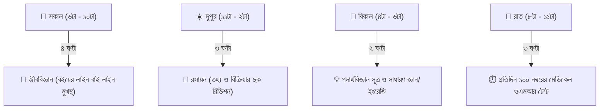

# মেডিকেল ভর্তি পরীক্ষার প্রস্তুতি রুটিন ও প্রথমবারেই চান্স পাওয়ার কৌশল 🩺🤍

প্রতি বছর দেড় লক্ষাধিক শিক্ষার্থীর স্বপ্ন থাকে সাদা অ্যাপ্রন গায়ে জড়িয়ে ডাক্তার হওয়া। কিন্তু সরকারি মেডিকেল কলেজগুলোতে আসন সংখ্যা মাত্র পাঁচ হাজারেরও কিছু বেশি! অর্থাৎ প্রতি ৩০ জনে মাত্র ১ জন শিক্ষার্থী সরকারি মেডিকেলে পড়ার সুযোগ পায়।

এই কঠিন প্রতিযোগিতায় যারা টিকে থাকে, তাদের প্রস্তুতি কিন্তু অন্যদের চেয়ে আলাদা হয়। মেডিকেল পরীক্ষা কোনো কঠিন অঙ্কের খেলা নয়, এটি হলো **তথ্য নিখুঁতভাবে মনে রাখা (Retention) এবং পরীক্ষার ১ ঘণ্টার ১০০ নম্বরে ন্যূনতম ভুল করার আর্ট**।

আজকের ব্লগে মেডিকেল ভর্তি পরীক্ষার জন্য বিষয়ভিত্তিক পড়ার নিয়ম এবং প্রথমবারেই চান্স পাওয়ার গোপন কৌশলগুলো তুলে ধরা হলো।

---

## ১. বিষয়ভিত্তিক নম্বর বণ্টন ও পড়ার কৌশল

| বিষয় | নম্বর | পড়ার মূল উৎস ও টেকনিক |
| :--- | :---: | :--- |
| **জীববিজ্ঞান (Biology)** | ৩০ | ড. আবুল হাসান (উদ্ভিদবিজ্ঞান) ও গাজী আজমল (প্রাণীবিজ্ঞান) স্যারের বইয়ের প্রতিটি লাইন দাঁড়ি-কমা সহ পড়তে হবে। ছক, উদাহরণ ও ব্যতিক্রম বৈশিষ্ট্যগুলো আলাদা খাতায় লিখে রিভিশন করো। |
| **রসায়ন (Chemistry)** | ২৫ | ড. সরোজ কান্তি সিংহ হাজারী স্যারের বই। বিক্রিয়া, শর্ত, প্রভাবক, মৌলের পর্যায়বৃত্ত ধর্ম ও পরিবেশ রসায়নের তথ্যভিত্তিক এমসিকিউ বারবার প্র্যাকটিস করো। |
| **পদার্থবিজ্ঞান (Physics)** | ২০ | ড. মো. শাহজাহান তপন ও ড. ইসহাক স্যারের বই। সূত্রের মৌলিক অঙ্ক ও অনুধাবনমূলক প্রশ্ন। বড় বড় গাণিতিক সমস্যা মেডিকেলে আসে না, সরাসরি ছোট সূত্রের ম্যাথ আসে। |
| **ইংরেজি (English)** | ১৫ | Vocabulary, Synonyms-Antonyms, Prepositions, Idioms ও Correction। বিগত ২০ বছরের বিসিএস ও মেডিকেল প্রশ্নের সমাধান শেষ করো। |
| **সাধারণ জ্ঞান (GK)** | ১০ | মুক্তিযুদ্ধ, বঙ্গবন্ধু ও সাম্প্রতিক বাংলাদেশের বড় বড় অর্জন। প্রতিদিন ১৫ মিনিট কারেন্ট অ্যাফেয়ার্স পড়লেই যথেষ্ট। |

---

## ২. মেডিকেলের জন্য একটি আদর্শ দৈনিক রুটিন (১২ ঘণ্টার প্ল্যান)

> [!TIP]
> **নেগেটিভ মার্কিং এড়ানোর ম্যাজিক:**  
> মেডিকেলে প্রতি ভুল উত্তরের জন্য $0.25$ নম্বর কাটা যায়। কখনোই ৬০-৭০% নিশ্চিত না হয়ে দাগাবে না। অনেকে ১০০টি দাগাতে গিয়ে ১৫-২০টি ভুল করে তালিকা থেকে ছিটকে পড়ে। ৯০টি নিখুঁত দাগানো ১০০টি দাগিয়ে নেগেটিভ খাওয়ার চেয়ে অনেক ভালো!

---

## ৩. দাগানো বই (Highlighted Books) রিভিশনের গুরুত্ব

মেডিকেল প্রস্তুতির শেষ ১ মাসে পুরো বই পড়া অসম্ভব। তাই প্রথমবার পড়ার সময়ই ৩ রঙের হাইলাইটার ব্যবহার করো:
1. **হলুদ হাইলাইটার:** সাধারণ গুরুত্বপূর্ণ তথ্য ও বিজ্ঞানীদের নাম।
2. **গোলাপী/লাল হাইলাইটার:** বিগত বছরের পরীক্ষায় আসা প্রশ্ন।
3. **সবুজ হাইলাইটার:** যে তথ্যগুলো বারবার ভুলে যাও বা কনফিউজিং (যেমন বিভিন্ন হরমোন বা এনজাইমের কাজ)।

---

## 🎯 মেডিকেল স্ট্যান্ডার্ড টাইমড এমসিকিউ সলভ করো অভ্যাস-এ

মেডিকেল পরীক্ষায় সবচেয়ে বড় পরীক্ষা হলো মাত্র ৬০ মিনিটে ১০০টি এমসিকিউ দাগানো। এই স্পিড তৈরি করতে বাসায় নিয়মিত টাইমার দিয়ে প্র্যাকটিস করতে হবে।

👉 **[অভ্যাস (Obhyash) প্ল্যাটফর্মে মেডিকেল মডেল টেস্ট দাও আজকেই](https://obhyash.com)**
* মেডিকেল ভর্তি পরীক্ষার বিগত ২০ বছরের প্রশ্নব্যাংক
* লাইভ নেগেটিভ মার্কিং হিসাব ও একুরেসি রেট (Accuracy Rate)
* দেশের হাজারো মেডিকেল ভর্তি পরীক্ষার্থীর সাথে নিজের র‍্যাঙ্কিং যাচাই!
