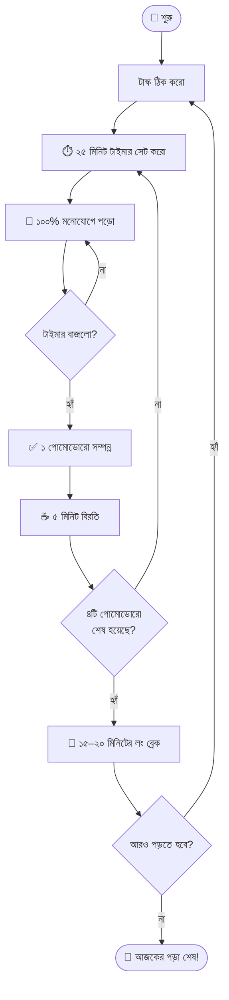
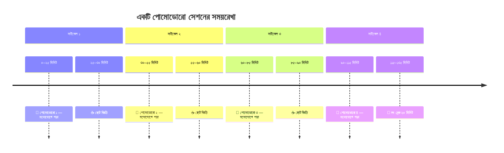

পড়তে বসলে কি ১৫ মিনিট পরেই মনোযোগ অন্যদিকে চলে যায়? কিংবা স্মার্টফোনের নোটিফিকেশন চেক করতে গিয়ে ঘণ্টার পর ঘণ্টা নষ্ট হয়? যদি উত্তর 'হ্যাঁ' হয়, তবে আপনার জন্য সবচেয়ে কার্যকরী সমাধান হতে পারে **পোমোডোরো টেকনিক (Pomodoro Technique)**।

১৯৮০-এর দশকে ফ্রান্সেসকো সিরিলো (Francesco Cirillo) নামক এক বিশ্ববিদ্যালয় পড়ুয়া এই অসাধারণ টাইম ম্যানেজমেন্ট কৌশলটি আবিষ্কার করেন। ইতালীয় ভাষায় 'Pomodoro' শব্দের অর্থ টমেটো (Tomato)। তিনি টমেটো আকৃতির একটি কিচেন টাইমার ব্যবহার করে এই টেকনিক তৈরি করেছিলেন বলে এর এমন নাম।

---

## পোমোডোরো টেকনিক কী?

খুব সহজ ভাষায়— একটানা দীর্ঘক্ষণ কাজ বা পড়াশোনা না করে, কাজটিকে ছোট ছোট সময়ে ভাগ করে নেওয়া এবং প্রতিটি ভাগের মাঝে খুব অল্প সময়ের বিরতি নেওয়াই হলো পোমোডোরো টেকনিক।

এর মূল রুল হলো: **২৫ মিনিট পড়াশোনা, ৫ মিনিট বিরতি**।



> [!NOTE]
> এই ২৫ মিনিটের একেকটি সেশনকে বলা হয় একটি 'পোমোডোরো'। আপনি বিশ্বাসও করতে পারবেন না, এই ছোট একটি নিয়ম কীভাবে আপনার প্রোডাক্টিভিটি রকেটের বেগে বাড়িয়ে দিতে পারে!

---

## কীভাবে পড়াশোনায় পোমোডোরো ব্যবহার করবেন?

এই টেকনিকটি আপনার রুটিনে অন্তর্ভুক্ত করার ৪টি সহজ ধাপ:

### ধাপ ১: আজকের টাস্ক ঠিক করুন 📝

হাতে থাকা বইটি নিয়ে ঠিক করুন আগামী কয়েক ঘণ্টায় আপনি ঠিক কী পড়তে চান। হতে পারে ফিজিক্সের ২টা চ্যাপ্টার রিভিশন দেওয়া অথবা ম্যাথের ৩০টি MCQ সমাধান করা। লক্ষ্য যত সুনির্দিষ্ট হবে, কাজ তত সহজ মনে হবে।

### ধাপ ২: ২৫ মিনিটের টাইমার সেট করুন ⏱️

> [!TIP]
> এবার আপনার ফোন বা ঘড়িতে ২৫ মিনিটের টাইমার চালু করুন। (তবে ভালো হয় যদি ফোনে ইন্টারনেট অফ করে বা সাইলেন্ট করে দূরে রেখে, একটি ফিজিক্যাল ঘড়ি বা স্টপওয়াচ ব্যবহার করেন)।

### ধাপ ৩: ১০০% ফোকাস দিয়ে পড়ুন 🧠

ওই ২৫ মিনিটে আপনার একমাত্র কাজ হলো পড়া। কোনো মেসেজ চেক করা নয়, কোনো নোটিফিকেশন দেখা নয়। মস্তিষ্ককে এমনভাবে প্রস্তুত করুন যেন আগামী ২৫ মিনিট পৃথিবী উল্টে গেলেও আপনি বই থেকে চোখ সরাবেন না।

### ধাপ ৪: ৫ মিনিটের বিরতি নিন ☕

টাইমার বাজলেই পড়া থামিয়ে দিন। এই ৫ মিনিট ব্রেইনকে বিশ্রাম দিন।
**এই সময়ে যা করতে পারেন:**

- একটু হাঁটাহাঁটি করা
- এক গ্লাস পানি খাওয়া
- চোখ বন্ধ করে লম্বা শ্বাস নেওয়া

> [!WARNING]
> এই ৫ মিনিটে ভুলেও সোশ্যাল মিডিয়া (ফেসবুক/ইনস্টাগ্রাম) স্ক্রল করতে যাবেন না! এটি আপনার মনোযোগ আবার নষ্ট করবে।

--

## লং ব্রেক (Long Break)

এভাবে পর পর ৪টি 'পোমোডোরো' (অর্থাৎ ২ ঘণ্টা) শেষ করার পর আপনাকে একটি বড় বিরতি নিতে হবে। এই বিরতির সময় হবে ১৫-২০ মিনিট। এই সময়ে আপনি হালকা কোনো স্ন্যাকস খেতে পারেন বা একটু রেস্ট নিতে পারেন। এরপর আবার নতুন করে পরের সাইকেল শুরু করুন।

---

## কেন এই টেকনিক ম্যাজিকের মতো কাজ করে?

1. **ব্রেইন সহজে বোর হয় না:** একটানা ২ ঘণ্টা পড়ার কথা ভাবলে আমাদের ব্রেইন এমনিতেই ভয় পেয়ে যায়। কিন্তু মাত্র ২৫ মিনিট পড়ার কথা শুনলে ব্রেইন খুব সহজেই রাজি হয়ে যায়।
2. **মনোযোগ ধরে রাখে:** যেহেতু সময়টি খুব ছোট (মাত্র ২৫ মিনিট), তাই এর মধ্যে অন্য কোনো চিন্তাকে ব্রেইনে ঢুকতে না দেওয়া বেশ সহজ।
3. **ক্লান্তি দূর করে:** প্রতি ২৫ মিনিট পর ৫ মিনিটের ছোট বিরতি আমাদের মস্তিষ্ককে রিফ্রেশ করে। ফলে দীর্ঘক্ষণ পড়লেও মাথা ব্যথা বা চরম ক্লান্তি আসে না।

### একটি পূর্ণ পোমোডোরো সাইকেল



### আপনার জন্য চ্যালেঞ্জ! 🎯

আজকেই পড়তে বসার সময় ফিজিক্স বা ম্যাথ বইটা নিয়ে মাত্র একটা বা দুইটা পোমোডোরো ট্রাই করে দেখুন। নিজেই নিজের মনোযোগ এবং পড়ার স্পিড দেখে অবাক হয়ে যাবেন!

```python
# একটি সহজ পোমোডোরো টাইমার স্ক্রিপ্ট
import time

def pomodoro_timer(minutes):
    seconds = minutes * 60
    print(f"🍅 {minutes} মিনিটের পোমোডোরো শুরু হলো!")

    while seconds > 0:
        time.sleep(1)
        seconds -= 1

    print("⏰ সময় শেষ! এবার ৫ মিনিটের একটা ব্রেক নিন।")

# ২৫ মিনিটের টাইমার চালু করা
pomodoro_timer(25)
```

শুভকামনা! 🚀
