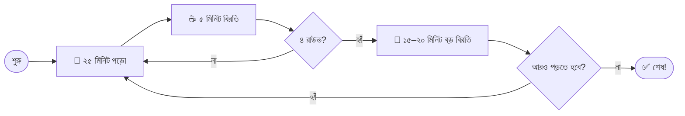
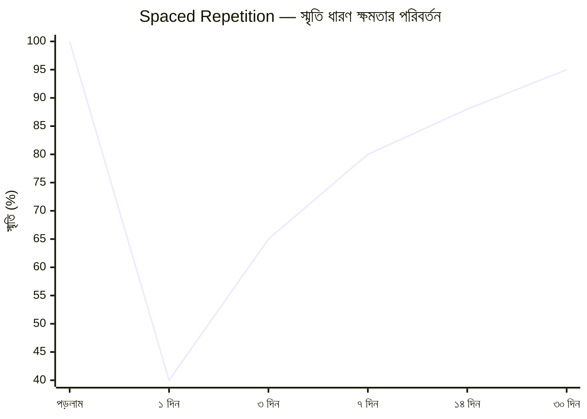
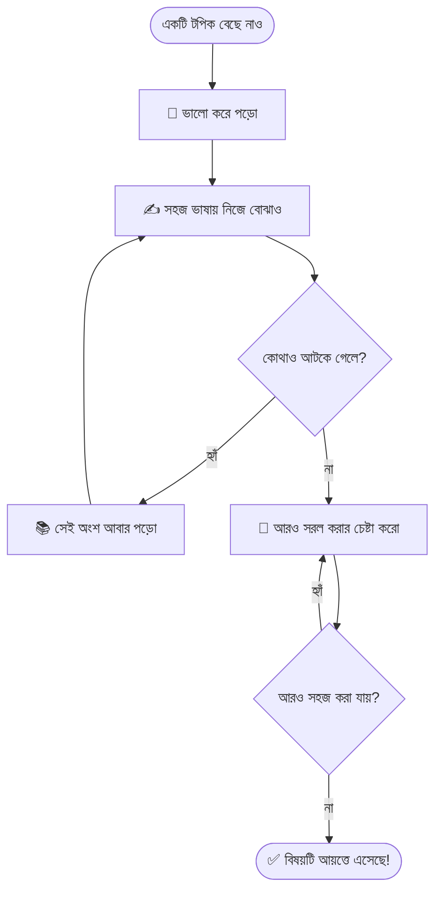
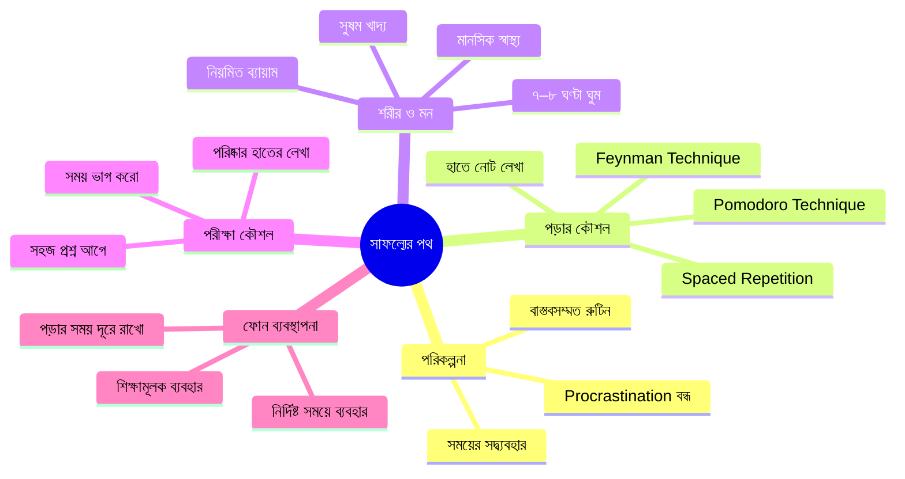

# পড়াশোনায় সাফল্যের গোপন চাবিকাঠি: পরীক্ষিত স্টাডি টিপস যা তোমার জীবন বদলে দেবে 📚

---

আচ্ছা, তোমাকে একটা কথা জিজ্ঞেস করি — পরীক্ষার আগের রাতে বই খুলে হাঁটু গেড়ে বসে থাকার অভিজ্ঞতা কি তোমার নেই? সারারাত জেগে পড়েও মনে হয় কিছুই মাথায় ঢুকছে না? আমার ছিল। আমি নিজেও একসময় ঠিক এভাবেই পড়তাম। কিন্তু একদিন বুঝলাম — **সমস্যাটা আমার পড়াশোনার পরিমাণে না, সমস্যাটা আমার পড়ার পদ্ধতিতে।**

আজকের এই লেখাটা বাংলাদেশের সব শিক্ষার্থীর জন্য — তুমি SSC দিচ্ছ, HSC দিচ্ছ, বিশ্ববিদ্যালয়ে পড়ছ, নাকি অ্যাডমিশনের জন্য প্রস্তুতি নিচ্ছ — সবার কাজে লাগবে।

চলো শুরু করি।

---

## ১. 🕐 "পরে পড়ব" মানসিকতা আজকেই ছাড়ো

আমরা বাঙালিরা একটু procrastinator জাতি, এটা মানতেই হবে। "আজ না, কাল থেকে পাক্কা শুরু করব" — এই কথা বলতে বলতে পরীক্ষা এসে যায়।

> _"তুমি যদি আজকের কাজ কালের জন্য ফেলে রাখো, তাহলে কাল তোমার দুটো কাজ জমে থাকবে।"_
> — **বেঞ্জামিন ফ্র্যাঙ্কলিন**

**কী করবে?**

আজকেই একটা ছোট পদক্ষেপ নাও। পুরো সিলেবাস শেষ করতে হবে না। শুধু **একটা টপিক** ধরো। ৩০ মিনিট পড়ো। এটুকুই যথেষ্ট শুরু করার জন্য।

---

## ২. 📅 একটা বাস্তবসম্মত রুটিন বানাও (এবং মেনে চলো!)

রুটিন ছাড়া পড়াশোনা অনেকটা ম্যাপ ছাড়া ভ্রমণের মতো — কোথায় যাচ্ছ জানো না, কতদূর এসেছ বুঝতে পারো না।

তবে একটা কথা বলি — রুটিন বানানোর সময় নিজের সাথে সৎ থেকো। সকাল ৫টা থেকে রাত ১২টা পর্যন্ত পড়ার রুটিন বানিয়ে প্রথম দিনেই ভেঙে পড়লে লাভ নেই।

### একটা বাস্তবসম্মত দৈনিক রুটিনের নমুনা:

| সময়                | কাজ                                    | মন্তব্য                            |
| ------------------- | -------------------------------------- | ---------------------------------- |
| সকাল ৬:০০ - ৬:৩০    | ঘুম থেকে উঠা, ফ্রেশ হওয়া              | ফোন ধরবে না!                       |
| সকাল ৬:৩০ - ৮:৩০    | কঠিন বিষয় পড়া (গণিত/পদার্থ)          | সকালে মাথা ফ্রেশ থাকে              |
| সকাল ৮:৩০ - ৯:০০    | নাস্তা ও বিরতি                         | হালকা হাঁটাহাঁটি করো               |
| সকাল ৯:০০ - ১২:০০   | স্কুল/কলেজ/ক্লাস                       | মনোযোগ দিয়ে ক্লাস করো             |
| দুপুর ১২:০০ - ২:০০  | দুপুরের খাবার ও বিশ্রাম                | ২০ মিনিট পাওয়ার ন্যাপ নিতে পারো   |
| বিকেল ২:০০ - ৪:৩০   | মাঝারি কঠিন বিষয় পড়া                 | নোট করতে করতে পড়ো                 |
| বিকেল ৪:৩০ - ৫:৩০   | খেলাধুলা / ব্যায়াম                    | শরীর ভালো থাকলে মাথা ভালো কাজ করে  |
| সন্ধ্যা ৬:০০ - ৮:০০ | হালকা বিষয় পড়া / রিভিশন              | বাংলা, ইংরেজি, সাধারণ জ্ঞান        |
| রাত ৮:০০ - ৯:০০     | রাতের খাবার ও পরিবারের সাথে সময়       | মানসিক সুস্থতা জরুরি               |
| রাত ৯:০০ - ১০:৩০    | দিনের পড়া রিভিশন / পরের দিনের প্ল্যান | ঘুমানোর আগে রিভিশন সবচেয়ে কার্যকর |
| রাত ১০:৩০ - ১১:০০   | ঘুমানোর প্রস্তুতি                      | কমপক্ষে ৭ ঘণ্টা ঘুমাও              |

> 💡 **টিপ:** রুটিনে "ফ্রি টাইম" রাখো। মানুষ রোবট না। একটু রিল দেখবে, গান শুনবে — এটাও জরুরি।

---

## ৩. 🧠 Pomodoro Technique ব্যবহার করো

এটা আমার জীবন বদলে দিয়েছে, সত্যি বলছি। খুব সিম্পল একটা টেকনিক:

1. **২৫ মিনিট** মনোযোগ দিয়ে পড়ো (কোনো ফোন নেই, কোনো বিরতি নেই)
2. **৫ মিনিট** বিরতি নাও (চা খাও, হাঁটো, জানালা দিয়ে বাইরে তাকাও)
3. এভাবে **৪ রাউন্ড** শেষ হলে **১৫-২০ মিনিটের** বড় বিরতি নাও
4. আবার শুরু করো

কেন কাজ করে? কারণ আমাদের মস্তিষ্ক একটানা অনেকক্ষণ মনোযোগ ধরে রাখতে পারে না। ছোট ছোট টুকরোয় ভাগ করলে তথ্য বেশি মনে থাকে।

মোবাইলেই "Focus Timer" বা "Forest" অ্যাপ নামিয়ে নাও — টাইমার সেট করে পড়া শুরু করো।

---

## ৪. ✍️ নিজের হাতে নোট করো — টাইপ না, লেখো

আমি জানি ল্যাপটপে বা ফোনে টাইপ করা সহজ। কিন্তু গবেষণা বলছে, **হাতে লেখা নোট মস্তিষ্কে তথ্য বেশি গেঁথে রাখে।** কারণ লেখার সময় তোমার মস্তিষ্ক তথ্যটাকে প্রক্রিয়া করে, শুধু কপি করে না।

### কার্যকর নোট করার কিছু পদ্ধতি:

- **Cornell Method:** পৃষ্ঠাকে তিনটা ভাগে ভাগ করো — বাম পাশে কী-ওয়ার্ড, ডান পাশে বিস্তারিত নোট, আর নিচে সামারি। পরীক্ষার আগে শুধু বাম পাশ আর নিচের অংশ দেখলেই চলে।
- **Mind Mapping:** একটা কেন্দ্রীয় আইডিয়া থেকে শাখা-প্রশাখা বের করো। যারা ভিজ্যুয়ালি শেখে তাদের জন্য অসাধারণ কাজ করে। বিশেষ করে জীববিজ্ঞান, ইতিহাস, বাংলার জন্য দারুণ।
- **রঙিন কলম ব্যবহার করো:** সংজ্ঞা একটা রঙে, উদাহরণ আরেকটা রঙে, গুরুত্বপূর্ণ পয়েন্ট আরেকটা রঙে। চোখে পড়বে, মনে থাকবে।

---

## ৫. 📱 মোবাইল ফোন — তোমার সবচেয়ে বড় শত্রু (এবং বন্ধুও)

সত্যি কথা বলতে, আমাদের প্রজন্মের সবচেয়ে বড় সমস্যা এটাই। "একটু রিল দেখি" বলে শুরু করে ২ ঘণ্টা কোথায় চলে যায় বুঝতেই পারি না।

> _"স্মার্টফোন আমাদের স্মার্ট করছে না, আমাদের মনোযোগ চুরি করছে।"_
> — **ক্যাল নিউপোর্ট, Deep Work**

### ফোনকে শত্রু থেকে বন্ধু বানানোর উপায়:

| শত্রু হিসেবে ফোন ❌                      | বন্ধু হিসেবে ফোন ✅                               |
| ---------------------------------------- | ------------------------------------------------- |
| পড়ার সময় পাশে রাখা                     | পড়ার সময় অন্য ঘরে রাখা                          |
| সোশ্যাল মিডিয়ায় ঘণ্টার পর ঘণ্টা স্ক্রল | নির্দিষ্ট সময়ে নির্দিষ্ট সময়ের জন্য ব্যবহার     |
| TikTok/Reels আসক্তি                      | Khan Academy, 10 Minute School, Crash Course দেখা |
| গ্রুপ চ্যাটে আড্ডা                       | স্টাডি গ্রুপে প্রশ্ন ও উত্তর শেয়ার               |
| রাতে ঘুমানোর আগে ফোন চালানো              | ঘুমের ১ ঘণ্টা আগে ফোন বন্ধ                        |

---

## ৬. 🔁 রিভিশন হলো আসল খেলা — Spaced Repetition

একবার পড়ে রেখে দিলে মস্তিষ্ক সেটা ভুলে যায়। এটা স্বাভাবিক — বিজ্ঞানী Hermann Ebbinghaus এটাকে বলেছেন **"Forgetting Curve"** বা "বিস্মৃতি বক্ররেখা"।

Ebbinghaus-এর সূত্র অনুযায়ী, স্মৃতির অবক্ষয় হয় এইভাবে:

$$R = e^{-t/S}$$

যেখানে $R$ = স্মৃতি ধারণ ক্ষমতা, $t$ = সময় (দিন), $S$ = স্মৃতির শক্তি।

এই বক্ররেখাকে হারানোর উপায় হলো **নির্দিষ্ট বিরতিতে বারবার রিভিশন**:

| কবে পড়েছ               | কবে রিভিশন করবে | কেন                           |
| ----------------------- | --------------- | ----------------------------- |
| আজ                      | আগামীকাল        | ২৪ ঘণ্টায় ৭০% ভুলে যাও       |
| আগামীকাল রিভিশনের পর    | ৩ দিন পর        | স্মৃতি শক্ত হচ্ছে             |
| ৩ দিন পর রিভিশনের পর    | ১ সপ্তাহ পর     | দীর্ঘমেয়াদী স্মৃতিতে যাচ্ছে  |
| ১ সপ্তাহ পর রিভিশনের পর | ১ মাস পর        | এবার মাথায় পাকাপাকি বসে গেছে |

**Anki** নামে একটা ফ্রি অ্যাপ আছে — Flashcard বানিয়ে Spaced Repetition করতে পারবে। MCQ প্রস্তুতির জন্য অসাধারণ।

---

## ৭. 🗣️ অন্যকে শেখাও — Feynman Technique

নোবেল বিজয়ী পদার্থবিদ **রিচার্ড ফাইনম্যান** বলতেন:

> _"তুমি যদি কোনো বিষয় সহজ ভাষায় ব্যাখ্যা করতে না পারো, তাহলে তুমি সেটা আসলে বোঝোনি।"_

এটা কীভাবে কাজে লাগাবে? একটা টপিক পড়ার পর কল্পনা করো তুমি একটা ১০ বছরের বাচ্চাকে সেটা বোঝাচ্ছ। যেখানে আটকে যাবে, বুঝবে সেই জায়গাটা তোমার দুর্বল — আবার পড়ো।

তোমার ছোট ভাই-বোনকে পড়াও, বন্ধুদের সাথে আলোচনা করো, এমনকি দেয়ালের সাথে কথা বলো — কিন্তু শেখাও। এটা পড়াশোনার সবচেয়ে শক্তিশালী কৌশলগুলোর একটা।

---

## ৮. 🏃 শরীরের যত্ন নাও — ঘুম, খাওয়া, ব্যায়াম

এই পয়েন্টটা সবাই ইগনোর করে, কিন্তু এটা সবচেয়ে গুরুত্বপূর্ণ।

**ঘুম:** রাতে কমপক্ষে ৭-৮ ঘণ্টা ঘুমাও। ঘুমের সময় মস্তিষ্ক দিনে শেখা তথ্য প্রক্রিয়া করে দীর্ঘমেয়াদী স্মৃতিতে সংরক্ষণ করে। সারারাত জেগে পড়া মানে মস্তিষ্ককে এই কাজটা করতে না দেওয়া। তাই পরীক্ষার আগের রাতে জেগে পড়ার চেয়ে ঠিকমতো ঘুমানো বেশি কার্যকর।

**খাওয়া:** ভাত-ডাল খাও, মাছ খাও, শাকসবজি খাও, বাদাম খাও। জাঙ্ক ফুড বেশি খেলে শরীর ভারী লাগে, মাথা কাজ করে না। পানি প্রচুর খাও — পানিশূন্যতা মনোযোগ নষ্ট করে।

**ব্যায়াম:** দিনে অন্তত ৩০ মিনিট শরীরচর্চা করো। ক্রিকেট খেলো, দৌড়াও, সাইকেল চালাও, হাঁটো — যেটা ভালো লাগে। ব্যায়াম মস্তিষ্কে রক্ত সঞ্চালন বাড়ায় এবং BDNF নামে এক ধরনের প্রোটিন নিঃসরণ করে যা স্মৃতিশক্তি বাড়ায়।

---

## ৯. 📝 পরীক্ষার হলের কিছু গুরুত্বপূর্ণ কৌশল

শুধু পড়লেই হবে না, পরীক্ষার হলে সেই পড়া কাজে লাগানোও একটা দক্ষতা:

- **প্রথম ৫ মিনিট প্রশ্নপত্র ভালো করে পড়ো।** তাড়াহুড়ো করে লেখা শুরু করো না। কোন প্রশ্নগুলো ভালো পারো সেগুলো আগে মার্ক করো।
- **সহজ প্রশ্ন আগে উত্তর দাও।** এতে আত্মবিশ্বাস বাড়ে এবং সময় বাঁচে কঠিন প্রশ্নের জন্য।
- **সময় ভাগ করে নাও।** ১০০ নম্বরের পরীক্ষায় ৩ ঘণ্টা থাকলে প্রতি নম্বরের জন্য প্রায় ১.৮ মিনিট। একটা প্রশ্নে আটকে বসে থেকো না।
- **হ্যান্ডরাইটিং পরিষ্কার রাখো।** সুন্দর হাতের লেখা বোনাস মার্কস আনতে পারে — এটা বাংলাদেশের পরীক্ষায় একটা বাস্তবতা।
- **খাতার প্রেজেন্টেশন গুরুত্বপূর্ণ।** হেডিং দাও, আন্ডারলাইন করো, প্যারাগ্রাফ ভাগ করো, প্রয়োজনে চিত্র আঁকো।

---

## ১০. 🧘 মানসিক স্বাস্থ্যের দিকে নজর দাও

এই কথাটা বাংলাদেশের সমাজে খুব কম বলা হয়, কিন্তু আমি বলব — **তোমার মানসিক স্বাস্থ্য তোমার পড়াশোনার চেয়ে বেশি গুরুত্বপূর্ণ।**

পরীক্ষার চাপ, বাবা-মায়ের প্রত্যাশা, বন্ধুদের সাথে তুলনা, অ্যাডমিশনের দুশ্চিন্তা — এসব মিলিয়ে মাঝে মাঝে মনে হতে পারে সব শেষ হয়ে যাচ্ছে। কিন্তু মনে রেখো, **একটা পরীক্ষা তোমার পুরো জীবন না।**

> _"তুমি তোমার রেজাল্ট না। তুমি তোমার চেষ্টা, তোমার স্বপ্ন, তোমার সম্ভাবনা।"_

স্ট্রেস অনুভব করলে কারো সাথে কথা বলো — বন্ধু, পরিবার, শিক্ষক, যে কেউ। লজ্জার কিছু নেই। মাঝে মাঝে বিরতি নেওয়া দুর্বলতা না, এটা বুদ্ধিমানের কাজ।

---

## 🗺️ সব টিপস এক নজরে — Mind Map

## 🎯 শেষ কথা

পড়াশোনায় কোনো শর্টকাট নেই — এটা সত্য। কিন্তু **সঠিক পদ্ধতিতে পড়লে** একই সময়ে অনেক বেশি শেখা সম্ভব — এটাও সত্য।

আজকের পুরো লেখাটা যদি এক লাইনে বলতে হয়:

> **বেশি সময় পড়ো না — বুঝে পড়ো, পদ্ধতি মেনে পড়ো, নিয়মিত পড়ো।**

তোমার যাত্রা তোমার নিজের। অন্যের সাথে তুলনা করো না। গতকালের নিজের চেয়ে আজকে একটু ভালো হলেই যথেষ্ট।

সামনে তোমার পরীক্ষা থাকলে — **সাহস রাখো, তুমি পারবে।** 💪

---

_এই লেখাটা কাজে লাগলে তোমার বন্ধুদের সাথে শেয়ার করো। কারো একটু উপকার হলেও আমার লেখা সার্থক।_ ✨
