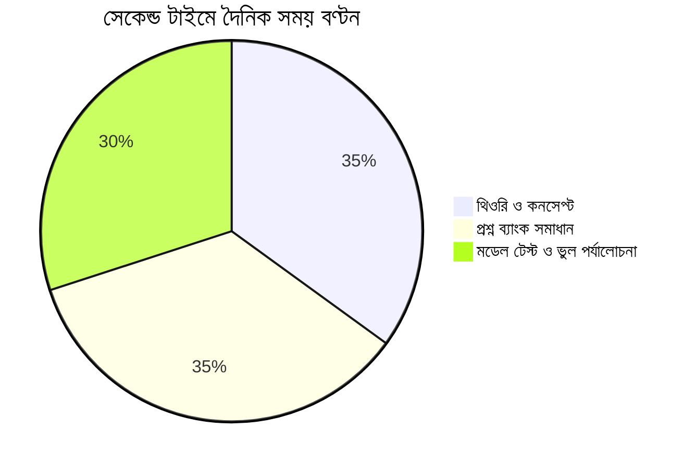

# সেকেন্ড টাইম বিশ্ববিদ্যালয় ভর্তি প্রস্তুতি: ভুল শুধরে চান্স পাওয়ার পূর্ণাঙ্গ গাইডলাইন 🎓💪

ভর্তি পরীক্ষায় প্রথমবার ব্যর্থ হওয়ার পর মনের অবস্থা কেবল একজন শিক্ষার্থীই বুঝতে পারে। চারপাশের আত্মীয়-স্বজনের কটু কথা, বন্ধুদের চান্স পাওয়ার খবর আর নিজের ভেতরের চরম হতাশা—সবকিছু মিলিয়ে সময়টা খুব কঠিন হয়ে ওঠে।

কিন্তু মনে রাখবে: **একটি পরীক্ষা কখনোই তোমার জীবনের শেষ কথা নয়।**  
বিসিএস টপার থেকে শুরু করে বুয়েট-ঢাবি-মেডিকেলের সেরা ডাক্তার ও ইঞ্জিনিয়ারদের তালিকায় হাজার হাজার মানুষ আছেন যারা প্রথমবার কোথাও সুযোগ পাননি, কিন্তু দ্বিতীয়বারে শীর্ষস্থান অধিকার করেছেন!

তুমি যদি সেকেন্ড টাইম প্রস্তুতি নেওয়ার সিদ্ধান্ত নিয়ে থাকো, তবে তোমার প্রয়োজন আবেগ নয়—বরং একটি **বাস্তবসম্মত ও কঠোর স্ট্র্যাটেজি**।

---

## ১. প্রথমবারের কোন ৩টি ভুলের পুনরাবৃত্তি করা যাবে না?

সেকেন্ড টাইমাররা যদি আগের বছরের মতোই পড়াশোনা করে, তবে ফলাফল আগের মতোই হবে। আগে খুঁজে বের করো গতবার কোথায় ভুল হয়েছিল:

1. **শুধু লেকচার দেখা, কিন্তু মডেল টেস্ট না দেওয়া:**  
   অনেক শিক্ষার্থী সারাদিন অনলাইন বা অফলাইনে ক্লাস করে, কিন্তু নিজে বাসায় বসে টাইমার ধরে প্রশ্ন ব্যাংক সলভ করে না। পরীক্ষার হলে স্পিড ও অ্যাকুরেসি আসে শুধুমাত্র মডেল টেস্ট থেকে।
2. **সোশ্যাল মিডিয়া ও ডিপ্রেশনে সময় নষ্ট:**  
   ফেসবুকে বন্ধুদের ইউনিভার্সিটির ছবি দেখে সময় অপচয় করা সেকেন্ড টাইমারদের প্রধান শত্রু। ৬ মাসের জন্য সোশ্যাল মিডিয়া আনইনস্টল করে দাও।
3. **দুর্বল চ্যাপ্টার এড়িয়ে যাওয়া:**  
   যে অধ্যায়গুলো কঠিন লাগত সেগুলো গতবার রেখে দেওয়া হয়েছিল। এবার সেই দুর্বলতাগুলোতেই আঘাত করতে হবে।

---

## ২. সেকেন্ড টাইম প্রস্তুতির ৪টি মূল স্তম্ভ

### ক) কোশ্চেন ব্যাংক অ্যানালাইসিস (Question Bank Analysis)
বিগত ১৫ বছরের প্রশ্ন বিশ্লেষণ করলে দেখবে, ৬০-৭০% প্রশ্ন একই কনসেপ্ট ও টপিক থেকে বারবার ফিরে আসে। প্রতিটি অধ্যায় পড়ার আগে সেই অধ্যায় থেকে অতীতে আসা সব প্রশ্ন শেষ করো।

### খ) দৈনিক ১০-১২ ঘণ্টার বাস্তবসম্মত রুটিন
* **সকাল (৮টা - ১২টা):** থিওরি পড়া ও মূল কনসেপ্ট ঝালাই।
* **দুপুর (৩টা - ৬টা):** বিগত বছরের প্রশ্ন ও ম্যাথ প্র্যাকটিস।
* **রাত (৮টা - ১১টা):** প্রতিদিন অন্তত একটি ৫০ বা ১০০ নম্বরের ফুল সিলেবাস/অধ্যায়ভিত্তিক মডেল টেস্ট দেওয়া।

---

## ৩. কোন কোন বিশ্ববিদ্যালয়ে সেকেন্ড টাইম দেওয়ার সুযোগ আছে?

প্রতি বছর সার্কুলার পরিবর্তন হতে পারে, তবে সাধারণত নিম্নলিখিত প্রতিষ্ঠানগুলোতে সুযোগ থাকে:

* **মেডিকেল ও ডেন্টাল কলেজ:** সেকেন্ড টাইমে সুযোগ রয়েছে (তবে প্রাপ্ত নম্বর থেকে নির্দিষ্ট মার্কস কর্তন করা হয়)।
* **জাহাঙ্গীরনগর বিশ্ববিদ্যালয় (JU):** সেকেন্ড টাইমারদের সবচেয়ে বড় আশ্রয়স্থল। এখানে প্রচুর সেকেন্ড টাইমার চান্স পায়।
* **রাজশাহী বিশ্ববিদ্যালয় (RU) ও চট্টগ্রাম বিশ্ববিদ্যালয় (CU):** নিয়ম অনুযায়ী পরীক্ষা দেওয়ার সুযোগ থাকে।
* **গুচ্ছভুক্ত ২৪টি বিশ্ববিদ্যালয় (GST):** সাধারণ বিজ্ঞান, মানবিক ও বাণিজ্য শাখায় সেকেন্ড টাইম সুবিধা রয়েছে।
* **কৃষি গুচ্ছ (Agriculture Cluster):** ৭টি কৃষি বিশ্ববিদ্যালয়ে দ্বিতীয়বার পরীক্ষা দেওয়া যায়।

> [!IMPORTANT]
> **নেগেটিভ মার্কিং ও মার্কস ডিডাকশন:**  
> কিছু জায়গায় সেকেন্ড টাইমে মোট স্কোর থেকে নির্দিষ্ট কিছু নম্বর (যেমন ৫ নম্বর) কর্তন করা হয়। তাই তোমার প্রস্তুতি এমন হতে হবে যেন তুমি কাট-মার্কের চেয়ে অন্তত ৮-১০ নম্বর এগিয়ে থাকতে পারো।

---

## 🎯 নিয়মিত এক্সাম দিয়ে তোমার অবস্থান যাচাই করো

সেকেন্ড টাইমে সবচেয়ে বড় চ্যালেঞ্জ হলো একাগ্রতা ধরে রাখা। বাসায় একা পড়ার চেয়ে প্রতিদিন অন্যান্য হাজারো ভর্তি পরীক্ষার্থীর সাথে পরীক্ষা দিয়ে নিজের লিডারবোর্ড র‍্যাঙ্ক দেখা অনেক বেশি অনুপ্রেরণা দেয়।

👉 **[অভ্যাস (Obhyash) প্ল্যাটফর্মে অ্যাডমিশন মডেল টেস্ট দাও আজকেই](https://obhyash.com)**
* বিশ্ববিদ্যালয় স্ট্যান্ডার্ড প্রশ্ন ব্যাংক ও লাইভ টেস্ট
* ভুল উত্তরের ইনস্ট্যান্ট অ্যানালাইসিস ও দুর্বলতা শনাক্তকরণ
* দেশের সেরা শিক্ষার্থীদের সাথে প্রতিদিনের লিগ লড়াই!
