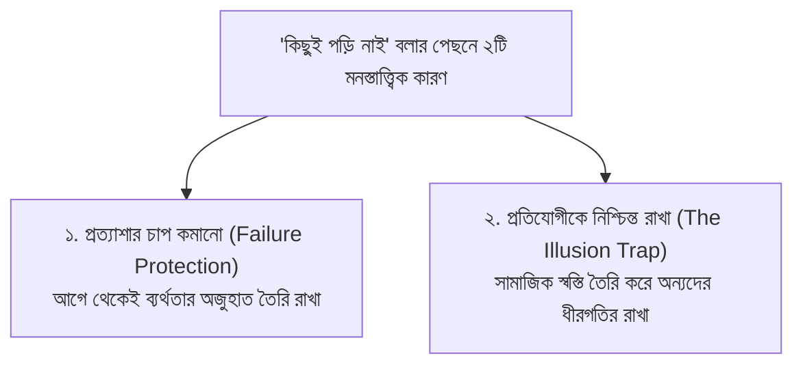
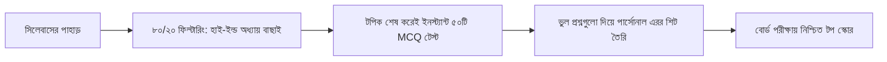
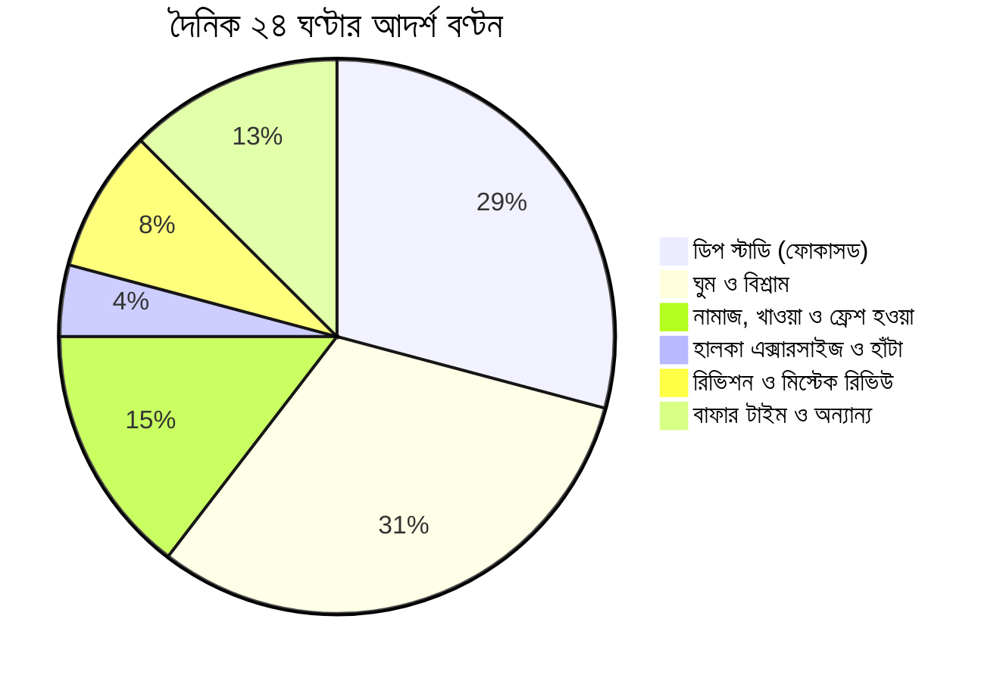

# "দোস্ত কিছুই পড়ি নাই" বলা বন্ধুরা আসলে কীভাবে পড়ছে? তোমার ব্যাচের নীরব প্রতিযোগিতা ও ঘুরে দাঁড়ানোর বৈজ্ঞানিক গাইড

ক্লাস শেষে বা কোচিংয়ের বারান্দায় বন্ধুর সাথে দেখা। তুমি কিছুটা দ্বিধা নিয়ে জিজ্ঞেস করলে, *"দোস্ত, ফিজিক্সের গতিবিদ্যা আর কেমিস্ট্রির জৈব যৌগের রিভিশন কতদূর হলো রে? আমার তো কিছুই শেষ হচ্ছে না!"*

বন্ধু একগাল হেসে পিঠ চাপড়ে বলল, *"আরে রাখ তোর পড়া! আমি বই-ই খুলিনি কয়দিন ধরে। সারাদিন গেম খেলছি আর ঘুমাইছি। কিচ্ছু পারি না, এবার নিশ্চিত ফেল করব!"*

তুমি একটা স্বস্তির নিঃশ্বাস ফেললে—*"যাক, শুধু আমি একাই পিছিয়ে নেই, আমার বন্ধুও তো একই নৌকার যাত্রী।"* কিন্তু মাস দুয়েক পর যখন টেস্ট পরীক্ষা বা বোর্ড পরীক্ষার রেজাল্ট বের হলো, দেখলে সেই বন্ধুই জিপিএ ৫.০০ বা গোল্ডেন এ+ পেয়ে মিষ্টি বিতরণ করছে! আর তুমি কোনোমতে টেনেটুনে পাস করে বা কাঙ্ক্ষিত ফল না পেয়ে ভাবছ—**"ও তো সারাদিন খেলত, পড়তই না, তাহলে রেজাল্ট এত ভালো করল কীভাবে? ওর কি অসম্ভব ব্রেন, নাকি আমিই ব্যর্থ?"**

বাস্তবতা হলো—এটি অলৌকিক কোনো মেধার জাদু নয়, বরং একটি সুপরিকল্পিত **"সাইলেন্ট প্রিপারেশন" (Silent Preparation)** বা নীরব প্রতিযোগিতার খেলা। 

এই আর্টিকেলে কোনো চটুল মোটিভেশনাল বুলি নয়; বরং তোমার ব্যাচের নীরব প্রতিযোগীরা আসলে প্রতিদিন পড়ার টেবিলে কী করে, কীভাবে তারা সামাজিক বিভ্রান্তি এড়িয়ে নিঃশব্দে এগিয়ে যায় এবং আজ থেকেই তুমি কীভাবে তাদের চেয়ে এক ধাপ এগিয়ে যাবে—তার **নিখুঁত বৈজ্ঞানিক ফ্রেমওয়ার্ক (Scientific Framework)** তুলে ধরা হলো।

> [!NOTE]
> **কঠোর অ্যাকাডেমিক বাস্তবতা (The Brutal Truth)**
> - বাংলাদেশে প্রতি বছর এসএসসি ও এইচএসসি মিলিয়ে প্রায় **৩৫ থেকে ৪০ লাখ** শিক্ষার্থী পরীক্ষা দেয়।
> - পাবলিক বিশ্ববিদ্যালয়, মেডিকেল ও শীর্ষ প্রকৌশল বিশ্ববিদ্যালয়গুলোতে সব মিলিয়ে আসন সংখ্যা মাত্র **৬০ থেকে ৬৫ হাজার** (মোট পরীক্ষার্থীর মাত্র ১.৫% থেকে ২%)।
> - তোমার ক্লাসের বন্ধুরা তোমার বন্ধু হলেও দিনশেষে জাতীয় পর্যায়ের মেধা তালিকায় তারা তোমার প্রত্যক্ষ প্রতিযোগী। সামাজিক যোগাযোগ বা আড্ডার "কিছুই পড়ি নাই" বয়ান এক ধরণের মনস্তাত্ত্বিক আত্মরক্ষা (Defense Mechanism), যার ফাঁদে পা দিয়ে লাখ লাখ শিক্ষার্থী নিজের ভবিষ্যৎ নষ্ট করে।

তুমি যখন আড্ডায় বা ফেসবুক স্ক্রলে বন্ধুদের সাথে তাল মেলাচ্ছ, তোমার ব্যাচের সিরিয়াস শিক্ষার্থীরা কিন্তু অলরেডি প্রতিদিনের পড়া প্রতিদিন শেষ করে এগিয়ে যাচ্ছে। অন্যের কথায় কান না দিয়ে নিজের আসল অবস্থান যাচাই করতে [অভ্যাস অ্যাপে বিনামূল্যে](/signup) এখনই যেকোনো বিষয়ের অধ্যায়ভিত্তিক টেস্ট দিয়ে দেখো সারা দেশের হাজারো শিক্ষার্থীর মাঝে তোমার রিয়েল-টাইম র‍্যাঙ্ক ও স্পিড কোথায়।

---

## ১. মনস্তাত্ত্বিক বিশ্লেষণ: বন্ধুরা কেন বলে "কিছুই পড়ি নাই"?

মনোবিজ্ঞানীদের মতে, ছাত্রাবস্থায় শিক্ষার্থীরা সচেতন বা অবচেতনভাবে দুটি প্রধান কারণে নিজেদের পড়াশোনা লুকিয়ে রাখে:

1. **প্রত্যাশার চাপ কমানো (Expectation Management):**  
   যদি কেউ সবাইকে বলে বেড়ায়—"আমি দিনে ১৪ ঘণ্টা পড়ছি", তবে তার ওপর পরিবার ও বন্ধুদের প্রত্যাশার পাহাড় তৈরি হয়। পরীক্ষায় কোনো কারণে সামান্য খারাপ হলে তীব্র সামাজিক ট্রলের শিকার হতে হয়। তাই বেশিরভাগ শিক্ষার্থী সুরক্ষামূলক প্রাচীর হিসেবে আগে থেকেই দাবি করে সে কিছুই পড়ছে না।
2. **ভ্রান্ত স্বস্তি তৈরি করা (The Illusion of Equal Failure):**  
   মানুষ একা পিছিয়ে পড়তে ভয় পায়, কিন্তু দলবেঁধে পিছিয়ে পড়াকে স্বাভাবিক মনে করে। যখন তোমার কোনো বন্ধু বলে সে পড়েনি, তুমি অবচেতনভাবে সান্ত্বনা পাও এবং তোমার পড়ার তাগিদ কমে যায়। অথচ সে রাতের বেলা নিঃশব্দে নিজের লক্ষ্য ঠিকই পূরণ করে নিচ্ছে।

---

## ২. সাইলেন্ট কম্পিটিটররা পড়ার টেবিলে আসলে কী করে? (৫টি গোপন অভ্যাস)

যারা শান্তভাবে সর্বোচ্চ ফলাফল অর্জন করে, তাদের সাথে সাধারণ শিক্ষার্থীদের তফাত পড়াশোনার মোট সময়ে নয়, বরং **পদ্ধতিতে**। তারা এই ৫টি বৈজ্ঞানিক কৌশল অনুসরণ করে:

### অভ্যাস ১: প্যাসিভ রিডিং নয়, অ্যাক্টিভ রিকল (Active Recall)
সাধারণ শিক্ষার্থী একটি অধ্যায় ৫ বার রিডিং পড়ে মনে করে পড়া শেষ। কিন্তু বই বন্ধ করলেই মাথা ফাঁকা!  
**টপারদের নিয়ম:** তারা একবার রিডিং পড়ার পর বই বন্ধ করে একটি সাদা কাগজে না দেখে লেখে—অধ্যায়টিতে কী কী সূত্র, সংজ্ঞা ও ব্যতিক্রম ছিল (Blurting Method)। যে লাইনে গিয়ে হাত আটকে যায়, শুধু সেই লাইনটি আবার বই খুলে দেখে।

### অভ্যাস ২: "ভুলের খাতা" বা এরর লগ (Mistake Ledger)
অধিকাংশ শিক্ষার্থী টেস্ট পেপারের প্রশ্ন সমাধান করে উত্তর সঠিক হলে খুশি হয়, আর ভুল হলে উত্তরমালা দেখে "ও আচ্ছা, এটা হবে" বলে পাতা উল্টে দেয়।  
**টপারদের নিয়ম:** তারা প্রতিটি ভুলের জন্য একটি আলাদা **Mistake Ledger** রাখে। ভুলের কারণকে তিনটি ক্যাটাগরিতে ভাগ করে:
* **কনসেপ্ট গ্যাপ (Concept Gap):** টপিকটি জানতাম না বা বুঝতে ভুল হয়েছিল।
* **সিলী মিসটেক (Silly Mistake):** একক রূপান্তর করিনি, প্রশ্ন ভালো করে পড়িনি।
* **টাইম প্রেশার (Time Pressure):** সময়ের অভাবে মাথা কাজ করেনি।  
পরীক্ষার আগের শেষ ৭ দিন তারা মূল বই পড়ার বদলে কেবল এই ভুলের খাতাটি রিভিশন দেয়।

### অভ্যাস ৩: ইনপুট বনাম আউটপুট অনুপাত (The 30/70 Rule)
পড়াশোনায় দুই ধরণের কাজ থাকে:
* **ইনপুট:** বই পড়া, লেকচার ভিডিও দেখা, স্যারের নোট রিডিং দেওয়া।
* **আউটপুট:** প্রশ্ন সমাধান করা, ওএমআর শিটে বৃত্ত ভরাট করা, ঘড়ি ধরে সৃজনশীল উত্তর লেখা।  
সাধারণ শিক্ষার্থীরা ৮০% সময় ইনপুটে ব্যয় করে এবং মাত্র ২০% সময় আউটপুটে দেয়। অথচ বোর্ড পরীক্ষায় নম্বর দেওয়া হয় শুধুমাত্র আউটপুটের ওপর! টপাররা তাদের মোট পড়ার সময়ের **৭০% সময় ব্যয় করে সরাসরি এমসিকিউ ও সিকিউ প্র্যাকটিসে**।

---

## ৩. শেষ ৯০ দিনের "রিভার্স ইঞ্জিনিয়ারিং" স্টাডি ফ্রেমওয়ার্ক

পড়া যখন জমে পাহাড় হয়ে যায়, তখন প্রথম অধ্যায় থেকে ক্রমানুসারে পড়তে যাওয়া আত্মহত্যার শামিল। নিচে ৯০ দিনের একটি বৈজ্ঞানিক রিভার্স রোডম্যাপ দেওয়া হলো:

| ধাপ ও সময়সীমা | প্রধান লক্ষ্য ও কার্যক্রম | প্রতিদিনের আউটপুট টার্গেট |
| :--- | :--- | :--- |
| **ধাপ ১: ডে ১ – ৩০** *(প্যারেটো ৮০/২০ ফিল্টারিং)* | বিগত ৫ বছরের প্রশ্ন বিশ্লেষণ করে যে ২০% টপিক থেকে ৮০% প্রশ্ন আসে তা চিহ্নিত করা। | প্রতিদিন ১টি হাই-ইল্ড টপিকের কনসেপ্ট ক্লিয়ার করা ও ৫০টি MCQ সলভ। |
| **ধাপ ২: ডে ৩১ – ৬০** *(টেস্ট পেপার সিমুলেশন)* | শীর্ষ ২০টি কলেজের টেস্ট পেপার থেকে ক্যাটাগরিভিত্তিক সৃজনশীল প্রশ্ন সমাধান। | প্রতিদিন ২টি পূর্ণাঙ্গ সৃজনশীল ঘড়ি ধরে ২১ মিনিটের মধ্যে লেখা। |
| **ধাপ ৩: ডে ৬১ – ৯০** *(স্পিড ও অ্যাকুরেসি ড্রিল)* | বোর্ড পরীক্ষার আসল শিফটে (সকাল ১০টা – ১টা) ফুল সিলেবাস মডেল টেস্ট ও মিস্টেক রিভিশন। | প্রতি ৩ দিনে ১টি পূর্ণাঙ্গ মডেল টেস্ট এবং ভুলের খাতা রিভিশন। |

---

## ৪. বিভাগভিত্তিক হাই-ইল্ড অধ্যায় ও স্ট্র্যাটেজিক ফোকাস

কোন অধ্যায়গুলো থেকে প্রশ্ন কখনোই মিস হয় না, তার একটি তালিকা নিচে দেওয়া হলো:

### 🧬 বিজ্ঞান বিভাগ (Science Group)
1. **পদার্থবিজ্ঞান:** ভেক্টর (নদী-নৌকা ও বৃষ্টির অঙ্ক), গতিবিদ্যা ও নিউটনিয়ান বলবিদ্যা (ব্যাংকিং কোণ ও সংঘর্ষের অংক), কাজ-শক্তি-ক্ষমতা (কুয়ো ও পাম্পের ক্ষমতা), স্থির তড়িৎ ও চলতড়িৎ (বর্তনী ও কার্শফের সূত্র)।
2. **রসায়ন:** গুণগত রসায়ন (দ্রাব্যতা ও কোয়ান্টাম সংখ্যা), পর্যায়বৃত্ত ধর্ম (আয়নীকরণ শক্তি ও সংকরায়ন), রাসায়নিক পরিবর্তন (বাফার দ্রবণ ও $K_p, K_c$), এবং ২য় পত্রের জৈব রসায়ন (নামকরণ, শনাক্তকারী পরীক্ষা ও রূপান্তর)।
3. **উচ্চতর গণিত:** সরলরেখা ও বৃত্ত (স্পর্শক ও দূরত্বের সমীকরণ), ত্রিকোণমিতি, ক্যালকুলাস (অন্তরীকরণ ও নির্দিষ্ট যৌগজ), কনিক এবং স্থিতিবিদ্যা-গতিবিদ্যা।

### 📊 ব্যবসায় শিক্ষা বিভাগ (Commerce Group)
1. **হিসাববিজ্ঞান:** আর্থিক বিবরণী (বাধ্যতামূলক সমন্বয় ও লাভ-ক্ষতি নির্ণয়), জাবেদা ও খতিয়ান, ব্যাংক সমন্বয় বিবরণী, শেয়ার ইস্যু ও উৎপাদন ব্যয় হিসাব।
2. **ব্যবসায় সংগঠন:** ব্যবসায় নীতি, একমালিকানা বনাম যৌথ মূলধনী কোম্পানি, প্রেষণা ও নেতৃত্ব তত্ত্ব।

### 🏛️ মানবিক বিভাগ (Humanities Group)
1. **পৌরনীতি ও সুশাসন:** সংবিধানের মূলনীতি ও সংশোধনী, আইন ও বিচার বিভাগের ভূমিকা, ই-গভর্ন্যান্স ও নাগরিক অধিকার।
2. **অর্থনীতি:** ভোক্তা ও উৎপাদকের আচরণ (চাহিদা-যোগান রেখা), বাজার কাঠামো, জাতীয় আয় গণনা ও মুদ্রাস্ফীতি।

---

## ৫. তোমার দৈনিক পড়ার রুটিনের "ডিপ ওয়ার্ক" (Deep Work) শিডিউল

সারাদিন টেবিলে অলস বসে থাকার কোনো মূল্য নেই যদি মস্তিষ্কে কোনো তথ্য কার্যকরভাবে প্রসেস না হয়। দিনে মাত্র **৬ থেকে ৭ ঘণ্টার নিবিড় ডিপ-ওয়ার্ক** সারাদিনের তথাকথিত ১২ ঘণ্টার ক্লান্তিকর পড়ার চেয়ে শতগুণ ভালো ফল দেয়:

### ৯০ মিনিটের আল্ট্রাডিয়ান ব্লক (Ultradian Rhythm):
মস্তিষ্কের মনোযোগের ক্ষমতা একটানা ৯০ মিনিটের বেশি সক্রিয় থাকতে পারে না। তাই পড়ার সময়কে তিনটি ৯০ মিনিটের ব্লকে সাজাও:
* **ব্লক ১ (সকাল ৭:০০ – ৮:৩০):** গণিত বা কঠিন গাণিতিক সমস্যা (যখন মেমোরি ফ্রেশ থাকে)।
* *বিরতি:* ২০ মিনিট হালকা হাঁটা ও পানি পান।
* **ব্লক ২ (সকাল ৯:০০ – ১০:৩০):** কঠিন থিওরি ও সাইন্টিফিক মেকানিজম নোট তৈরি।
* *বিরতি:* গোসল, খাওয়া ও বিশ্রাম।
* **ব্লক ৩ (বিকাল ৪:০০ – ৫:৩০):** চ্যাপ্টারভিত্তিক প্রশ্ন সমাধান ও ওএমআর প্র্যাকটিস।
* **ব্লক ৪ (রাত ৮:০০ – ৯:৩০):** সৃজনশীল লেখার ড্রিল ও দিনের ভুলের রিভিশন।

> [!TIP]
> **স্মার্টফোনকে শত্রু থেকে মেন্টরে রূপান্তর করো:**  
> পড়ার সময় ফোনকে অন্য ঘরে বা ড্রয়ারে রেখে দাও। আর যখন ফোন ব্যবহার করবে, তখন সোশ্যাল মিডিয়ায় অন্যের বানানো স্ক্রল দেখতে সময় নষ্ট না করে [অভ্যাস প্ল্যাটফর্মে](/signup) এসে প্রতিদিনের ডেইলি স্ট্রিক ধরে রেখে বন্ধুদের সাথে রিয়েল-টাইম কুইজ যুদ্ধে অংশ নাও। এতে ফোনের স্ক্রিন টাইমও পড়াশোনায় কনভার্ট হয়ে যাবে।

---

## ৬. টপ ৫ মারাত্মক ভুল যা শিক্ষার্থীদের পিছিয়ে দেয় (ও বাঁচার উপায়)

### ভুল ১: "কালকে থেকে সিরিয়াস হব" ট্র্যাপ (The Procrastination Loop)
প্রতিদিন রাতে ঘুমানোর আগে পরিকল্পনা করা যে কাল ভোর থেকে জীবন বদলে দেবো, কিন্তু সকালে উঠে আবার সেই একই অলসতা।  
**বাঁচার উপায়:** "কাল থেকে" নয়; পড়ার লক্ষ্যকে ছোট করো—"এখনই মাত্র ১৫ মিনিট একটা টপিক পড়ব।" একবার শুরু করে দিলে মোমেন্টাম চলে আসে।

### ভুল ২: শুধু নোট ও বই সংগ্রহ করা (Hoarding Illusion)
বন্ধুদের কাছ থেকে বা ফেসবুক গ্রুপ থেকে শত শত পিডিএফ ও লেকচার নোট ডাউনলোড করে জমিয়ে রাখা। মনে হয় অনেক কিছু সংগ্রহ করেছি, কিন্তু ভেতরে কিছুই পড়া হয় না।  
**বাঁচার উপায়:** ১০টি ভিন্ন নোটের বদলে NCTB-এর মূল বই এবং ১টি নির্ভরযোগ্য টেস্ট পেপারের ওপর ১০০% বিশ্বাস রাখো।

### ভুল ৩: বন্ধুদের সামাজিক মিথ্যাচারে বিভ্রান্ত হওয়া
বন্ধুর "কিছুই পড়ি নাই" শুনে নিজের পড়ার গতি কমিয়ে দেওয়া।  
**বাঁচার উপায়:** নিজের পড়াশোনার হিসাব শুধুমাত্র নিজের ডায়েরি বা লিডারবোর্ডের সাথে মেলাও, ক্লাসের কোনো সহপাঠীর মুখের কথার সাথে নয়।

### ভুল ৪: শুধুমাত্র সহজ অধ্যায় বারবার পড়া
যে অধ্যায়টি ভালো লাগে বা সহজ, পড়ার টেবিলে বসলেই বারবার সেটাই রিভিশন দেওয়া; আর কঠিন অধ্যায়গুলোকে ফেলে রাখা।  
**বাঁচার উপায়:** দিনের সবচেয়ে কঠিন ও অপ্রিয় কাজটি সকালের প্রথম স্লটেই শেষ করে ফেলো (Eat That Frog টেকনিক)।

### ভুল ৫: পরীক্ষার হলে সময় মেপে না লেখা
সব জানা সত্ত্বেও ঘড়ি না দেখার কারণে শেষ ৩টি সৃজনশীল অসম্পূর্ণ রেখে আসা।  
**বাঁচার উপায়:** বাসায় প্রতিটি সৃজনশীলের জন্য কঠোরভাবে **২১ মিনিট** বরাদ্দ করে লেখার অনুশীলন করা।

---

## ৭. সচরাচর জিজ্ঞাসিত প্রশ্নাবলী (FAQ)

### ১. আমার তো সিলেবাসের অর্ধেক বাকি, শেষ কয়েক মাসে কি আসলেই ঘুরে দাঁড়ানো সম্ভব?
শতভাগ সম্ভব। তবে এখন পুরো বই লাইন ধরে পড়ার সময় নেই; এখন পড়তে হবে **প্রশ্ন বিশ্লেষণ পদ্ধতি (Question-Driven Learning)** মেনে। টেস্ট পেপার খুলে দেখো কোন টপিক থেকে প্রতি বছর প্রশ্ন আসছে, শুধু সেই টপিকগুলোর বেসিক বুঝে প্রশ্ন সমাধান করো।

### ২. দিনে কত ঘণ্টা পড়লে নিশ্চিত এ+ পাওয়া যাবে?
ঘণ্টার হিসেবে কোনো গ্যারান্টি নেই; আসল হলো **"টাস্ক কমপ্লিশন" (Task Completion)**। দিনে যদি তুমি ৪ ঘণ্টা পড়ে ১টি অধ্যায়ের সব সূত্রের অঙ্ক ও ৫০টি MCQ নির্ভুলভাবে শেষ করতে পারো, তা সারাদিন বই খুলে বসে থাকার চেয়ে অনেক বেশি কার্যকর।

### ৩. পড়ার টেবিলে বসলেই ঘুম পায় বা মনোযোগ চলে যায়, কী করব?
পড়ার সময় কেবল চোখ দিয়ে পড়বে না; সবসময় হাতে একটি কলম ও রাফ খাতা রাখবে। বইয়ের মূল শব্দগুলো খাতায় স্ক্রিবল বা ড্রিবল করতে করতে পড়লে মস্তিষ্ক কখনো স্লিপ মোডে যায় না।

### ৪. কোন সময় পড়া সবচেয়ে ভালো—রাত নাকি সকাল?
বিজ্ঞান অনুযায়ী যে সময়ে তোমার ঘরে কোনো আওয়াজ থাকে না এবং তোমার কোনো ক্লান্তি থাকে না। তবে বোর্ড পরীক্ষা যেহেতু সকাল ১০টায় অনুষ্ঠিত হয়, তাই পরীক্ষার অন্তত ১ মাস আগে থেকেই সকালের সময়টিতে পড়ার টেবিলে ব্রেনকে সক্রিয় রাখার অভ্যাস গড়ে তোলা বাধ্যতামূলক।

---

## ৮. শেষ কথা: গল্পটা বদলে দেওয়ার দায়িত্ব একান্তই তোমার

আজ থেকে এক বছর বা ছয় মাস পর যখন পরীক্ষার চূড়ান্ত ফলাফল আসবে, তখন কিন্তু তোমার কোনো বন্ধুই স্বীকার করবে না যে সে তোমাকে "কিছুই পড়ি নাই" বলে বিভ্রান্ত করেছিল। তখন সেই ব্যর্থতার দায়ভার, চোখের জল এবং পরিবারকে জবাবদিহি তোমাকেই একা করতে হবে।

প্রতিযোগিতা অন্যদের সাথে নয়; প্রতিযোগিতা তোমার নিজের অলসতা, গড়িমসি আর ভয়ের সাথে। আজ তুমি যে একটি ঘণ্টা অলসভাবে নষ্ট করছ, সেই একই এক ঘণ্টায় সারা দেশের কোথাও না কোথাও তোমার এক সহপাঠী নিঃশব্দে এক ধাপ এগিয়ে গেল।

দেরি এখনো হয়ে যায়নি। টেবিল গুছিয়ে নাও, ফোন ড্রয়ারে রাখো, একটা গভীর শ্বাস নাও এবং আজ থেকেই নিজের নীরব লড়াই শুরু করো। 

তোমার নিয়মিত প্রস্তুতিকে ট্র্যাকে রাখতে এবং প্রতিদিন নিজের উন্নতি মাপতে সাথে রাখো **[অভ্যাস (Obhyash)](/signup)**। পরিশ্রম কখনো বৃথা যায় না; দিনশেষে বিজয় তোমারই হবে!
