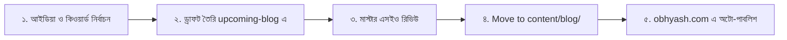

# 📝 Obhyash Blog Production Pipeline & Upcoming Staging

এই ফাইল ও ফোল্ডারটি (`content/upcoming-blog/`) হলো অভ্যাসের ব্লগ প্রোডাকশন পাইপলাইন (Staging Area)। গুগল ট্রেন্ডস (Google Trends) এবং সার্চ কনসোলের লাইভ ডাটা বিশ্লেষণ করে সর্বোচ্চ ট্রাফিক জেনারেট করার মতো ব্লগ আইডিয়াগুলো এখানে অগ্রাধিকার ভিত্তিতে সাজানো রয়েছে।

---

## 🔄 কাজের ধাপ (Workflow)

1. **ড্রাফট তৈরি:** যেকোনো নতুন ব্লগের কাজ শুরু করতে এই ফোল্ডারে `.md` ফাইল তৈরি করবে।
2. **রিভিউ ও অপ্টিমাইজেশন:** এই ফোল্ডারে থাকা [CLAUDE_SEO_BLOG_PROMPT.md](./CLAUDE_SEO_BLOG_PROMPT.md) অনুযায়ী ১,৮০০+ শব্দ, কোনো এআই ইমোজি ছাড়া, 'তুমি' সম্বোধন, মোবাইল-ফ্রেন্ডলি টাইটেল এবং মানবণ্টন নিশ্চিত করবে।
3. **পাবলিশ করা:** প্রস্তুত হলে ফাইলটিকে সরাসরি `content/blog/` ফোল্ডারে সরিয়ে (Move) দেবে। নেক্সট.জেএস স্বয়ংক্রিয়ভাবে এটিকে লাইভ করে দেবে।

---

## 📊 গুগল ট্রেন্ডস অ্যানালাইসিস সারসংক্ষেপ

ডাউনলোডকৃত গুগল ট্রেন্ডসের ১০টি ফাইলের **লাইভ সার্চ কোয়েরি এবং ব্রেকআউট (Breakout) টার্মগুলো** নিখুঁতভাবে বিশ্লেষণ করে নিচে সর্বোচ্চ ট্রাফিক ড্রাইভ করার মতো ব্লগ আইডিয়া ও টাইটেল তালিকাভুক্ত করা হলো।

আমাদের ওয়েবসাইটে বর্তমানে **এসএসসি (SSC)-র কোনো ব্লগ নেই**, অথচ ট্রেন্ডসের ডাটা অনুযায়ী শিক্ষার্থীরা এখন এসএসসি রেজাল্ট, বৃত্তি, বোর্ড প্রশ্ন ও ২০২৭ সিলেবাস নিয়ে সবচেয়ে বেশি সার্চ করছে!

---

## 🎯 সম্পূর্ণ ব্লগ পাইপলাইন ও অগ্রাধিকার তালিকা

### ক্যাটাগরি ১: এসএসসি ২০২৭ (নতুন ব্রেকআউট ট্রেন্ড — দীর্ঘমেয়াদী হাই ট্রাফিক)
*(উৎস: `relatedQueries (3).csv` ও `relatedQueries (1).csv` — "২০২৭ সালের এসএসসি সিলেবাস" স্কোর: ৭৬, "২০২৭ সালে এসএসসি পরীক্ষা কবে হবে" Breakout)*

- [x] **১. এসএসসি ২০২৭ নতুন সিলেবাস ও পূর্ণাঙ্গ রূপরেখা** *(Published)*
  - **ফাইল নাম:** `ssc-2027-new-syllabus-exam-system-marks-distribution.md`
  - **টাইটেল:** এসএসসি ২০২৭ নতুন সিলেবাস ও পরীক্ষার মানবণ্টন: পূর্ণাঙ্গ গাইড
  - **টার্গেট কি-ওয়ার্ড:** `২০২৭ সালের এসএসসি সিলেবাস`, `ssc 2027 syllabus`, `এসএসসি ২০২৭ সিলেবাস ও মানবণ্টন`
  - **কেন ভাইরাল হবে:** ক্লাস নাইন ও টেনের শিক্ষার্থীরা নতুন কারিকুলাম ও পরীক্ষা পদ্ধতি নিয়ে চরম দ্বিধাদ্বন্দ্বে আছে। এইচএসসি ২০২৭-এর মতোই এটি গুগলে টপ র‍্যাংক করবে।

- [x] **২. এসএসসি ২০২৭ পরীক্ষা ও রুটিন গাইড**
  - **ফাইল নাম:** `ssc-2027-exam-date-routine-preparation-guide.md`
  - **টাইটেল:** ২০২৭ সালের এসএসসি পরীক্ষা কবে হবে? সম্ভাব্য সময়সূচি, রুটিন ও প্রস্তুতি রূপরেখা
  - **টার্গেট কি-ওয়ার্ড:** `২০২৭ সালে এসএসসি পরীক্ষা কবে হবে`, `এসএসসি পরীক্ষার রুটিন ২০২৭`, `ssc 2027 exam date`

- [x] **৩. এসএসসি ২০২৭ বিজ্ঞান বিভাগের সেরা বই ও রিসোর্স গাইড**
  - **ফাইল নাম:** `ssc-2027-science-best-booklist-guide.md`
  - **টাইটেল:** এসএসসি ২০২৭ বিজ্ঞান বিভাগের সেরা পাঠ্যবই ও সহায়ক গাইড: এ+ পাওয়ার গোপন স্ট্র্যাটেজি
  - **টার্গেট কি-ওয়ার্ড:** `ssc book pdf`, `ssc science booklist`, `এসএসসি বই তালিকা ২০২৭`

---

### ক্যাটাগরি ২: এসএসসি রেজাল্ট ও বৃত্তি (ইনস্ট্যান্ট ভাইরাল ট্রাফিক — স্পাইক ভলিউম)
*(উৎস: `relatedQueries.csv` ও `relatedQueries (1).csv` — `ssc britti result` +২,০০০%, `এসএসসি রেজাল্ট কিভাবে দেখব` +৫,০০০%)*

- [x] **৪. এসএসসি বৃত্তি ফলাফল ২০২৬**
  - **ফাইল নাম:** `ssc-scholarship-britti-result-2026-check.md`
  - **টাইটেল:** এসএসসি বৃত্তি রেজাল্ট ২০২৬ দেখার নিয়ম: মেধা ও সাধারণ বৃত্তির ফলাফল ও তালিকা PDF
  - **টার্গেট কি-ওয়ার্ড:** `ssc britti result`, `ssc scholarship result`, `scholarship result 2026` (+২,০০০% সার্চ জাম্প)
  - **কেন ভাইরাল হবে:** রেজাল্টের পর প্রতিটি বোর্ডের শিক্ষার্থীরা বৃত্তির গ্যাজেট পিডিএফ খুঁজতে থাকে।

- [x] **৫. এসএসসি রেজাল্ট ২০২৬ মার্কশিটসহ দেখার নিয়ম**
  - **ফাইল নাম:** `ssc-result-2026-marksheet-check-online-sms.md`
  - **টাইটেল:** এসএসসি রেজাল্ট ২০২৬ মার্কশিটসহ দেখার নিয়ম: সকল শিক্ষা বোর্ডের রেজাল্ট চেক লিংক
  - **টার্গেট কি-ওয়ার্ড:** `এসএসসি রেজাল্ট ২০২৬`, `এসএসসি পরীক্ষার রেজাল্ট কিভাবে দেখব`, `web based result ssc`

---

### ক্যাটাগরি ৩: এসএসসি বোর্ড প্রশ্ন ও বিষয়ভিত্তিক প্রস্তুতি (এভারগ্রিন হাই ডিমান্ড)
*(উৎস: `relatedQueries (2).csv` ও `relatedQueries.csv` — `এসএসসি গণিত প্রশ্ন ২০২৬` স্কোর: ২৪, `বাংলা ২য় পত্র প্রশ্ন ২০২৬` +৭০%, `ssc math` ২০, `ssc physics` ১১)*

- [x] **৬. এসএসসি সাধারণ গণিত বোর্ড প্রশ্ন ও সমাধান**
  - **ফাইল নাম:** `ssc-general-math-all-board-questions-solution-2026.md`
  - **টাইটেল:** এসএসসি সাধারণ গণিত সকল বোর্ড প্রশ্ন ও নির্ভুল সমাধান ২০২৬ (SSC Math Solution)
  - **টার্গেট কি-ওয়ার্ড:** `এসএসসি গণিত প্রশ্ন ২০২৬`, `ssc math question 2026`, `ssc general math board solve`

- [x] **৭. এসএসসি বাংলা ২য় পত্র বোর্ড প্রশ্ন ও ১০০% কমন সাজেশন**
  - **ফাইল নাম:** `ssc-bangla-2nd-paper-board-question-solution-2026.md`
  - **টাইটেল:** এসএসসি বাংলা ২য় পত্র সকল বোর্ড প্রশ্ন ২০২৬ ও পূর্ণাঙ্গ ব্যাকরণ সমাধান গাইড
  - **টার্গেট কি-ওয়ার্ড:** `বাংলা ২য় পত্র প্রশ্ন ২০২৬ এসএসসি`, `ssc bangla 2nd paper question` (+৭০% সার্চ জাম্প)

- [x] **৮. এসএসসি পদার্থবিজ্ঞান সূত্র ও ক্যালকুলেশন হ্যাকস**
  - **ফাইল নাম:** `ssc-physics-formula-sheet-math-solutions-pdf.md`
  - **টাইটেল:** এসএসসি পদার্থবিজ্ঞান সকল সূত্রের শিট ও গাণিতিক সমাধান: সহজে ফুল মার্কস পাওয়ার টেকনিক
  - **টার্গেট কি-ওয়ার্ড:** `ssc physics`, `ssc physics formula sheet`, `এসএসসি পদার্থবিজ্ঞান সূত্র`

- [x] **৯. এসএসসি উচ্চতর গণিত জ্যামিতি ও ত্রিকোণমিতি হ্যাকস**
  - **ফাইল নাম:** `ssc-higher-math-a-plus-mastery-guide.md`
  - **টাইটেল:** এসএসসি উচ্চতর গণিত এ+ রোডম্যাপ: সৃজনশীল ও এমসিকিউতে ফুল মার্কস তোলার রুটিন
  - **টার্গেট কি-ওয়ার্ড:** `ssc higher math`, `এসএসসি উচ্চতর গণিত সমাধান`, `ssc higher math suggestions`

---

### ক্যাটাগরি ৪: এইচএসসি ২০২৬/২০২৭ ট্রেন্ডিং টপিকস
*(উৎস: `relatedQueries (4).csv` — `nctb` +৮০% রাইজিং, `বাংলা ২য় পত্র প্রশ্ন` +৬০%, `এইচএসসি রেজাল্ট কবে দিবে` ৩৫)*

- [x] **১০. এইচএসসি বাংলা ২য় পত্র প্রশ্ন ও সমাধান**
  - **ফাইল নাম:** `hsc-bangla-2nd-paper-board-question-grammar-solution.md`
  - **টাইটেল:** এইচএসসি বাংলা ২য় পত্র সকল বোর্ড প্রশ্ন ২০২৬: ব্যাকরণ ও নির্মিতি অংশের নির্ভুল উত্তর
  - **টার্গেট কি-ওয়ার্ড:** `বাংলা ২য় পত্র প্রশ্ন ২০২৬ এইচএসসি`, `hsc bangla 2nd paper question` (+৬০% ট্রেন্ড)

- [x] **১১. এইচএসসি রেজাল্ট ২০২৬ প্রকাশের তারিখ ও নোটিশ**
  - **ফাইল নাম:** `hsc-result-2026-publish-date-board-notice.md`
  - **টাইটেল:** এইচএসসি রেজাল্ট ২০২৬ কবে দিবে? বোর্ড ফলাফল প্রকাশের সঠিক তারিখ ও বিস্তারিত নোটিশ
  - **টার্গেট কি-ওয়ার্ড:** `এইচএসসি রেজাল্ট কবে দিবে`, `এইচএসসি পরীক্ষার রেজাল্ট কবে ২০২৬`

- [x] **১২. বাংলাদেশ উন্মুক্ত বিশ্ববিদ্যালয় (BOU) এইচএসসি ভর্তি**
  - **ফাইল নাম:** `bou-open-university-hsc-admission-circular-2026-27.md`
  - **টাইটেল:** উন্মুক্ত বিশ্ববিদ্যালয় এইচএসসি ভর্তি বিজ্ঞপ্তি ২০২৬-২০২৭: যোগ্যতা, ফি ও আবেদন নিয়ম
  - **টার্গেট কি-ওয়ার্ড:** `উন্মুক্ত বিশ্ববিদ্যালয় এইচএসসি ভর্তি তথ্য ২০২৬ ২০২৭`, `bou hsc admission`

- [x] **১৩. এইচএসসি ২০২৭ বিজ্ঞান বিভাগের সেরা বই তালিকা**
  - **ফাইল নাম:** `hsc-2027-science-best-booklist.md`
  - **টাইটেল:** HSC 2027 বিজ্ঞান বিভাগের সেরা বই: বোর্ড ও ভর্তি গাইড
  - **টার্গেট কি-ওয়ার্ড:** `hsc 2027 science booklist`, `hsc science best book`, `এইচএসসি বিজ্ঞান বিভাগের সেরা বই`

---

### ক্যাটাগরি ৫: বিশ্ববিদ্যালয় ভর্তি ২০২৬-২৭ (মেডিকেল ও বুয়েট)
*(উৎস: `relatedQueries (5).csv` ও `relatedQueries (6).csv` — `buet admission result` +১৯০%, `medical admission question 2025` +৭০%, `exam date`)*

- [x] **১৪. মেডিকেল বিগত বছরের প্রশ্নব্যাংক ও সমাধান**
  - **ফাইল নাম:** `medical-admission-past-year-question-bank-solution-pdf.md`
  - **টাইটেল:** মেডিকেল ভর্তি বিগত ১০ বছরের প্রশ্ন ও সমাধান: ২০২৬-২৭ গাইড
  - **টার্গেট কি-ওয়ার্ড:** `medical admission question 2025`, `medical admission past questions`, `মেডিকেল প্রশ্নব্যাংক সমাধান`

- [x] **১৫. বুয়েট প্রিলিমিনারি ও লিখিত রেজাল্ট এবং মেরিট কাট-মার্কস**
  - **ফাইল নাম:** `buet-admission-result-cutoff-marks-merit-list.md`
  - **টাইটেল:** বুয়েট ভর্তি রেজাল্ট ২০২৬-২৭: তারিখ, কাট-মার্কস ও মেধা তালিকা
  - **টার্গেট কি-ওয়ার্ড:** `buet admission result 2026`, `buet merit list`, `বুয়েট রেজাল্ট ২০২৬` (+১৯০% সার্চ বৃদ্ধি)

---

### 🚀 সর্বোচ্চ অগ্রাধিকারের টপ ৩ (Daily Traffic Accelerator):
1. **`ssc-2027-new-syllabus-exam-system-marks-distribution`** (নতুন ব্রেকআউট—বর্তমানে কোনো প্রতিযোগী নেই)
2. **`ssc-scholarship-britti-result-2026-check`** (সরাসরি +২,০০০% সার্চ গ্রোথ—দ্রুততম ট্রাফিক)
3. **`ssc-general-math-all-board-questions-solution-2026`** (সবচেয়ে বেশি সার্চ হওয়া অ্যাকাডেমিক বিষয়)
