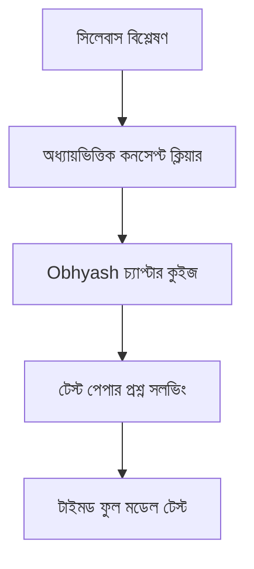

# Obhyash Master SEO Blueprint & Content Engineering SOP
## গুগল র‍্যাংক #১ ও পজিশন ০ (Featured Snippet) অর্জনের চূড়ান্ত স্ট্যান্ডার্ড ম্যানুয়াল

> **উদ্দেশ্য:** Obhyash ওয়েবসাইটে প্রকাশিত প্রতিটি ব্লগ যেন গুগলে টপ পজিশনে র‍্যাংক করে, অর্গানিক ট্রাফিক আনয়ন করে এবং শিক্ষার্থীদের নিরবচ্ছিন্নভাবে Obhyash অ্যাপের সক্রিয় ব্যবহারকারীতে রূপান্তর করে।

---

## সূচিপত্র
1. [গুগল E-E-A-T ও র‍্যাংকিং মেকানিজম](#১-গুগল-e-e-a-t-ও-র‍্যাংকিং-মেকানিজম)
2. [ফ্রন্টম্যাটার (YAML) মাস্টার স্ট্যান্ডার্ড](#২-ফ্রন্টম্যাটার-yaml-মাস্টার-স্ট্যান্ডার্ড)
3. [ফিচার্ড স্নsnippet (Position 0) হ্যাকিং টেকনিক](#৩-ফিচার্ড-স্নsnippet-position-0-হ্যাকিং-টেকনিক)
4. [অন-পেজ এসইও ও সিমান্টিক এলএসআই (LSI) কৌশল](#৪-অন-পেজ-এসইও-ও-সিমান্টিক-এলএসআই-lsi-কৌশল)
5. [ইউজার এনগেজমেন্ট ও বাউন্স রেট কমানোর সাইকোলজি](#৫-ইউজার-এনগেজমেন্ট-ও-বাউন্স-রেট-কমানোর-সাইকোলজি)
6. [Obhyash টেকনিক্যাল কম্পোনেন্টস (LaTeX, Mermaid, Callouts)](#৬-obhyash-টেকনিক্যাল-কম্পোনেন্টস)
7. [কনভার্সন অপটিমাইজেশন (CRO) ও অ্যাপ ড্রাইভ](#৭-কনভার্সন-অপটিমাইজেশন-cro-ও-অ্যাপ-ড্রাইভ)
8. [সম্পূর্ণ প্লাগ-অ্যান্ড-প্লে টেমপ্লেট (Full Skeleton)](#৮-সম্পূর্ণ-প্লাগ-অ্যান্ড-প্লে-টেমপ্লেট)
9. [প্রাক-প্রকাশনা আল্টিমেট কোয়ালিটি চেকলিস্ট](#৯-প্রাক-প্রকাশনা-আল্টিমেট-কোয়ালিটি-চেকলিস্ট)

---

## ১. গুগল E-E-A-T ও র‍্যাংকিং মেকানিজম

গুগল ২০২৬ সালে কনটেন্ট কোয়ালিটি যাচাই করতে **E-E-A-T (Experience, Expertise, Authoritativeness, Trustworthiness)** মডেল কঠোরভাবে প্রয়োগ করে:

* **Experience (বাস্তব অভিজ্ঞতা):** লেখায় প্রমাণ থাকতে হবে যে লেখক নিজে পরীক্ষা বা স্টুডেন্টদের মেন্টরিংয়ের সাথে জড়িত।  
  * *ভালো উদাহরণ:* "আমাদের অভিজ্ঞ শিক্ষক টিম বিগত ৫ বছরের বোর্ড প্রশ্ন পর্যালোচনা করে দেখেছেন যে..."  
  * *খারাপ উদাহরণ (রোবোটিক):* "এইচএসসি পরীক্ষা একটি গুরুত্বপূর্ণ পরীক্ষা যা সবার দেওয়া উচিত।"
* **Expertise (দক্ষতা ও নির্ভুলতা):** ভুল তথ্য, ভুল নম্বর বণ্টন বা পুরোনো শিক্ষাক্রমের কথা বলা যাবে না। প্রতিটি তথ্যের ভিত্তি থাকতে হবে NCTB বা শিক্ষা বোর্ডের অফিশিয়াল বিজ্ঞপ্তির সাথে সংগতিপূর্ণ।
* **Authoritativeness (কর্তৃত্ব):** আর্টিকেলে বোর্ডের অফিশিয়াল লিংক (`dhakaeducationboard.gov.bd`) এবং Obhyash-এর সম্পর্কিত আর্টিকেলের রেফারেন্স থাকতে হবে।
* **Trustworthiness (নির্ভরযোগ্যতা):** স্পষ্ট লেখক পরিচিতি, প্রকাশের তারিখ এবং স্বচ্ছ উৎস প্রদান করা।

---

## ২. ফ্রন্টম্যাটার (YAML) মাস্টার স্ট্যান্ডার্ড

প্রতিটি আর্টিকেলের শীর্ষভাগে নিচের স্ট্যান্ডার্ড মেনে YAML ব্লক লিখতে হবে:

```yaml
---
title: 'HSC 2026 Exam Date & Routine: সকল বোর্ডের সময়সূচী ও রুটিন PDF ডাউনলোড'
excerpt: 'এইচএসসি ২০২৬ (HSC 2026) পরীক্ষার সম্ভাব্য তারিখ, ঢাকা ও সকল শিক্ষা বোর্ডের অফিশিয়াল রুটিন, বিষয়ভিত্তিক সময়সূচী ও সরাসরি PDF ডাউনলোড লিংক।'
category: 'এইচএসসি পরীক্ষা'
tags:
  - 'এইচএসসি ২০২৬'
  - 'HSC 2026'
  - 'HSC Routine 2026'
  - 'পরীক্ষার রুটিন'
  - 'ঢাকা বোর্ড'
author:
  name: 'অভ্যাস মেন্টর টিম'
  role: 'এইচএসসি ও এডমিশন স্পেশালিস্ট'
  initials: 'OT'
readTime: 8
coverColor: 'from-blue-600 to-indigo-900'
publishedAt: '2026-09-29T10:00:00.000Z'
featured: true
---
```

### ফ্রন্টম্যাটার ফিল্ডের কঠোর নিয়ম:
1. **Title (৫৫–৬৫ ক্যারেক্টার):**  
   - ফরম্যাট: `[Primary Keyword] + [Separator (: / -)] + [Benefit / Secondary Hook / Format]`  
   - *উদাহরণ:* `HSC 2026 Exam Date & Routine: সকল বোর্ডের সময়সূচী ও রুটিন PDF`
2. **Excerpt (১৩০–১৫৫ ক্যারেক্টার):**  
   - সার্চ রেজাল্টে দেখা যাওয়া মেটা ডেসক্রিপশন। এতে মূল কিওয়ার্ড এবং অ্যাকশন ভার্ব (ডাউনলোড করুন, জেনে নিন) থাকতে হবে।
3. **Tags (৪–৬টি ট্যাগ):**  
   - বাংলা এবং ইংরেজি উভয় ভাষায় ট্যাগ দিন যাতে সার্চ ফিল্টারিং সহজ হয়।
4. **CoverColor (Tailwind CSS Gradients):**  
   - ফিজিক্স/ম্যাথ: `from-blue-600 to-cyan-900`
   - কেমিস্ট্রি/বায়োলজি: `from-emerald-600 to-teal-900`
   - রুটিন/নোটিশ: `from-amber-600 to-rose-900`
   - স্টাডি টিপস/মোটিভেশন: `from-purple-600 to-indigo-950`

---

## ৩. ফিচার্ড স্নsnippet (Position 0) হ্যাকিং টেকনিক

গুগল সার্চ রেজাল্টের সবার উপরে বড় বক্স বা "Position 0" দখল করতে আর্টিকেলের শুরুর অংশ ৩টি নিয়মে সাজাতে হবে:

### ১. প্যারাগ্রাফ স্নsnippet (The 45-Word Direct Answer)
টাইটেলের পরপরই কোনো অপ্রাসঙ্গিক ভূমিকা ছাড়া সরাসরি প্রশ্নের উত্তর দিন:
> **HSC 2026 পরীক্ষা কবে শুরু হবে?** মাধ্যমিক ও উচ্চমাধ্যমিক শিক্ষা বোর্ডের খসড়া শিক্ষাপঞ্জি অনুযায়ী, ২০২৬ সালের এইচএসসি পরীক্ষা আগামী **মে ২০২৬-এর দ্বিতীয় সপ্তাহে** শুরু হতে যাচ্ছে। লিখিত পরীক্ষা চলবে প্রায় ৪৫ দিন ব্যাপী এবং এরপরই ব্যবহারিক পরীক্ষা অনুষ্ঠিত হবে।

### ২. টেবিল স্নsnippet (Data Scraping Target)
পরীক্ষার তারিখ, সময় বা নম্বরের তথ্য অবশ্যই ৩-৪ কলামের পরিস্কার টেবিলে দিতে হবে:

```markdown
| বিষয় | বিষয় কোড | পরীক্ষার সম্ভাব্য তারিখ | পরীক্ষার শিফট ও সময় |
| :--- | :---: | :---: | :--- |
| বাংলা ১ম পত্র | ১০১ | ১২ মে ২০২৬ | সকাল ১০:০০ – দুপুর ১:০০ |
| বাংলা ২য় পত্র | ১০২ | ১৪ মে ২০২৬ | সকাল ১০:০০ – দুপুর ১:০০ |
| ইংরেজি ১ম পত্র | ১০৭ | ১৭ মে ২০২৬ | সকাল ১০:০০ – দুপুর ১:০০ |
```

### ৩. লিস্ট স্নsnippet (Numbered Steps)
প্রক্রিয়া বা নিয়মের জন্য ক্রমিক তালিকা ব্যবহার করুন (`১.`, `২.`, `৩.`):
* ১. অফিসিয়াল ওয়েবসাইটে প্রবেশ করুন।
* ২. এইচএসসি কর্নার থেকে নোটিশ নির্বাচন করুন।
* ৩. 'Download PDF' বাটনে ক্লিক করুন।

---

## ৪. অন-পেজ এসইও ও সিমান্টিক এলএসআই (LSI) কৌশল

1. **কিওয়ার্ড ডেনসিটি (Keyword Density):**  
   - মেইন কিওয়ার্ডটি আর্টিকেলের দৈর্ঘ্যের **০.৮% থেকে ১.২%** এর মধ্যে থাকবে (১,৫০০ শব্দের আর্টিকেলে ১০–১২ বার)।
   - কোনো প্যারাগ্রাফে জোর করে কিওয়ার্ড বারবার বসানো যাবে না।
2. **সিমান্টিক এলএসআই (Semantic Keywords):**  
   - মূল কিওয়ার্ড `HSC 2026 Routine` হলে তার সাথে সম্পর্কিত শব্দগুলো ন্যাচারালি ছড়িয়ে দিন:
   - *বাংলা শব্দসমূহ:* সময়সূচী, পরীক্ষা কবে হবে, প্রশ্নপদ্ধতি, নম্বর বণ্টন, ব্যবহারিক পরীক্ষা, বোর্ড চ্যালেঞ্জ, প্রবেশপত্র, সিট প্ল্যান।
   - *ইংরেজি শব্দসমূহ:* Exam Date, Routine PDF, Short Syllabus, CQ & MCQ, Marks Distribution.
3. **হেডিং হাইয়ারার্কি:**  
   - পেজে `H1` থাকবে মাত্র একটি।
   - মূল সেকশনগুলো `## H2`।
   - সাব-পয়েন্ট বা গভীর ব্যাখ্যাগুলো `### H3`।

---

## ৫. ইউজার এনগেজমেন্ট ও বাউন্স রেট কমানোর সাইকোলজি

শিক্ষার্থীরা যেন ব্লগে ঢুকেই বের হয়ে না যায় (Dwell Time বৃদ্ধির উপায়):

1. **সংক্ষিপ্ত প্যারাগ্রাফ (Bite-sized Paragraphs):**  
   - প্রতিটি প্যারাগ্রাফ সর্বোচ্চ ২ থেকে ৩ বাক্যের হবে।
   - লম্বা দেওয়ালের মতো লেখা দেখলে মোবাইলের পাঠকরা বেরিয়ে যায়।
2. **বাকেট ব্রিগেড (Bucket Brigades):**  
   - পাঠকদের আটকে রাখার জন্য ছোট ছোট কানেক্টিং লাইন ব্যবহার করুন:
   * *“কিন্তু আসল টুইস্ট এখানেই...”*
   * *“এখন প্রশ্ন হলো, তুমি কি প্রস্তুত?”*
   * *“এক নজরে দেখে নেওয়া যাক—”*
3. **ভিজ্যুয়াল ডিভাইডার ও বোল্ড টেক্সট:**  
   - প্রতি ২০০-৩০০ শব্দ পর পর একটি করে সাব-হেডিং, বুলেট পয়েন্ট অথবা হরাইজন্টাল রুল (`---`) ব্যবহার করুন।
   - গুরুত্বপূর্ণ তথ্য ও তারিখ **বোল্ড (Bold)** করে দিন যাতে দ্রুত স্ক্যান করা যায়।

---

## ৬. Obhyash টেকনিক্যাল কম্পোনেন্টস

Obhyash-এর ব্লগ ইঞ্জিনে আধুনিক কম্পোনেন্ট বিল্ট-ইন রয়েছে। এগুলো আর্টিকেলে সঠিকভাবে ব্যবহার করুন:

### ১. কলআউট বক্স (Callout Alert Boxes)
সতর্কতা ও বিশেষ টিপসের জন্য গিটহাব স্টাইল অ্যালার্ট ব্যবহার করুন:

```markdown
> [!NOTE]
> শিক্ষা মন্ত্রণালয় কর্তৃক রুটিনে কোনো পরিবর্তন আনা হলে এই পেজে তাৎক্ষণিক আপডেট করা হবে।

> [!TIP]
> রুটিন মুখস্থ না করে তোমার পড়ার টেবিলের সামনে প্রিন্ট করে টানিয়ে রাখো।

> [!IMPORTANT]
> পরীক্ষার হলে প্রবেশের সময় প্রবেশপত্র (Admit Card) ও রেজিস্ট্রেশন কার্ডের মূল কপি সাথে রাখা বাধ্যতামূলক।
```

### ২. গাণিতিক ফর্মুলা (LaTeX / KaTeX)
বিজ্ঞান ও গণিত আর্টিকেলে টেক্সট হিসেবে সূত্র না লিখে KaTeX সিনট্যাক্স ব্যবহার করুন:
* ইনলাইন সূত্র: `$E = mc^2$` বা `$v = u + at$`
* ব্লক সূত্র:
```markdown
$$x = \frac{-b \pm \sqrt{b^2 - 4ac}}{2a}$$
```

### ৩. ডায়াগ্রাম ও ফ্লোচার্ট (Mermaid.js)
পড়াশোনার রুটিন বা ধাপ দেখাতে মারমেইড ডায়াগ্রাম ব্যবহার করা যায়:


---

## ৭. কনভার্সন অপটিমাইজেশন (CRO) ও অ্যাপ ড্রাইভ

ব্লগের প্রতিটি ভিজিটরকে Obhyash অ্যাপের সক্রিয় ব্যবহারকারীতে রূপান্তর করার ৩-স্তরীয় আর্কিটেকচার:

### স্তর ১: মিড-কনটেন্ট সফট হুক (Mid-Article Soft Hook)
ব্লগের ৩৫-৪০% পড়ার পর প্রাসঙ্গিক ফিচারের ইঙ্গিত দিন:
> **💡 প্র্যাকটিস টিপস:**  
> শুধু থিওরি পড়ে এ+ পাওয়া সম্ভব নয়। এই অধ্যায়ের বিগত ১০ বছরের বোর্ড প্রশ্ন ও শীর্ষ কলেজের টেস্ট পেপার প্রশ্ন বিনামূল্যে সমাধান করতে পারো **[Obhyash অ্যাপে](https://obhyash.com/app)**।

### স্তর ২: পেইন-পয়েন্ট ভিত্তিক ফিচার বক্স (Pain Point Callout)
শিক্ষার্থীদের সাধারণ ভয়কে অ্যাড্রেস করুন (যেমন: নেগেটিভ মার্কিং, টাইম ম্যানেজমেন্ট):
```markdown
> [!TIP]
> **⏰ পরীক্ষার হলে সময় নিয়ে দুশ্চিন্তা?**  
> Obhyash অ্যাপের লাইভ টাইমার মডেল টেস্ট তোমাকে একদম আসল বোর্ড পরীক্ষার মতো সময় সচেতন করে তুলবে। তোমার ভুল হওয়া প্রশ্নগুলো স্বয়ংক্রিয়ভাবে জমা থাকবে 'Mistake Bank'-এ!  
> 👉 **[এখনই ফ্রি মডেল টেস্ট দিয়ে নিজের প্রস্তুতি যাচাই করো](https://play.google.com/store/apps/details?id=com.obhyash.app)**
```

### স্তর ৩: সমাপনী শক্তিশালী সিটিএ (Closing Hard CTA)
ব্লগের শেষে স্পষ্ট ও অনুপ্রেরণাদায়ক অ্যাকশন বাটন:
```markdown
---

## 🚀 পরীক্ষার সম্পূর্ণ প্রস্তুতি হোক এক অ্যাপেই
সময় চলে যাওয়ার পর আফসোস করার চেয়ে এখন থেকেই প্রতিদিন ২০ মিনিট সেলফ-টেস্টে ব্যয় করো। হাজারো শিক্ষার্থীর সাথে লিডারবোর্ডে নিজের অবস্থান দেখতে আজই যুক্ত হও অভ্যাস পরিবারে।

📲 **ডাউনলোড লিংক:** **[Google Play Store থেকে Obhyash App ইনস্টল করো](https://play.google.com/store/apps/details?id=com.obhyash.app)**
```

---

## ৮. সম্পূর্ণ প্লাগ-অ্যান্ড-প্লে টেমপ্লেট

প্রতিটি নতুন ব্লগ লেখার সময় নিচের কাঠামোটি হুবহু কপি করে ব্যবহার করুন:

```markdown
---
title: '[Primary Keyword]: [Compelling Hook / Benefit] (HSC [Year])'
excerpt: '[130-150 character summary containing primary and secondary keywords for search results.]'
category: '[Category Name]'
tags:
  - '[Tag 1]'
  - '[Tag 2]'
  - '[Tag 3]'
  - '[Tag 4]'
author:
  name: 'অভ্যাস মেন্টর টিম'
  role: 'এইচএসসি ও এডমিশন স্পেশালিস্ট'
  initials: 'OT'
readTime: 8
coverColor: 'from-blue-600 to-indigo-900'
publishedAt: '2026-09-29T10:00:00.000Z'
featured: false
---

# [Main H1 Title Matching Search Intent]

[Featured Snippet Paragraph: 45-50 words answering the primary user question directly, boldly and authoritatively.]

---

## ১. [Context & Major Official Overview]
[Short 2-3 sentence paragraph setting up the background.]

| [Col 1] | [Col 2] | [Col 3] | [Col 4] |
| :--- | :---: | :---: | :--- |
| Data | Data | Data | Data |

---

## ২. [Core Deep-Dive Section / Step-by-Step Guide]
[Explain concepts clearly with bullet points and bold highlights.]

* **[Point 1]:** Explanation...
* **[Point 2]:** Explanation...

> [!TIP]
> **[Obhyash Contextual CTA]:** [Relevant feature hook driving app download or practice].  
> 👉 **[Obhyash অ্যাপে প্র্যাকটিস শুরু করো](https://obhyash.com/app)**

---

## ৩. [Common Mistakes to Avoid / Pro Strategies]
[Actionable insights that students won't find anywhere else.]

---

## ৪. [Internal Cluster Linking]
এই প্রস্তুতির পাশাপাশি তোমার দুর্বলতা দূর করতে পড়তে পারো আমাদের [সম্পর্কিত আর্টিকেলের নাম](/blog/related-slug) এবং [আরেকটি আর্টিকেলের নাম](/blog/another-slug)।

---

## ❓ প্রায়শই জিজ্ঞাসিত প্রশ্নাবলী (FAQ)

### ১. [Common Search Question 1]?
[Direct, clear 2-sentence answer.]

### ২. [Common Search Question 2]?
[Direct, clear 2-sentence answer.]

### ৩. [Common Search Question 3]?
[Direct, clear 2-sentence answer.]

---

## 🎯 চূড়ান্ত পরামর্শ ও প্রস্তুতি
[Final motivational closing.]

📲 **[Download Obhyash App on Google Play Store](https://play.google.com/store/apps/details?id=com.obhyash.app)**
```

---

## ৯. প্রাক-প্রকাশনা আল্টিমেট কোয়ালিটি চেকলিস্ট

আর্টিকেলটি `.md` ফাইলে সেভ করার আগে নিচের ৮টি বিষয় শতভাগ নিশ্চিত করুন:

- [ ] **টাইটেল যাচাই:** টাইটেলের শুরুতে কি প্রাইমারি কিওয়ার্ড রয়েছে এবং মোট দৈর্ঘ্য ৫৫–৬৫ অক্ষরের মধ্যে?
- [ ] **স্নাইপার অ্যানসার:** প্রথম ৫০ শব্দের মধ্যে কোনো ধানাইপানাই ছাড়া সরাসরি প্রশ্নের সোজাসাপ্টা উত্তর দেওয়া হয়েছে কি?
- [ ] **টেবিল যাচাই:** অন্তত একটি সুসংগঠিত ডেটা টেবিল উপস্থিত রয়েছে কি?
- [ ] **মোবাইল অপটিমাইজেশন:** প্যারাগ্রাফগুলো ২–৩ বাক্যের মধ্যে সীমাবদ্ধ এবং পড়তে আরামদায়ক কি?
- [ ] **কলআউট ও অ্যালার্ট:** অন্তত ২টি Obhyash ভ্যালু-অ্যাডেড কলআউট বক্স যুক্ত আছে কি?
- [ ] **ইন্টারনাল লিংক:** অব্যাশের অন্য প্রাসঙ্গিক ব্লগের অন্তত ২টি সঠিক লিংক হাইপারলিংক করা হয়েছে কি?
- [ ] **FAQ সেকশন:** গুগলের PAA টার্গেট করে অন্তত ৩–৫টি প্রাসঙ্গিক প্রশ্ন ও উত্তর রয়েছে কি?
- [ ] **বানান ও সত্যতা:** কোনো ভুল তথ্য, বিভ্রান্তিকর আশ্বাস বা অপ্রাসঙ্গিক কিওয়ার্ড স্টাফিং নেই তো?
